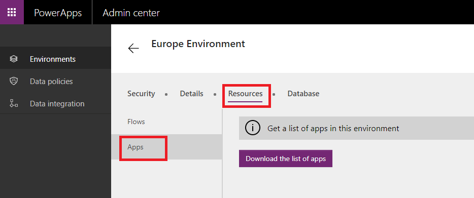

# 查看在组织中创建的 PowerApps
作为环境管理员，你现在可以从 [PowerApps 管理中心][1]下载在环境中创建的应用列表。 如果你是 Office 365 全局管理员或 Azure Active Directory 租户管理员，则可以在组织中下载适用于所有环境的应用列表。 该列表包含应用名称、应用的创建者，应用用于连接到数据源的任何连接器以及其他信息。

## 下载应用列表
1. 在 PowerApps 管理中心中，单击左边缘附近的“环境”，并选择要为其查看应用列表的环境：
   
    
2. 从水平导航栏中访问“资源”，然后选择“应用”。 通过单击“下载应用列表”按钮下载应用列表，如下所示：
   
    
3. 请等待几分钟，直到 .csv 文件下载完毕，然后在 Excel 中打开。
   
   
   <!--Reference links in article-->

[1]:https://admin.powerapps.com
