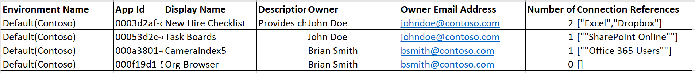

# 快速入门：下载环境中创建的应用列表
如果你是环境管理员，那么你可以查看和下载你管理的环境中创建的应用列表。 如果你是 365 全局管理员或 Azure Active Directory 租户管理员，那么你可以查看和下载组织所有环境中创建的应用列表。

在本快速入门中，你将了解如何将单个环境中创建的应用列表下载到 .csv 文件，接着如何在 Excel 中查看该列表。

## 先决条件
 若要按照本快速入门教程，则需要以下项目：
 * PowerApps 计划 2 或 Microsoft Flow 计划 2 许可证。 此外，也可以注册 [PowerApps 计划 2 免费试用版](https://web.powerapps.com/signup?redirect=marketing&email=)。
 * PowerApps 环境管理员、Office 365 全局管理员或 Azure Active Directory 租户管理员权限。 有关详细信息，请参阅 [PowerApps 中的环境管理](environments-administration.md)。

## 登录到 PowerApps 管理中心
在 [https://admin.powerapps.com]([https://admin.powerapps.com) 上登录到管理中心。

## 下载应用列表
1. 在导航窗格中，单击或点击“环境”，然后单击或点击想为其下载应用列表的环境。

    
2. 在“资源”选项卡上，依次单击或点击“应用”和“下载应用列表”。

    

    应用列表下载到 .csv 文件中。 此过程可能需要几分钟的时间。 确保此列表下载完之前不要关闭窗口，否则可能需要重新启动该进程。

## 查看列表
创建 .csv 文件后，请在 Excel 中打开它。 该列表包含应用显示名称、应用的所有者、应用用于连接到数据源的任何连接器以及其他信息。

## 后续步骤
在本快速入门中，你了解了如何下载和查看组织环境中创建的应用列表。 接下来，了解如何管理组织中创建的应用。

> [!div class="nextstepaction"]
> [管理组织中创建的应用](admin-manage-apps.md)
