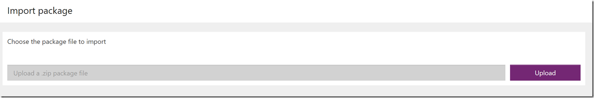

# 通过打包进行环境和租户应用迁移
了解如何通过打包将资源从一个环境迁移到另一个环境。 这些环境可以位于同一租户中，也可以跨不同的租户。

## 场景
可能需要迁移资源的一种常见场景是，你有一个测试或开发环境，同时又有一个生产环境。 开发人员和测试人员对其环境中的应用进行访问时，其权限很宽松。 但将新应用迁移到生产环境中时，对更新和更改权限的控制会很严格。

另一场景是，每个客户都有其自己的环境和数据， 添加新客户时，将为其创建新环境，然后再将应用迁移到环境中。

## 可以通过打包迁移哪些资源？
导出应用时，应用的从属资源也会导出到包中。  最初仅支持所有可能的资源类型的子集，如下表所示。

| 资源类型 | 受支持 | 导入选项 |
| --- | --- | --- |
| 应用 |是 |有两个选项可用于将应用导入到环境： <ol><li><b>新建</b> – 在导入包的环境中将此应用创建为新应用。</li> <li><b>更新</b> - 环境中已存在此应用，导入此包后将更新此应用。</li></ol> |
| 流 |是 |有两个选项可用于将流导入到环境： <ol><li><b>新建</b> – 在导入包的环境中将此流创建为新流。</li> <li><b>更新</b> - 环境中已存在此流，导入此包后将更新此流。</li></ol> <b>注意</b>：流依赖的所有资源也会包含在导出的应用包内，并需要在导入包时进行配置。 |
| 自定义连接器 |否 |应用依赖自定义连接器时，当前不<b></b>支持将连接器导出为包的一部分。 

 如果应用依赖自定义连接器，目前唯一的选择是在目标环境中手动重新创建或更新该连接器，并在导入包时选择该连接器。 |
| 连接 |否 |应用依赖连接（例如带凭据的 SQL 连接）时，当前不支持将连接或凭据导出为包的一部分。 

 如果应用依赖共享连接（例如 SQL），目前唯一的选择是，使用相应的凭据在目标环境中手动重新创建该连接，并在导入包时选择该连接。 |
| CDS 自定义项 |否 |不再支持导出 CDS 自定义项作为打包的一部分。 现在通过导出和导入环境默认解决方案对其提供支持，如下文所述。 |
| 网关 |否 |网关仅在默认（和 {租户名称}（预览版提供））环境中受支持，因此不能导出/迁移。 |

## 如何获取打包应用的权限？
拥有应用“编辑”权限的所有用户均可导出应用。

拥有目标环境的“环境制作”权限的所有用户均可导入应用。

用户必须拥有 PowerApps 计划 2 或 PowerApps 计划 2 试用版许可证才能导出或导入任何应用。

> [!NOTE]
> 虽然打包功能处于预览状态，但所有拥有 PowerApps 有效许可证的用户都可以在自己的应用和环境上试用打包功能。

## 导出应用
1. 在 http://web.powerapps.com 中，单击或点击“应用”，选择省略号以找到想要迁移的应用，然后选择“导出(预览)”。

    
2. 导出包页打开后，为包输入“名称”和“说明”。

    
3. 在“审阅包内容”部分中，可以选择添加评论或备注，或更改包导入期间将每个资源导入到目标环境的方式的设置。

    

4. 选择“导出”后，将在几秒内开始下载包文件。

## 导入应用
1. 在 http://web.powerapps.com 中，单击或点击“应用”，然后选择“导入包(预览)”。

    
2. 选择“上传”，然后选择要导入的应用包文件。

    
3. 上传包后，需要查看包内容并需要为标有红色图标的所有项输入其他内容（选择各个项的扳手图标并输入所需信息）。

    
4. 提供所有所需信息后，选择“导入”。

    
5. 导入完成后，将自动重定向到一个页面（如下所示），提示导入操作是否已成功。

    

> [!NOTE]
>  如果在导入应用时选择了更新现有应用，新更改内容将被保存为此应用的草稿。  需要[发布](http://powerapps.microsoft.com/tutorials/save-publish-app/#publish-an-app)这些更改才能让此应用程序的所有其他用户获取这些更改。
>
>

## 导出 CDS 自定义项和模型驱动应用
导出默认环境解决方案支持导出任意实体、选项集自定义项或 https://web.powerapps.com 中生成的模型驱动应用，如下所示：
> [!NOTE]
>  如果想要了解有关 PowerApps 解决方案的详细信息，请参阅[解决方案简介](../developer/common-data-service/introduction-solutions.md)。
>
>

1. 在 http://web.powerapps.com 中，选择环境中的“模型驱动(预览)”设计模式。

    

2. 在左侧导航栏中选择“高级”启动此环境默认解决方案的解决方案资源管理器

    

3. 选择“导出解决方案”并完成所需的步骤。  解决方案包文件将在几秒钟内开始下载。

    

## 导入 CDS 自定义项和模型驱动应用
遗憾的是，导入 CDS 解决方案包需要体验中的手动变通方法，我们正在积极修复此问题：

1. 在 http://web.powerapps.com 中，选择环境中的“模型驱动(预览)”设计模式。

    

2. 在左侧导航栏中选择“高级”启动此环境默认解决方案的解决方案资源管理器。

    

3. 从浏览器复制 URL，进行以下更改，然后导航到浏览器中的新 URL：

   * 当前 URL 结构：https://{orguniquename}.crm.dynamics.com/tools/solution/edit.aspx?id={solutionname}

       

   * 新 URL 结构：https://{orguniquename}.crm.dynamics.com/tools/solution/SolutionImportWizard.aspx

       

4. 选择想要导入的 CDS 解决方案包文件并完成向导。

5. 如果导入成功，将看到以下确认对话框。 若要向环境中的其他自定义项提供解决方案更改，请选择“发布所有自定义项”

    
