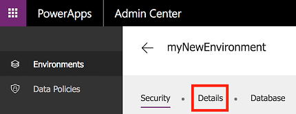

# 管理 PowerApps 中的环境
在 [PowerApps 管理中心][1]内，管理已创建的环境及已将已添加到其环境管理员或系统管理员角色的环境。 从管理中心可执行以下管理操作：

* 创建环境。
* 重命名环境。
* 授予或撤销用户或组的环境管理员或环境创建者角色。
* 为环境预配 Common Data Service 数据库。
* 设置数据丢失防护策略。
* 设置数据库安全策略（由数据库角色设置为开放或受限）。
* Azure AD 租户全局管理员角色（包括 Office 365 全局管理员）的成员也可以管理自己已在租户中创建的所有环境，并在整个租户范围内设置策略。

## 访问 PowerApps 管理中心
若要访问 PowerApps 管理中心，请执行以下操作：

* 直接转到 [admin.powerapps.com][1]，或

* 转到 [powerapps.com][2]，再选择导航标头中的齿轮图标。

    

若要在 PowerApps 管理中心管理某个环境，必须拥有以下角色之一：

* 环境的环境管理员或系统管理员，或者

* Azure AD 或 Office 365 租户的“全局管理员”角色。

此外，还需要 PowerApps 计划 2 或 Microsoft Flow 计划 2 许可证才能访问管理中心。 有关详细信息，请参阅 [PowerApps 定价页][3]。

> [!IMPORTANT]
> 在 PowerApps 管理中心内所做的任何更改都会影响 [Microsoft Flow 管理中心][4]，反之亦然。

## 创建环境
有关如何创建环境的说明，请参阅[快速入门：创建环境](create-environment.md)。

## 查看环境
打开管理中心时，默认会显示“环境”选项卡，其中列出了你是其环境管理员的所有环境（如下所示）：

如果你是 Azure AD 或 Office 365 租户的“全局管理员”角色的成员，将显示租户中用户创建的所有环境，因为你已自动成为所有这些环境的环境管理员。

## 重命名环境
1. 打开 [PowerApps 管理中心][1]，在列表中找到要重命名的环境，然后单击或点击它。

    

2. 单击或点击“详细信息”。

    
3. 在“名称”文本框中输入新名称，然后单击“保存”。

    

    如果已在环境中创建数据库，将不会看到此选项。 可以通过单击“详细信息”选项卡中的链接从 Dynamics 365 管理中心重命名环境。

    

## 删除环境
1. 在 [PowerApps 管理中心][1]单击或点击要删除的环境。

    
2. 单击或点击“详细信息”。

    
3. 单击或点击“删除环境”以删除该环境。

    

## 为环境创建 Common Data Service 数据库
如果某个环境没有数据库，环境管理员可在 [PowerApps 管理中心][1]执行以下步骤创建一个数据库。 只有拥有 PowerApps 计划 2 许可证的用户才能创建 Common Data Service 数据库。

1. 在环境表中选择一个环境。

    
2. 选择“详细信息”选项卡。
3. 选择“创建数据库”。

    

创建数据库后，请选择安全模型。 有关详细信息，请参阅[配置数据库安全性](database-security.md)。

## 管理环境的安全性

### 环境权限
在环境中，Azure AD 租户中的所有用户都是该环境的用户。 但是，若要让这些用户扮演更高特权的角色，需要将他们添加到特定的环境角色。 环境中内置两个角色，在环境中拥有相应的权限：

* “环境管理员”角色（或“系统管理员”角色）可以执行所有环境管理操作，包括以下操作：
    * 授予或撤销用户的“环境管理员”或“环境创建者”角色。

    * 为环境预配 Common Data Service 数据库。

    * 查看和管理在环境中创建的所有资源。

    * 设置数据丢失防护策略。 有关详细信息，请参阅[数据丢失防护策略](prevent-data-loss.md)。

  > [!NOTE]
  > 如果环境包含数据库，则需要向用户分配“系统管理员”角色，而不是“环境管理员”角色。

* **环境创建者**角色可以在环境中创建资源，包括应用、连接、自定义连接器、网关和 Microsoft Flow 流。 环境创建者还可将他们在环境中构建的应用分发到组织中的其他用户。 他们可与组织中的单个用户、安全组或所有用户共享应用。 有关详细信息，请参阅[在 PowerApps 中共享应用](../maker/canvas-apps/share-app.md)。

若要将用户或安全组分配到某个环境角色，环境管理员可在 [PowerApps 管理中心][1]执行以下步骤：

1. 在环境表中选择该环境。

    
2. 选择“安全性”选项卡。
3. 如果环境中没有创建数据库：

    a. 选择“环境管理员”或“环境创建者”角色。

    

    b. 指定 Azure Active Directory 中一个或多个用户或安全组的名称，或指定要添加整个组织。

    

    c. 选择“保存”更新环境角色分配。

4. 如果环境中创建了数据库：

    a. 将用户添加到环境，然后单击链接，为用户分配角色。

    

    b. 从环境/实例的用户列表中选择用户。

    

    c. 向用户分配角色。

    

    d. 选择“确定”更新环境角色分配。

> [!NOTE]
> 分配到这些环境角色的用户或组并不会自动获得对环境内数据库（若有）的访问权限，必须由数据库所有者单独授予。 有关详细信息，请参阅[配置数据库安全性](database-security.md)。  
>
>

### 数据库安全性
创建和修改数据库架构以及连接到在环境中预配的某个数据库内存储的数据的能力，由该数据库的用户角色和权限集控制。 可通过“安全”选项卡的“用户角色”和“权限集”部分管理环境数据库的用户角色和权限集。有关详细信息，请参阅[配置数据库安全性](database-security.md)。

## 数据策略
组织的数据必须受到保护，防止与不应有权访问这些数据的受众共享。 若要保护这些数据，可以创建并实施策略来定义可共享的特定于使用者服务和连接器的业务数据。 用于定义如何共享数据的策略称为数据丢失防护 (DLP) 策略。 可以通过 [PowerApps 管理中心][1]的“数据策略”部分管理环境的 DLP 策略。  有关详细信息，请参阅[数据丢失防护策略](prevent-data-loss.md)。

## 常见问题
### 可以创建多少个环境和数据库？
最多可以创建两个试用环境和两个生产环境，具体取决于许可证。 [请参阅此处](environments-overview.md#creating-an-environment)了解详细信息。 每个用户可以在两个试用环境和两个生产环境中预配数据库，具体取决于其许可证。 

### 哪个许可证包含 Common Data Service？
PowerApps 计划 2。  有关包含此许可证的所有计划的详细信息，请参阅 [PowerApps 定价页][3]。

### 尝试创建新环境时发生错误。 应如何解决？
如果收到以下错误消息：“计划不支持所选环境类型或已达该类型的环境限制。” ，表示可能存在以下两种情况之一

1. 已经用完用于创建特定类型环境的配额。 假设在创建试用环境时收到此错误消息。 这说明预配了两个试用环境。 可在 [PowerApps 管理中心][1]查看所有环境。
如果需要，可删除该特定类型的现有环境并创建新环境。 但是，请确保不会丢失希望保留的数据、应用、流和其他资源。

2. 没有用于创建该特定类型环境的配额。 请在[此处](environments-overview.md#creating-an-environment)查看可以创建的环境类型。

如果收到任何其他错误消息或有更多疑问，请在[此处][5]与我们联系。

### 尝试在环境中创建数据库时发生错误。 应如何解决？
在以下情况下，可能会在创建数据库时出现错误：

1. **默认环境**：租户的默认环境目前不支持创建数据库。 

2. **个人使用环境**：通过注册 PowerApps 社区计划获得个人使用环境。 如果尚未创建数据库，则目前无法在个人使用环境中预配数据库。 

3. **环境位于 AAD 租户主区域以外的区域**：目前，仅可在 Azure Active Directory 租户主区域中创建的环境中预配数据库。 即将推出在其他区域中预配数据库这一功能。 因此，如果要在环境中创建数据库，请确保环境区域与租户默认位置所在区域相同。

4. **某些区域不支持创建数据库**：某些区域尚不支持创建数据库。 例如，南美洲的国家/地区。 因此，如果租户主位置位于南美洲，则目前无法在任何环境中预配数据库。 
    
我们正在努力为以上所有情况提供支持。
如果收到任何其他错误消息或有更多疑问，请在[此处][5]与我们联系

### 试用环境何时过期？   
试用环境在创建后 30 天过期。 如果不希望环境过期，可通过几种方法将其转换为生产环境。 此功能即将推出，推出之前试用环境不会过期。

### 当前数据库（使用以前版本的 Common Data Service 创建）是否也会计入配额？
如果之前已拥有数据库（使用以前版本的 Common Data Service 创建），它们也将计入生产环境配额。 如果现在在环境（于 2018 年 5 月 15 日前创建）中创建数据库，则同样会计为生产环境。

### 是否可以重命名环境？
可以，可在 PowerApps 管理中心找到此功能。 有关详细信息，请参阅[环境管理](environments-administration.md#rename-your-environment)。

### 是否可以删除环境？
可以，可在 PowerApps 管理中心找到此功能。 有关详细信息，请参阅[环境管理](environments-administration.md#delete-your-environment)。
请注意，目前不能删除具有数据库（使用最新版 Common Data Service 创建）的生产环境。 此功能即将推出！

### 环境管理员是否可以查看和管理环境的所有资源（应用、流、API 等等）？
可以，可在 PowerApps 管理中心找到查看环境的应用和流的功能。 有关详细信息，请参阅[查看应用](admin-view-apps.md)。

<!--Reference links in article-->
[1]: https://admin.powerapps.com
[2]: https://web.powerapps.com
[3]: https://powerapps.microsoft.com/pricing/
[4]: https://admin.flow.microsoft.com
[5]: https://go.microsoft.com/fwlink/?linkid=871628