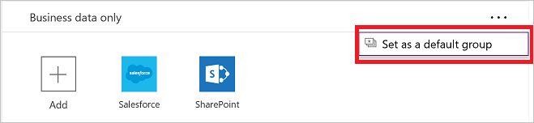
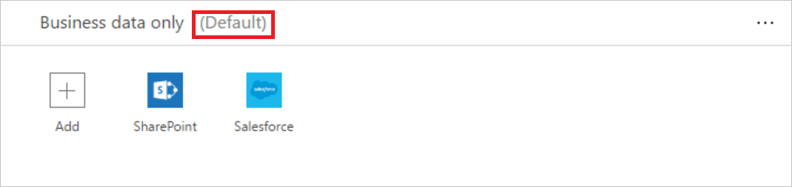

# 全面了解数据组
数据组是对[数据丢失防护 (DLP) 策略](prevent-data-loss.md)中的服务进行分类的一种简单方式。 两个可用的数据组为“仅限业务数据”组和“不允许业务数据”组。 组织可以自由确定要将哪些服务放置到哪个特定的数据组中。 为服务分类的一种合理方式是根据对组织造成的影响将服务放置在组中。 默认情况下，所有服务放置在“不允许业务数据”数据组中。 通过管理中心创建或修改 DLP 策略的属性时，可以管理数据组中的服务。

## 数据在数据组之间的共享方式
无法在不同组中的服务之间共享数据。 例如，如果将 SharePoint 和 Salesforce 放置在“仅限业务数据”组中，将 Facebook 和 Twitter 放置在“不允许业务数据”组中，则无法创建用于在 SharePoint 与 Facebook 之间移动数据的 PowerApp。 尽管无法在不同组中的服务之间共享数据，但可以在特定组中的服务之间共享数据。 追溯到前面的示例，由于 SharePoint 和 Salesforce 放置在同一个数据组中，因此最终用户创建的 PowerApps 可在 SharePoint 与 Salesforce 之间共享数据。 关键之处在于，特定组中的服务可以共享数据，而不同组中的服务无法共享数据。

此外，必须将一个数据组指定为默认组。 最初，“不允许业务数据”组是默认组，所有服务都放置在该数据组中。 管理员可将默认数据组更改为“仅限业务数据”数据组。 > [!NOTE]
> 添加到 PowerApps 的所有新服务都将被置于指定的默认组中。 为此，我们建议将“不允许业务数据”保留为默认组，在组织已评估允许与新服务共享业务数据所造成的影响后，手动将服务添加到“仅限业务数据”组中。

## 将服务添加到数据组
本演练将 SharePoint 和 Salesforce 添加到数据丢失防护 (DLP) 策略的“仅限业务数据”数据组。

1. 选择 DLP 策略的“仅限业务数据”组框中的“+添加”链接：    
     
2. 选择 SharePoint 和 Salesforce，然后选择“添加服务”将这两个服务添加到“仅限业务数据”组：    
     
3. 在顶部菜单中选择“保存策略”：  
   
4. 可以看到，SharePoint 和 Salesforce 现已放置在“仅限业务数据”组中：  
      

本演练已将 SharePoint 和 Salesforce 添加到 DLP 策略的“仅限业务数据”数据组。 如果 DLP 策略环境中的某人创建的应用会在 SharePoint 或 Salesforce 与“不允许业务数据”数据组中的任一服务之间共享数据，则系统将不允许该应用运行。

## 从数据组中删除服务
由于所有服务必须在一个可用的数据组中，因此，若要从特定的组中删除某个服务，只需将该服务添加到另一个组，然后保存策略。  

## 更改默认数据组
本演练将默认数据组从“不允许业务数据”数据组更改为“仅限业务数据”数据组。  

> [!IMPORTANT]
> 添加到 PowerApps 的所有新服务都将被置于指定的默认组中。 为此，我们建议将“不允许业务数据”保留为默认组，并手动将服务添加到“仅限业务数据”组中。

1. 选择想要指定为默认数据组的数据组右上角的“...”：    
     
2. 选择“设为默认组”：  
      
3. 在顶部菜单中选择“保存策略”：  
   
4. 可以看到，该数据组现已指定为默认数据组：  
      

## 后续步骤
* [详细了解数据丢失防护 (DLP) 策略](prevent-data-loss.md)
* [详细了解环境](environments-overview.md)
* [详细了解 Microsoft PowerApps](../maker/canvas-apps/getting-started.md)
