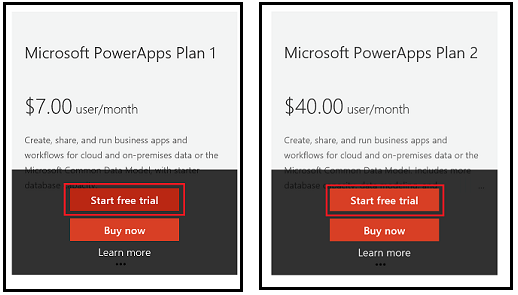
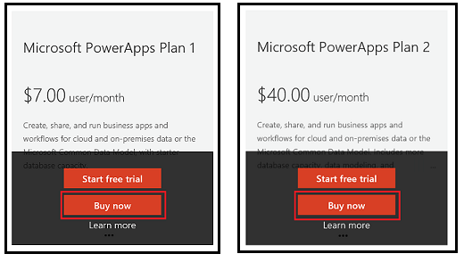

# 为组织购买 PowerApps
本文介绍了如何以管理员身份为组织购买 PowerApps。 你可以直接通过 PowerApps 网站购买 PowerApps，也可以通过 Office 365 管理中心、Microsoft 代表或合作伙伴购买。 本文将讨论 PowerApps 计划 1 或计划 2 的可用试用选项，然后阐述如何以组织身份购买 PowerApps 计划 1 或计划 2。 有关详细信息，请参阅[组织中的 PowerApps 问答](signup-question-and-answer.md)。

> [!NOTE]
>   必须已是租户的 Office 365 全局管理员或计费管理员，或必须创建租户，才能为组织购买 PowerApps。

## 选择正确的计划
有关可以为组织选择哪些许可证的详细信息，请参阅 [PowerApps 授权概述](pricing-billing-skus.md)。

## 直接购买 PowerApps
你可以为组织从 [powerapps.microsoft.com][4] 购买 PowerApps 订阅，然后将 PowerApps 许可证分配给用户。 [了解详细信息][5]。

1. 打开 [powerapps.microsoft.com][4]，然后选择“定价”。

2. 对所需计划选择“**立即购买**”。

    

3. 提供信息以便购买，然后导航到 [Office 365 管理中心][6]，将 PowerApps 许可证分配给用户。

## 通过 Office 365 获取 PowerApps
你可以为组织从 [Office 365 管理中心][6] 购买 PowerApps 订阅，然后将 PowerApps 许可证分配给用户。 [了解详细信息][5]。

> [!NOTE]
> 2016 年 11 月，PowerApps 将添加到现有和新的 Office 365 订阅中。
>
> * 在此变更结束前，如果使用 Office 365 订阅登录 PowerApps，系统则提示你注册免费的 PowerApps 计划 2 试用版。
> * 如果想要试用 PowerApps，请自行注册试用版，直至你的 Office 365 订阅更新完成。  
> * 但请注意，在 30 天的试用版过期后，试用版许可证可能包含无法通过 Office 365 订阅获取的 PowerApps 功能。  请参阅 [PowerApps 定价][2] 了解 Office 365 订阅中包括的功能。

### 购买订阅试用版
1. 浏览到 [Office 365 管理中心][6]。

2. 左侧导航窗格中，选择**“计费”->“订阅”**。

3. 选择右侧的“**+ 添加订阅**”。

4. 在“**其他计划**”下，将鼠标悬停在所需计划的省略号 (...) 上方，然后选择“**开始免费试用**”。

    

5. 在确认屏幕上，选择“**立即试用**”。

    在“**计费->订阅**”下，你将看到“**Microsoft PowerApps 计划 1 试用版**”或列出 100 个可用许可证的“**Microsoft PowerApps 计划 2 试用版**。 免费试用期限为 90 天。

### 购买订阅
1. 浏览到 [Office 365 管理中心][6]。

2. 左侧导航窗格中，选择**“计费”->“订阅”**。

3. 选择右侧的“**+ 添加订阅**”。

4. 在“**其他计划**”下，将鼠标悬停在所需计划的省略号 (...) 上方，然后选择“**立即购买**”。

    

5. 输入要添加的许可证数，然后选择“**立即结帐**”或“**添加到购物车**”。

   > [!NOTE]
   > 如果需要，稍后可以添加更多许可证。

6. 输入结帐流程中的所需信息，

    在“**计费->订阅**”下，你将看到列出的“**Microsoft PowerApps 计划 1**”或“**Microsoft PowerApps 计划 2**”。 如果你以后想要添加更多许可证，则可以返回到“**添加订阅**”，然后选择“**更改许可证数量**”。

## 外接程序
目前尚不支持。

## 另请参阅
[组织中的 PowerApps 问答](signup-question-and-answer.md)  
[自助注册 PowerApps](../maker/signup-for-powerapps.md)  

<!--Reference links in article-->
[1]: http://go.microsoft.com/fwlink/p/?LinkId=715583
[2]: http://go.microsoft.com/fwlink/p/?LinkId=708209
[4]: https://go.microsoft.com/fwlink/?linkid=832551
[5]: https://support.office.com/article/997596b5-4173-4627-b915-36abac6786dc
[6]: https://portal.office.com/admin/default.aspx
