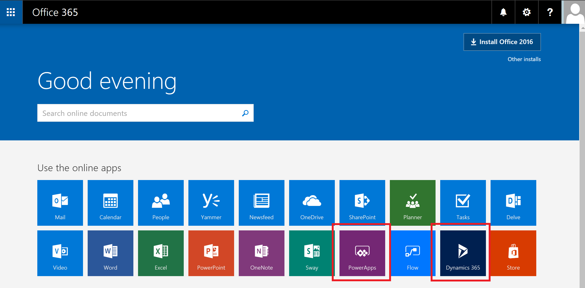

# 管理组织中的 PowerApps 许可证
本文介绍了组织中的用户如何获得使用 PowerApps 的访问权限以及可如何控制对 PowerApps 服务的访问权限。

## 注册 PowerApps
### 什么是 PowerApps？
Microsoft PowerApps 可供用户用来创建适用于 Windows、iOS 和 Android 移动设备的应用程序。 使用这些应用，你可以创建到常用 SaaS 服务（包括 Twitter、Office 365、Dropbox 和 Excel）的连接。

### 用户如何针对 PowerApps 进行注册？
对于你的组织中的个体用户，唯一的注册选项是 PowerApps 计划 2 试用版，他们可以通过 PowerApps 网站进行注册：

##### 选项 1
用户可以转到 [powerapps.microsoft.com](https://powerapps.microsoft.com) 进行注册：选择“免费注册”，然后通过 [portal.office.com](https://portal.office.com/Start?sku=powerapps) 针对 PowerApps 完成注册过程。

##### 选项 2
用户可以转到 [powerapps.microsoft.com](https://powerapps.microsoft.com) 进行注册：选择“登录”，使用其工作帐户或学校帐户进行登录，通过接受 PowerApps 使用条款针对 PowerApps 计划 2 试用版进行注册。    

当你的组织中的用户针对 PowerApps 进行注册时，会自动为该用户分配一个 PowerApps 许可证。

> [!NOTE]
> 在 PowerApps 内注册试用版许可证的用户，在 Office 365 管理门户中不会显示为 PowerApps 计划 2 试用版用户（除非用户有额外的 Office 365、Dynamics 365 或 PowerApps 许可证）。

有关更多详细信息，请参阅[针对 PowerApps 进行自助注册](../maker/signup-for-powerapps.md)。

### 我的组织中的用户可以如何获取对 PowerApps 的访问权限？
你的组织中的用户可以通过三种不同的方式获取对 PowerApps 的访问权限：

* 他们个人可以针对 PowerApps 计划 2 试用版进行注册，如[用户如何针对 PowerApps 进行注册？](#how-do-users-sign-up-for-powerapps)部分中所概述。
* 你可以在 Office 365 管理门户内为其分配 PowerApps 许可证。
* 将向用户分配包括对 PowerApps 服务的访问权限的 Office 365 和 Dynamics 365 计划。 有关包括 PowerApps 功能的 Office 365 和 Dynamics 365 计划的列表，请参阅 [PowerApps 定价页](https://powerapps.microsoft.com/pricing)。

### 是否可以阻止我的组织中的用户针对 PowerApps 进行注册？
任何个人都可以免费试用 Microsoft PowerApps 计划 2 的功能 30 天，如[用户如何针对 PowerApps 进行注册？](#how-do-users-sign-up-for-powerapps)部分中所概述。  此选项可供租户中的任何用户使用，管理员无法禁用此选项。当用户的试用版到期后，用户将失去对 PowerApps 计划 2 功能的访问权限。  

如果某人针对 Microsoft PowerApps 计划 2 的 30 天试用版进行了注册，则可以选择在组织中不支持它们，这样他们无论如何都不会给你的公司带来成本。 当个人针对 Microsoft PowerApps 进行注册时，将直接在个人与 Microsoft（例如 Microsoft 提供的众多公有云服务之一，诸如 Bing、Wunderlist、OneDrive 或 Outlook.com）之间建立关系，并且不会以任何方式暗示该服务是由你的组织提供的。

最后，如果你的公司希望在 Microsoft PowerApps 内限制纯组织数据的使用，可以通过数据丢失防护 (DLP) 策略来实现。 有关更多详细信息，请参阅[数据丢失防护 (DLP) 策略](prevent-data-loss.md)。

## PowerApps 的管理
### 为何让 PowerApps 图标显示在 Office 365 应用启动器中？
Microsoft PowerApps 是 Office 365 套件的基本组成部分，已作为现有 Office 365 SKU 的一项服务启用。 由于世界各地的用户现在都可以使用 Microsoft PowerApps，因此它显示在应用启动器屏幕中的“所有应用”中。 若要了解哪些 Office 365 SKU 现在包括 PowerApps，请参阅[授权概述](pricing-billing-skus.md)。

如果希望默认情况下从“所有应用”中删除 PowerApps 磁贴，请参阅下一部分。

### 如何为现有用户删除 PowerApps？
如果为某个用户分配了 PowerApps 计划 1 或 PowerApps 计划 2 许可证，则可以执行以下步骤来为该用户删除 PowerApps 许可证：

1. 转到 [Office 365 管理门户](https://portal.microsoftonline.com/)。

2. 在左侧导航栏中，选择“用户”，然后选择“活动用户”。

3. 找到你要为其删除许可证的用户，选择选择其名称。

4. 在用户详细信息窗格中，在“产品许可证”部分中选择“编辑”。

5. 找到名为 **Microsoft PowerApps 计划 1** 或 **Microsoft PowerApps 计划 2** 的许可证，将开关设置为“关闭”，然后选择“保存”。

    

如果用户通过其 Office 365 和 Dynamics 365 计划许可证获得了对 PowerApps 的访问权限，则可以执行以下步骤来禁用其对 PowerApps 服务的访问权限：

1. 转到 [Office 365 管理门户](https://portal.microsoftonline.com/)。

2. 在左侧导航栏中，选择“用户”，然后选择“活动用户”。

3. 找到你要为其删除访问权限的用户，然后选择其名称。

4. 在用户详细信息窗格中，在“产品许可证”部分中选择“编辑”。

5. 展开用户的 Office 365 或 Dynamics 365 许可证，禁用对名为 **PowerApps for Office 365** 或 **PowerApps for Dynamics 365** 的服务的访问权限，然后选择“保存”。

    

还可以通过 PowerShell 批量删除许可证。 有关详细示例，请参阅[使用 Office 365 PowerShell 从用户帐户中删除许可证](https://technet.microsoft.com/library/dn771774.aspx)。   最后，[使用 Office 365 PowerShell 禁用对服务的访问权限](https://technet.microsoft.com/library/dn771769.aspx)中提供了有关批量删除许可证中的服务的进一步指导。

为你的组织中的用户删除 PowerApps 许可证或服务还会导致在以下位置为该用户删除 PowerApps 和 Dynamics 365 图标：

* [Office.com](https://office.com)

    
* Office 365 AppLauncher“waffle”

    

### 我如何限制用户使用 PowerApps 访问我所在组织的业务数据？
PowerApps 允许你针对业务数据和非业务数据创建数据区域，如下所示。  在实现这些数据丢失防护策略后，将会阻止用户设计或运行组合了业务数据和非业务数据的 PowerApps。 有关更多详细信息，请参阅[数据丢失防护 (DLP) 策略](prevent-data-loss.md)。

### 为何我的 Office 365 租户中显示了 Microsoft PowerApps 的 10,000 个许可证？
作为合格的组织，组织中的用户有资格对 Microsoft PowerApps 计划 2 试用 30 天，这些试用版许可证代表了租户中的新 PowerApps 用户可用的容量。 这些许可证不收取任何费用。 具体而言，有两个可能原因会导致你在 Office 365 管理门户中看到显示了 10,000 个（试用版）许可证：

* 如果你的租户中至少有一位用户参加了时间跨度为 2016 年 4 月到 2016 年 10 月的 PowerApps 公共预览版，则你将会看到标签为“Microsoft PowerApps 和逻辑流”的 10,000 个许可证

    
* 如果你的租户中至少有一位用户通过完成[用户如何针对 PowerApps 进行注册？](#how-do-users-sign-up-for-powerapps)部分中概述的“选项 1”针对 PowerApps 计划 2 试用版进行了注册，则你将会看到标签为“Microsoft PowerApps 和流”的 10,000 个许可证

    

你可以选择自己通过 Office 365 管理门户向用户分配额外的许可证，但请注意，这些是适用于 Microsoft PowerApps 计划 2 的许可证，并且会在分配给用户 30 天后过期。

### 这是否免费？ 是否会针对这些许可证向我收费？
这些许可证是免费试用版许可证，供用户对 Microsoft PowerApps 计划 2 试用 30 天。

### 这会对目前我管理我的组织中的用户身份的方式带来什么变化？
如果你的组织已经具有现有的 Office 365 环境并且你的组织中的用户具有 Office 365 帐户，则身份管理方式不会更改。

如果你的组织已经具有现有的 Office 365 环境但你的组织中的用户并非都具有 Office 365 帐户，则我们会在租户中创建一个用户并根据该用户的工作或学校电子邮件地址分配许可证。 这意味着你在任一特定时间管理的用户的数量将随着你的组织中针对该服务进行注册的用户增长而增长。

如果你的组织没有已连接到你的电子邮件域的 Office 365 环境，则你管理身份的方式不会更改。 用户将被添加到新的仅限云用户的用户目录中，你将可以作为租户管理员进行接管并对用户进行管理。

### 管理 Microsoft 为我的用户创建的租户的流程是怎样的？
如果某个租户是由 Microsoft 创建的，你可以通过以下步骤来索取并管理该租户：

1. 通过使用与你要管理的租户域匹配的电子邮件地址域针对 PowerApps 进行注册来加入该租户。 例如，如果 Microsoft 创建了 contoso.com 租户，则使用以 @contoso.com 结尾的电子邮件地址加入该租户。
2. 通过验证域所有权来索取管理控制权：在处于租户中后，你可以通过验证域所有权来将你自己提升到管理员角色。 为此，请执行下列步骤：
3. 转到 [https://portal.office.com](https://portal.office.com/Start?sku=powerapps)。
4. 选择左上角的应用启动器图标，然后选择“管理”。
5. 阅读“成为管理员”页面上的说明，然后选择“是，我想成为管理员”。  

> [!NOTE]
> 如果看不到此选项，表明已有 Office 365 管理员。

### 如果我有多个域，是否可以控制要将用户添加哪个 Office 365 租户？
如果你不做任何事情，则会为每个用户电子邮件域和子域创建一个租户。

如果无论用户的电子邮件地址扩展是什么，你都希望所有用户位于同一租户中，请执行以下操作：  

* 提前创建一个目标租户或者使用某个现有租户。 在该租户内添加你希望合并的所有现有域和子域。 然后，其电子邮件地址以这些域和子域结尾的所有用户在注册时都将自动加入目标租户。

> [!IMPORTANT]
> 尚无受支持的自动化机制，可用于在租户创建后立即跨租户移动用户。 若要了解向单个 Office 365 租户添加域的信息，请参阅[向 Office 365 添加用户和域](https://support.office.com/article/Add-your-users-and-domain-to-Office-365-ffdb2216-330d-4d73-832b-3e31bcb5b2a7)。
