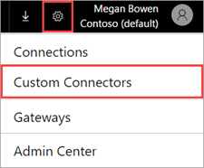
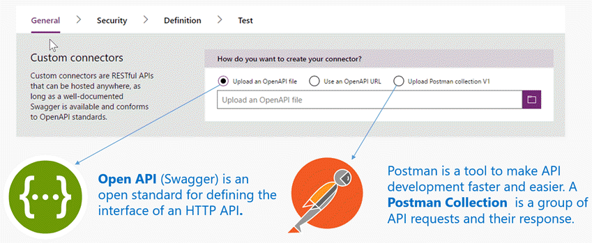
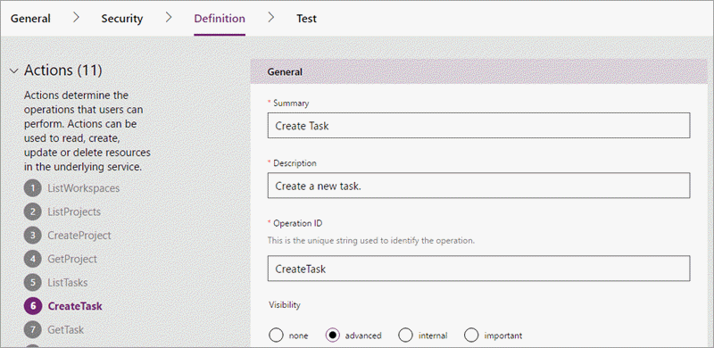

# 开发 API 连接器 (PowerApps)
连接器生成工作由多项步骤组成。 首先，在 [PowerApps](https://web.powerapps.com/) 中，单击或点击页面右上角的“设置”按钮（齿轮图标）。 然后，单击或点击“自定义连接器”。

## 描述 API
使用可定义 HTTP API 接口的 [OpenAPI 标准](https://swagger.io/)来描述 API 连接器。 可以使用现有的 OpenAPI 文件开始生成，也可以导入 [Postman 集合](https://www.getpostman.com/docs/collections)（它会自动为你生成 OpenAPI 文件）。 

如果开始使用其中任一 API 说明，则会自动填充向导中的元数据字段。 随时都可以编辑这些字段。  

## 建立安全机制
选择服务支持的身份验证类型，并提供其他详细信息，以便可以在服务和任意客户端之间适当传播标识。 

[详细了解](register-custom-api.md)连接器安全性。

## 生成触发器和操作
1. 若要为连接器生成触发器和操作，请切换到“定义”选项卡。 
   
    
2. 使用向导，可以添加新操作，也可以编辑现有操作的架构和响应。 通过各个操作的“常规”属性，可以控制连接器的最终用户体验。 请单击下面的链接，详细了解不同类型的操作：
   
   * [触发器](https://flow.microsoft.com/documentation/customapi-webhooks)（在 PowerApps 中不可见）
   * [操作](register-custom-api.md)
     
     若要实现 Microsoft Flow 的高级功能，请参阅[适用于 API 连接器的 OpenAPI 扩展](https://flow.microsoft.com/documentation/customapi-how-to-swagger/)。 
3. 最后，单击或点击“创建连接器”，注册 API 连接器。

若要使用向导中没有的其他功能，请联系 [condevhelp@microsoft.com](mailto:condevhelp@microsoft.com)。

## 测试连接器
提交前，请使用一种或多种方法测试 API 连接器： 

* 使用 API 连接器[“测试”向导](https://flow.microsoft.com/blog/new-updates-custom-api/)，可以调用各个操作来验证其功能和响应架构。
* 在 Microsoft Flow 设计器中，可以使用 API 连接器以直观的方式生成流。 通过这种测试方法，可以了解连接器的用户界面功能。
* 在 PowerApps Studio 中，可以使用编辑栏调用各个操作，然后将响应绑定到屏幕上的控件。

本主题提供了概述性信息；有关详细信息，请参阅[注册和使用自定义连接器](register-custom-api.md)。

