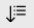
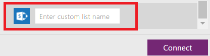

# 生成应用以管理 SharePoint 列表中的数据
[!VIDEO nb:cid:UUID:34ccfd46-7826-49ce-90d8-cf6a144b6968]

在 PowerApps 中，无论站点是在本地还是云中，都可以自动生成三屏应用来管理 SharePoint 列表中的数据。

默认情况下，每个生成的应用均具有用于浏览记录的屏幕、用于显示记录详细信息的屏幕及用于创建或更新记录的屏幕。 自动确定每个屏幕的初始布局和内容，但你可能需要自定义应用以满足自己的需求。

如果不熟悉 PowerApps，请参阅 [PowerApps 简介](getting-started.md)。

截至本文，PowerApps 支持自定义列表，但不支持自定义库。 此外，还可以在某些类型的列（例如**选项**和**图片**）中显示数据，但无法更新该数据。 有关详细信息，请参阅 [已知问题](connections/connection-sharepoint-online.md#known-issues)。

注意：如果任何列名称包含空格，PowerApps 会将空格显示为“\_x0020\_”。 例如，“Column Name”显示为“Column_x0020_Name”。

## 指定 SharePoint 应用
1. 如果尚未创建 [到 SharePoint 的连接](connect-to-sharepoint.md)，请创建该连接。
2. 通过以下任一方式打开 PowerApps：
   
   * [安装适用于 Windows 的 PowerApps Studio](http://aka.ms/powerappsinstall)，打开该程序，然后使用注册所用的同一凭据进行登录。 在左边缘附近单击或点击“**新建**”。
     
       
   * 在浏览器中 [打开适用于 Web 的 PowerApps Studio](https://create.powerapps.com/api/start)。
     
       有关适用于 Web 的 PowerApps Studio 的预览版中支持的浏览器和限制的列表，请参阅 [在浏览器中创建或编辑应用](create-app-browser.md)。
3. 在“开始处理数据”下，单击或点击 SharePoint 磁贴上的“手机布局”。
   
    

## 指定站点和列表
1. 在“**连接到 SharePoint 站点**”下，键入或粘贴包含要使用列表的站点的 URL，然后单击或点击“**转到**”。
   
    **注意**：请勿在 URL 中加入特定列表。
   
    
2. 在“**选择列表**”下，单击或点击要使用列表的名称。
   
    单击或点击排序按钮，可以按字母顺序对列表名称进行排序。
   
    
   
    还可以在搜索框中键入或粘贴至少一个字母，仅显示包含指定文本的列表名称。
   
    
   
    默认情况下，并非所有类型的列表都会显示。 如果要使用的列表名称未显示，请滚动到底部，再在“输入自定义列表名称”框中键入列表名称。
   
    
3. 单击或点击“**连接**”生成应用。
   
    
4. 如果系统提示获取简介教程，请单击或点击“**下一步**”来熟悉 PowerApps 界面的主要区域（也可以单击或点击“**跳过**”）。
   
    
   
    稍后可以通过单击或点击右上角附近的问号图标，然后单击或点击“**获取简介教程**”，随时获取教程。

## 后续步骤
* 要保存刚才生成的应用，请按 Ctrl-S。
* 要自定义浏览屏幕（默认情况下会显示），请参阅 [自定义布局](customize-layout-sharepoint.md)。
* 要自定义详细信息或编辑屏幕，请参阅 [自定义窗体](customize-forms-sharepoint.md)。

