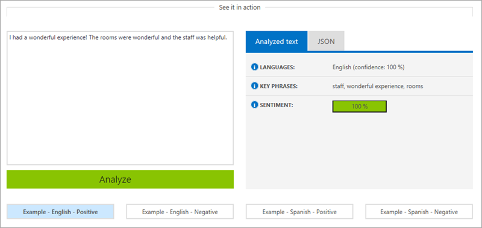
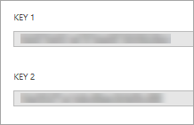
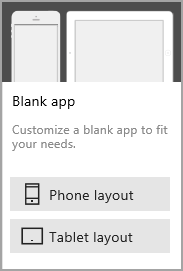
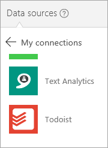
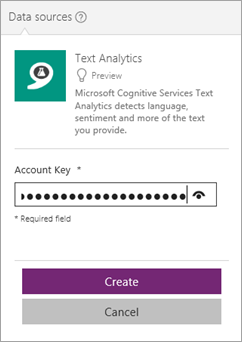
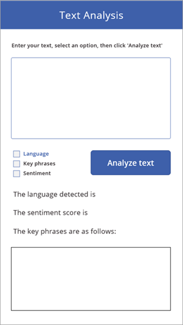
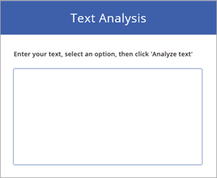

# <a name="use-cognitive-services-in-powerapps"></a>在 PowerApps 中使用认知服务
本文介绍如何生成使用 [Microsoft 认知服务文本分析 API](https://docs.microsoft.com/azure/cognitive-services/text-analytics/overview) 分析文本的基本应用。 我们将介绍如何设置文本分析 API，以及如何使用[文本分析连接器](https://docs.microsoft.com/connectors/cognitiveservicestextanalytics/)连接到它。 随后将介绍如何创建调用此 API 的应用。

注意：如果你是刚刚开始在 PowerApps 中生成应用，建议先阅读[从头开始创建应用](get-started-create-from-blank.md)，然后再深入了解本文。

## <a name="introduction-to-microsoft-cognitive-services"></a>Microsoft 认知服务简介
Microsoft 认知服务是一组可使应用程序更加智能、富有吸引力和易被发现的 API、SDK 和服务。 借助这些服务，你可以轻松地将智能功能添加到应用程序，这些功能包括表情和视频检测；面部、语音和视觉识别；以及语音和语言理解等。

本文重点介绍如何通过文本分析 API 添加“语言理解”功能。 通过此 API 可以检测文本中的感情、关键词语、主题和语言。 我们先体验一下此 API 的演示，然后再注册预览版。

### <a name="try-out-the-text-analytics-api"></a>体验文本分析 API
此 API 具有在线演示，可以查看它的工作方式，并查看服务返回的 JSON。

1. 转到[文本分析 API](https://azure.microsoft.com/services/cognitive-services/text-analytics/) 页。
2. 在“查看它的实际操作”部分中，使用示例文本或输入自己的文本。 然后单击或点击“分析”。 
   
    
3. 此页将显示“已分析的文本”选项卡上的格式化结果和“JSON”选项卡上的 JSON 响应。[JSON](http://json.org/) 是一种表示数据的方法；在本示例中，是文本分析 API 返回的数据。

## <a name="sign-up-for-the-text-analytics-api"></a>注册文本分析 API
可免费获取此 API 的预览版，并且它与 Azure 订阅相关联。 可通过 Azure 门户管理此 API。

1. 如果还没有 Azure 订阅，可以[注册免费订阅](https://azure.microsoft.com/free/)。
2. 登录你的 Azure 帐户。
3. 转到 Azure 门户中的[“创建认知服务”边栏选项卡](https://go.microsoft.com/fwlink/?LinkId=761108)。
4. 输入文本分析 API 的相关信息，如下图所示。 选择“F0”（免费）定价层。
   
    
5. 在左下角单击或点击“创建”。
6. 在“仪表板”上单击或点击刚刚创建的 API。
   
    
7. 单击或点击“密钥”。
   
    
8. 复制屏幕右侧的任一密钥。 后面与此 API 建立连接时将使用此密钥。
   
    

## <a name="build-the-app"></a>生成应用
现在我们已启动并运行文本分析 API，可以从 PowerApps 连接到它，并生成可调用此 API 的应用。 这是单屏幕应用，它提供的功能与文本分析 API 页上的演示类似。 我们来开始生成应用！

### <a name="create-the-app-and-add-a-connection"></a>创建应用并添加连接
首先，我们创建一个空白的手机应用，并添加与文本分析连接器的连接。 如果需要关于这些任务的详细信息，请参阅[从头开始创建应用](get-started-create-from-blank.md)和[管理 PowerApps 中的连接](add-manage-connections.md)。

1. 在 PowerApps Studio 中，依次单击或点击“文件” > “新建”和“空白应用”下的“手机布局”。
   
    
2. 在中间窗格中，单击或点击“连接到数据”。
3. 在右侧窗格中，单击或点击“新建连接” > “文本分析”。
   
    
4. 将密钥复制到“帐户密钥”中，然后单击或点击“创建”。
   
    

### <a name="add-controls-to-the-app"></a>向应用添加控件
创建此应用的下一步是添加所有控件。 通常在生成应用时，我会在此过程中向控件添加公式，但是在本示例中，我们将首先以控件为主，在下一节中再添加一些公式。 下图演示了带有所有控件的应用。



按照下列步骤创建此屏幕。 如果已指定了控件名称，则在下一节的公式中使用该名称。

1. 在“开始”选项卡上，依次单击或点击“新建屏幕”和“可滚动屏幕”。 
2. 在“屏幕2”上，选择“[标题]”并将其更改为“文本分析”。
3. 添加“标签”控件以添加介绍性文本。
4. 添加“文本输入”控件，以便可以输入要分析的文本。 将控件命名为 tiTextToAnalyze。 此时，应用应如下图所示。
   
    
5. 添加三个“复选框”控件，方便选择要执行的 API 操作。 将三个控件分别命名为 chkLanguage、chkPhrases、和 chkSentiment。
6. 添加一个按钮，以便在选择要执行的操作后可以调用此 API。 此时，应用应如下图所示。
   
    
7. 添加三个“标签”控件。 前两个控件保存语言和感情 API 调用的结果；第三个控件只是对屏幕底部的库的介绍。
8. 添加“空白垂直库”控件，然后向此库添加“标签”控件。 此库将保存关键词语 API 调用的结果。 此时，应用应如下图所示。
   
    
9. 在左侧窗格中，选择“屏幕1”>“省略号(. . .)”>“删除”（此应用无需此屏幕）。

我们将保持此应用的简单性，以便重点关注调用文本分析 API，但是你可以添加内容，例如添加根据所选中的复选框显示或隐藏控件的逻辑，用户未选择任何选项时的错误处理功能等。

### <a name="add-logic-to-make-the-right-api-calls"></a>添加逻辑以进行正确的 API 调用
好了，我们拥有了一款美观的应用，但是它还不能执行任何操作。 稍后我们将解决此问题。 在深入了解详细信息前，我们先了解一下此应用遵循的模式：

1. 此应用根据在应用中选中的复选框进行特定 API 调用。 当我们单击或点击“分析文本”时，应用将进行 1 个、2 个或 3 个 API 调用。
2. API 返回的数据存储在三个不同的[集合](working-with-variables.md#create-a-collection)中：分别是 languageCollect、sentimentCollect、和 phrasesCollect。
3. 两个标签的 Text 属性和库的 Items 属性根据三个集合中的内容进行更新。

下面，我们来添加按钮的 OnSelect 属性的公式。 这里将会发生奇迹。

```
If(chkLanguage.Value=true,

        ClearCollect(languageCollect, TextAnalytics.DetectLanguage({numberOfLanguagesToDetect:1, text:tiTextToAnalyze.Text}).detectedLanguages.name)

);

If(chkPhrases.Value=true,

        ClearCollect(phrasesCollect, TextAnalytics.KeyPhrases({language:"en", text:tiTextToAnalyze.Text}).keyPhrases)

);

If(chkSentiment.Value=true,

        ClearCollect(sentimentCollect, TextAnalytics.DetectSentiment({language:"en", text:tiTextToAnalyze.Text}).score)

)
```

过程有些复杂，我们将分开介绍：

* If 语句非常简单 – 如果选中了特定复选框，则针对该操作执行 API 调用。
* 在每个调用中，指定相应的参数：
  * 在全部三个调用中，均将 tiTextToAnalyze.Text 指定为输入文本。
  * 在 DetectLanguage() 中，将 numberOfLanguagesToDetect 硬编码为 1，不过，也可以根据应用中的一些逻辑传递此参数。
  * 在 KeyPhrases() 和 DetectSentiment() 中，将语言硬编码为“en”，也可以根据应用中的一些逻辑传递此参数。 例如，我们可以先检测语言，然后根据 DetectLanguage() 返回的内容设置此参数。
* 针对执行的各个调用，将结果添加到相应的集合：
  * 在 languageCollect 中，添加在文本中识别的语言的名称。
  * 在 phrasesCollect 中，添加在文本中识别的 keyPhrases。
  * 在 sentimentCollect 中，添加文本的感情分数，这是 0 到 1 之间的值，1 为 100% 积极。

### <a name="display-the-results-of-the-api-calls"></a>显示 API 调用的结果
若要显示 API 调用的结果，在各个控件中引用相应的集合：

1. 将语言标签的 Text 属性设置为：`"The language detected is " & First(languageCollect).name`。
   
    First() 函数返回 languageCollect 中的第一个（仅适用于本示例）记录，我们显示与该记录关联的名称（唯一的字段）。
2. 将感情标签的 Text 属性设置为：`"The sentiment score is " & Round(First(sentimentCollect.Value).Value, 3)\*100 & "% positive."`。
   
    此公式也使用 First() 函数，并获取第一个（也是唯一的一个）记录的值 (0-1)，然后将其设置为百分比格式。
3. 将关键词语库的 Items 属性设置为：`phrasesCollect`。
   
    我们现在正在使用一个库，因此无需使用 First() 函数来提取单个值。 我们引用此集合，此库会将关键词语显示为一个列表。

## <a name="run-the-app"></a>运行应用
至此，应用已创建完成。我们来运行应用，看看它能否正常运行。 在下图中，已将三个选项全部选中，并且文本与文本分析 API 页上的默认文本相同。


如果将此应用的输出与本文开头部分的文本分析 API 页进行比较，可以看到结果相同。

希望现在你已加深了对文本分析 API 的了解，并且熟悉如何将其融入应用。 如果你希望我们的文章重点介绍其他认知服务（或其他通用服务），请告知我们。 与往常一样，请在评论中留下反馈及任何问题。

