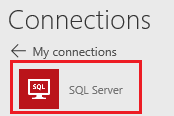
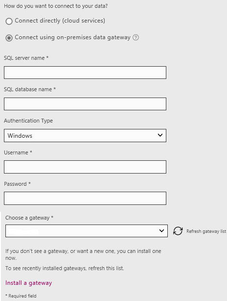
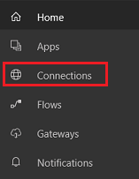
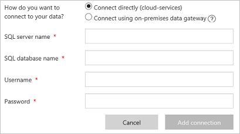
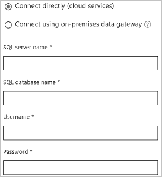
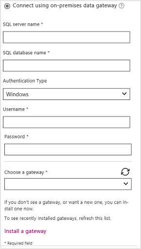

# 从 PowerApps 连接到 SQL Server

在 Azure 或本地数据库中连接到 SQL Server，以便在 PowerApps 中显示其中的信息。

**先决条件**

* [注册](../signup-for-powerapps.md) PowerApps、[安装](http://aka.ms/powerappsinstall) PowerApps Studio，打开该程序，然后提供过去注册所用的同一凭据进行登录。
* 使用主键收集包含至少一个表的数据库的以下信息：
  
  * 数据库的名称
  * 托管数据库的服务器的名称
  * 用于连接数据库的一个有效用户名和密码
  * 连接数据库所需的身份验证类型
    
    如果没有此信息，请询问要使用的数据库的管理员。
* 对于本地数据库，标识与你共享的[数据网关](../gateway-management.md)（或创建一个数据网关）。
  
    **注意**：只能在用户的[默认环境](../working-with-environments.md)中创建和使用网关和本地连接。

## 自动生成应用
1. 在 PowerApps Studio 中，单击或点击“文件”菜单（沿左边缘）上的“新建”。
   
    
2. 在“开始处理数据”下，单击或点击连接器行末尾的右箭头。
3. 如果已有要使用的数据库的连接，单击或点击此连接，然后跳到此过程的步骤 7。
4. 单击或点击“新建连接”，然后单击或点击“SQL Server”。
   
    
5. 执行以下任一步骤：
   
   * 指定“直接连接(云服务)”，然后键入或粘贴要使用的数据库的服务器名称、数据库名称、用户名和密码。
     
       
   * 指定“使用本地数据网关连接”，然后键入或粘贴要使用的数据库的服务器名称、数据库名称、用户名和密码，并指定身份验证类型和网关。
     
       
     
       **注意**：如果没有网关，可[安装网关](../gateway-reference.md)，然后单击或点击“刷新网关列表”。
6. 单击或点击“连接”。
7. 单击或点击“选择数据集”下的选项，单击或点击“选择表”下的选项，然后单击或点击“连接”。
   
    PowerApps 可创建在三个屏幕中显示数据的应用。 启发会建议显示的数据属性，但可能需要自定义 UI 以满足你的需求。
8. 通过使用类似[通过 Excel 创建应用](../get-started-create-from-data.md)中介绍的技术来自定义应用，开始更改应用布局。

## 从头开始构建应用
1. 使用注册 PowerApps 所用的同一帐户登录 [powerapps.com](https://web.powerapps.com)。
2. 在左侧导航栏中，单击或点击“连接”：  
   
    
3. 在右上角，单击或点击“新建连接”，然后单击或点击“SQL Server”。
4. 执行以下任一步骤：
   
   * 指定“直接连接(云服务)”，然后键入或粘贴要使用的数据库的服务器名称、数据库名称、用户名和密码。
     
       
   * 指定“使用本地数据网关连接”，然后键入或粘贴要使用的数据库的服务器名称、数据库名称、用户名和密码，并指定身份验证类型和网关。
     
       
     
       **注意**：如果没有网关，可[安装网关](../gateway-reference.md)，然后单击或点击顺时针图标来刷新列表。
5. 单击或点击“创建”以创建连接。
6. 通过使用类似[从头开始创建应用](../get-started-create-from-blank.md)中介绍的技术来创建应用。

## 更新现有应用
1. 在 PowerApps Studio 中，打开想要更新的应用。
2. 在功能区中的“视图”选项卡上，单击或点击“数据源”。
3. 单击或点击右侧窗格中的“添加数据源”。
   
    
4. 单击或点击“新连接”，单击或点击“SQL Server”，然后单击或点击“连接”。
5. 执行以下任一步骤：
   
   * 指定“直接连接(云服务)”，然后键入或粘贴要使用的数据库的服务器名称、数据库名称、用户名和密码。
     
       
   * 指定“使用本地数据网关连接”，然后键入或粘贴要使用的数据库的服务器名称、数据库名称、用户名和密码，并指定身份验证类型和网关。
     
       
     
       **注意**：如果没有网关，可[安装网关](../gateway-reference.md)，然后单击或点击圆形图标来刷新列表。
6. 单击或点击“连接”。
7. 单击或点击“选择数据集”下的选项。
8. 在“**选择表**”下，选中一个或多个复选框，然后单击或点击“连接”。

## 后续步骤
* 了解如何[显示来自数据源的数据](../add-gallery.md)。
* 了解如何[查看详细信息和创建或更新记录](../add-form.md)。
* 请参阅其他可连接的[数据源](../connections-list.md)类型。  
* [了解表和记录](../working-with-tables.md)以及表格数据源。

<!--NotAvailableYet
## View the available functions ##
This connection includes the following functions:

| Function Name |  Description |
| --- | --- |
|[GetItems](connection-azure-sqldatabase.md#getitems) | Retrieves rows from a SQL table |
|[PostItem](connection-azure-sqldatabase.md#postitem) | Inserts a new row into a SQL table |
|[GetItem](connection-azure-sqldatabase.md#getitem) | Retrieves a single row from a SQL table |
|[DeleteItem](connection-azure-sqldatabase.md#deleteitem) | Deletes a row from a SQL table |
|[PatchItem](connection-azure-sqldatabase.md#patchitem) | Updates an existing row in a SQL table |
|[GetTables](connection-azure-sqldatabase.md#gettables) | Retrieves tables from a SQL database |

### GetItems
Get rows: Retrieves rows from a SQL table

#### Input properties

| Name| Data Type|Required|Description|
| ---|---|---|---|
|table|string|yes|Name of SQL table|
|$skip|integer|no|Number of entries to skip (default = 0)|
|$top|integer|no|Maximum number of entries to retrieve (default = 256)|
|$filter|string|no|An ODATA filter query to restrict the number of entries|
|$orderby|string|no|An ODATA orderBy query for specifying the order of entries|

### PostItem
Insert row: Inserts a new row into a SQL table

#### Input properties

| Name| Data Type|Required|Description|
| ---|---|---|---|
|table|string|yes|Name of SQL table|
|item| |yes|Row to insert into the specified table in SQL|

#### Output properties

| Property Name | Data Type | Required | Description |
|---|---|---|---|
|value|array|No | |

### GetItem
Get row: Retrieves a single row from a SQL table

#### Input properties

| Name| Data Type|Required|Description|
| ---|---|---|---|
|table|string|yes|Name of SQL table|
|id|string|yes|Unique identifier of the row to retrieve|

#### Output properties

| Property Name | Data Type | Required | Description |
|---|---|---|---|
|ItemInternalId|string|No | |

### DeleteItem
Delete row: Deletes a row from a SQL table

#### Input properties

| Name| Data Type|Required|Description|
| ---|---|---|---|
|table|string|yes|Name of SQL table|
|id|string|yes|Unique identifier of the row to delete|

#### Output properties
None.

### PatchItem
Update row: Updates an existing row in a SQL table

#### Input properties

| Name| Data Type|Required|Description|
| ---|---|---|---|
|table|string|yes|Name of SQL table|
|id|string|yes|Unique identifier of the row to update|
|item| |yes|Row with updated values|

#### Output properties

| Property Name | Data Type | Required | Description |
|---|---|---|---|
|ItemInternalId|string|No | &nbsp; |

### GetTables
Get tables: Retrieves tables from a SQL database

#### Input properties
None.

#### Output properties

| Property Name | Data Type | Required | Description |
|---|---|---|---|
|value|array|No | Can output the Name and DisplayName properties |

### ExecuteProcedure
Execute stored procedure: Executes a stored procedure in SQL

#### Input properties

| Name| Data Type|Required|Description|
| ---|---|---|---|
|procedure|string|yes|Procedure name|
|parameters| |yes|Input parameters|

#### Output properties
Result of the stored procedure execution.

| Property Name | Data Type | Required | Description |
|---|---|---|---|
|OutputParameters|object|No | Output parameter values |
|ReturnCode|integer|No | Return code of a procedure |
|ResultSets|object|No | Result sets|

-->
