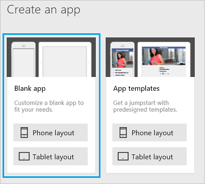
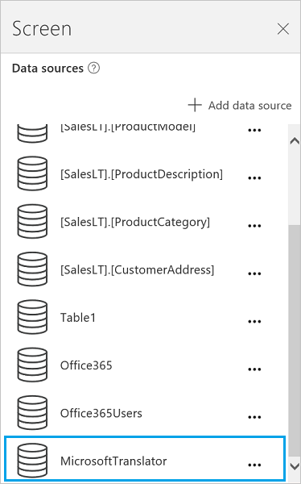
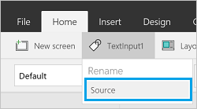

# 从 PowerApps 连接到 Microsoft Translator

添加 Microsoft Translator 连接器，以在应用的“标签”控件中显示已翻译的文本。 例如，可以创建一个输入文本框，要求用户输入要翻译的部分文本。 在另一个标签中，可以显示已翻译的文本。

本主题演示如何创建 Microsoft Translator 连接，如何在应用中使用 Microsoft Translator 连接，并列出可用的函数。

**请注意**：此连接器限定每个用户每天进行 150 次调用。

&nbsp;

[!INCLUDE [connection-requirements](../../includes/connection-requirements.md)]

## 连接到 Microsoft Translator
1. 打开 PowerApps，选择“新建”，然后创建一个“空白应用”。 选择手机或平板电脑布局。 平板电脑布局为你提供了多个工作区：  
   
   
2. 在右侧窗格中，单击或点击“数据”选项卡，然后单击或点击“添加数据源”。
3. 选择“新建连接”，然后选择“Microsoft Translator”：  
   
    
   
    
4. 选择“连接”。 连接显示在“数据源”下：  
   
    

## 在应用中使用 Microsoft Translator 连接
### 翻译文本
1. 在“**插入**”菜单上，选择“**文本**”，然后选择“**文本输入**”。 将文本输入控件重命名为“Source”：  
   
    
2. 添加“下拉”列表（“插入”“菜单”>“控件”），将其重命名为“TargetLang”并移至“Source”下方。
3. 将“TargetLang”的 **[Items](../controls/properties-core.md)** 属性设置为以下公式：  
   
    `MicrosoftTranslator.Languages()`
4. 添加一个标签，将它移到“TargetLang”下方，然后将“[Text](../controls/properties-core.md)”属性设置为以下公式：  
   
    `MicrosoftTranslator.Translate(Source.Text, TargetLang.Selected.Value)`
5. 向“Source”键入一些文本，然后在“TargetLang”中选择语言。 此时，标签显示用选定语言输入的文本：  
   
    

### 朗读已翻译的文本
如果尚未执行，请按照上一部分中的步骤操作，翻译一些文本。 以下后续步骤使用同一控件。

1. 将“TargetLang”下拉列表的 **[Items](../controls/properties-core.md)** 属性设置为以下公式：  
   
    `MicrosoftTranslator.SpeechLanguages()`
2. 将第二个标签（不是“Source”框）重命名为“Target”。
3. 添加“音频”控件（“插入”“菜单”>“媒体”），并将其“Media”属性设置为以下公式：  
   
    `MicrosoftTranslator.TextToSpeech(Target.Text, TargetLang.Selected.Value)`
4. 按 F5，或选择“预览”按钮 ()。 向“Source”键入一些文本，在“TargetLang”中选择语言，然后选择音频控件中的播放按钮。
   
    应用将播放你使用所选的语言输入的文本的音频版本。
5. 按 Esc 返回默认工作区。

### 检测源语言
以下步骤使用同一**源**文本输入控件和**目标**文本控件。 可以根据喜好创建新的控件，只需更新公式中的名称即可。

1. 选择“目标”文本控件，并将 **[Text](../controls/properties-core.md)** 属性设置为以下公式：  
   
    `MicrosoftTranslator.Detect(Source.Text).Name`
2. 向“Source”键入一些文本。
   
    此时，标签显示所键入文本的语言。 例如，如果键入“bonjour”，则标签显示“法语”；如果键入“ciao”，则标签显示“意大利语”。

## 查看可用函数
此连接包括以下函数：

| 函数名称 | 说明 |
| --- | --- |
| [Languages](connection-microsoft-translator.md#languages) |检索 Microsoft Translator 支持的所有语言 |
| [Translate](connection-microsoft-translator.md#translate) |使用 Microsoft Translator 将文本翻译为指定的语言 |
| [Detect](connection-microsoft-translator.md#detect) |检测给定文本的源语言 |
| [SpeechLanguages](connection-microsoft-translator.md#speechlanguages) |检索可用于语音合成的语言 |
| [TextToSpeech](connection-microsoft-translator.md#texttospeech) |将给定文本转换为声波格式音频流的语音 |

### 语言
获取语言：检索 Microsoft Translator 支持的所有语言

#### 输入属性
无。

#### 输出属性
| 属性名称 | 数据类型 | 需要 | 说明 |
| --- | --- | --- | --- |
| 代码 |字符串 |否 | |
| 名称 |字符串 |否 | |

### Translate
翻译文本：使用 Microsoft Translator 将文本翻译为指定的语言

#### 输入属性
| 名称 | 数据类型 | 需要 | 说明 |
| --- | --- | --- | --- |
| query |字符串 |是 |要翻译的文本 |
| languageTo |字符串 |是 |目标语言代码（例如：“fr”） |
| languageFrom |字符串 |否 |源语言（如未提供，Microsoft Translator 将尝试自动检测）（例如：en） |
| category |字符串 |否 |翻译类别（默认：“常规”） |

#### 输出属性
无。

### Detect
检测语言：检测给定文本的源语言

#### 输入属性
| 名称 | 数据类型 | 需要 | 说明 |
| --- | --- | --- | --- |
| query |字符串 |是 |将要标识其语言的文本 |

#### 输出属性
| 属性名称 | 数据类型 | 需要 | 说明 |
| --- | --- | --- | --- |
| 代码 |字符串 |否 | |
| 名称 |字符串 |否 | |

### SpeechLanguages
获取语音语言：检索可用于语音合成的语言

#### 输入属性
无。

#### 输出属性
| 属性名称 | 数据类型 | 需要 | 说明 |
| --- | --- | --- | --- |
| 代码 |字符串 |否 | |
| 名称 |字符串 |否 | |

### TextToSpeech
文本到语言：将给定文本转换为声波格式音频流的语音

#### 输入属性
| 名称 | 数据类型 | 需要 | 说明 |
| --- | --- | --- | --- |
| query |字符串 |是 |要转换的文本 |
| language |字符串 |是 |用于生成语音的语言代码（示例：“en-us”） |

#### 输出属性
无。

## 有用链接
查看所有[可用连接](../connections-list.md)。  
了解如何向你的应用[添加连接](../add-manage-connections.md)。

