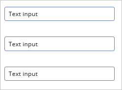

# 从 PowerApps 连接到 Office 365 Outlook

如果连接到 Office 365 Outlook，则除了其他任务之外，还可以显示、发送、删除和回复电子邮件。

可以添加控件，从而在应用中实现这些功能。 例如，可以添加“文本输入”控件来提示输入电子邮件的收件人、主题和正文，也可以添加“按钮”控件来发送电子邮件。

本主题演示了如何将 Office 365 Outlook 添加为连接、如何将 Office 365 Outlook 添加为应用的数据源，以及如何在不同的控件中使用此数据。

> [!IMPORTANT]
> 截至本文撰写之时，日历操作不支持周期性活动。

[!INCLUDE [connection-requirements](../includes/connection-requirements.md)]

## 连接到 Office 365 Outlook
1. [添加数据连接](../add-data-connection.md)并选择 **Office 365 Outlook**：  
   
    
2. 选择“**连接**”，如果系统提示你登录，请输入你的工作帐户。

Office 365 Outlook 连接已创建，并已添加到应用中。 现在可供使用。

## 显示邮件
1. 在“插入”菜单上，选择“库”，然后选择“文本库”控件。
2. 将其 **[Items](../controls/properties-core.md)** 属性设置为以下公式：  
   
    `Office365.GetEmails({fetchOnlyUnread:false})`
   
    系统会自动使用一些电子邮件填充库控件。
3. 在库中，将第一个标签的“Text”属性设置为“`ThisItem.From`”。 将第二个标签设置为“`ThisItem.Subject`”。 将第三个标签设置为“`ThisItem.Body`”。 还可以重设标签大小。
   
    系统会自动使用新属性填充库控件。
4. 此函数有几个可选参数。 将库的“Items”属性设置为以下公式之一：
   
    `Office365.GetEmails({fetchOnlyUnread:false})`  
    `Office365.GetEmails({fetchOnlyUnread:false, top:2})`  
    `Office365.GetEmails({folderPath:"Sent Items", fetchOnlyUnread:false, top:2})`  
    `Office365.GetEmails({folderPath:"Sent Items", fetchOnlyUnread:false, top:2, searchQuery:"powerapps"})`  
    `Office365.GetEmails({folderPath:"Deleted Items", fetchOnlyUnread:false, top:2, skip:3})`

## 发送邮件
1. 在“**插入**”菜单上，选择“**文本**”，然后选择“**文本输入**”。
2. 重复执行上述步骤两次，以创建三个框，再将这些框排入一列：  
   
    
3. 将这些控件重命名为：  
   
   * **inputTo**
   * **inputSubject**
   * **inputBody**
4. 在“插入”菜单上，选择“控件”，然后选择“按钮”。 将其 **[OnSelect](../controls/properties-core.md)** 属性设置为以下公式：  
   
    `Office365.SendEmail(inputTo.Text, inputSubject.Text, inputBody.Text)`
5. 移动按钮，使其出现在所有其他控件下方，并将其  **[Text](../controls/properties-core.md)** 属性设置为“发送电子邮件”。
6. 按 F5 或选择预览按钮 ()。 在“inputTo”中键入有效的电子邮件地址，并在其他两个“文本输入”控件中键入所需的任何内容。
7. 选择“发送电子邮件”来发送邮件。 按 Esc 返回默认工作区。

## 发送包含附件的邮件
例如，可以创建应用，以便用户能够使用设备摄像头拍摄照片，并将照片作为附件发送。 用户还可以将其他许多类型的文件附加到电子邮件应用。

若要向邮件添加附件，请按照上一部分中的步骤操作，不同之处在于（设置按钮的“OnSelect”属性时）添加用于指定附件的参数。 此参数采用表结构，最多可以在其中为每个附件指定三个属性：

* 名称
* ContentBytes
* @odata.type

> [!NOTE]
> 只能为一个附件指定 @odata.type 属性，并能将它设置为空字符串。

在以下示例中，照片将以 file1.jpg 的形式发送：

`Office365.SendEmail(inputTo.Text, inputSubject.Text, inputBody.Text, {Attachments:Table({Name:"file1.jpg", ContentBytes:Camera1.Photo, '@odata.type':""})})`

在以下示例中，除了照片之外，还将发送音频文件：

`Office365.SendEmail(inputTo.Text, inputSubject.Text, inputBody.Text, {Attachments:Table({Name:"file1.jpg", ContentBytes:Camera1.Photo, '@odata.type':""}, {Name:"AudioFile", ContentBytes:microphone1.audio })})`

## 删除邮件
1. 在“插入”菜单上，选择“库”，然后选择“文本库”控件。
2. 将其 **[Items](../controls/properties-core.md)** 属性设置为以下公式：  
   
    `Office365.GetEmails({fetchOnlyUnread:false})`
   
    系统会自动使用一些电子邮件填充库控件。
3. 在库中，将第一个标签的“Text”属性设置为“`ThisItem.Id`”。 将第二个标签设置为“`ThisItem.Subject`”。 将第三个标签设置为“`ThisItem.Body`”。
4. 选择库中的第一个标签，然后将其重命名为“EmailID”：
   
    
5. 选择库中的第三个标签，然后添加一个“按钮”控件（使用“插入”菜单）。 将按钮的“OnSelect”属性设置为以下公式：  
   
    `Office365.DeleteEmail(EmailID.Text)`
6. 按 F5 或选择预览按钮 ()。 选择库中的一封电子邮件，然后单击此按钮。 
    
    > [!NOTE]
    > 这会从收件箱中删除选定电子邮件。 因此，请慎重选择。
7. 按 Esc 返回默认工作区。

## 将邮件标记为已读
此部分使用的控件与[删除邮件](connection-office365-outlook.md#delete-a-message)部分一样。

1. 将按钮的“OnSelect”属性设置为以下公式：  
   
    `Office365.MarkAsRead(EmailID.Text)`
2. 按 F5 或选择预览按钮 ()。 选择一封未读电子邮件，再单击此按钮。
3. 按 Esc 返回默认工作区。

## 有用链接
* 有关所有函数及其参数的列表，请参阅 [Office 365 Outlook 参考](https://docs.microsoft.com/connectors/office365connector/)。
* 查看所有[可用连接](../connections-list.md)。  
* 了解如何[管理连接](../add-manage-connections.md)。

