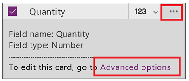
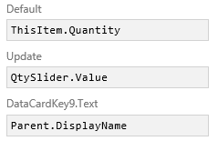

# 在 Microsoft PowerApps 中自定义卡
举例来说，通过更改卡控件执行基本的自定义（无需解锁卡）。 例如，通过解锁卡及添加默认情况下该卡无法使用的控件来执行高级自定义。

有关概述，请参阅 [了解数据卡](working-with-cards.md)。

**先决条件**

* 了解如何 [添加和配置控件](add-configure-controls.md)。
* 可以只查看针对此主题的一般概念。 若要完全按照此步骤（分步执行），请执行以下主题中的步骤：
  
  1. [利用 SharePoint 构建应用](app-from-sharepoint.md)。
  2. [自定义布局](customize-layout-sharepoint.md)。
  3. [自定义窗体](customize-forms-sharepoint.md)。

## 自定义锁定的卡
在此过程中，会将**[切换](controls/control-toggle.md)**控件替换为**[单选](controls/control-radio.md)**控件，而无需解锁卡。

1. 在“EditScreen1”中，单击或点击“已付款”卡以将其选中。
   
    
2. 在右侧窗格中，依次单击或点击“已付款”数据卡的数据卡选择器和“编辑选项”。
   
    
   
    屏幕将体现所做的更改。
   
    
   
    有关哪些类型的 SharePoint 列支持哪些类型的卡的信息，请参阅 [已知问题](connections/connection-sharepoint-online.md#known-issues)。

## 解锁和自定义卡
在此过程中，将解锁卡，然后将**[文本输入](controls/control-text-input.md)**控件替换为**[滑块](controls/control-slider.md)**控件。

1. 在“EditScreen1”中，单击或点击“数量”卡。
2. 在右侧窗格中，单击或点击该卡的省略号图标，然后单击或点击“高级选项”。
   
    
3. 在右侧窗格顶部，单击或点击锁图标以解锁卡。
   
    
4. 在卡中，删除“输入文本”控件，添加“滑块”控件，并将新的控件命名为 **QtySlider**。
5. 在右侧窗格中，将“数量”卡的“Update”属性设置为以下公式： 
   **QtySlider.Value**
   
   **注意**：如果未出现“Update”属性，则单击或点击“数据”部分底部的“更多选项”。
   
   
6. 单击或点击滑块以将其选中，然后打开右侧窗格顶部的控件列表。
7. 单击或点击“ErrorMessage4”，然后将其“Height”属性设置为以下公式： 
   **QtySlider.Y + QtySlider.Height**

