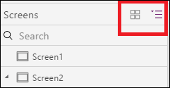

# 自定义 PowerApps 中的窗体
自定义**显示窗体**控件和**编辑窗体**控件，使其在可帮助用户轻松了解和更新数据的控件中，以最直观的顺序显示最重要的数据。

每个窗体包含一个或多个卡，其中每个卡均可显示数据源中特定列的数据。 按照本主题中的步骤操作，可以指定在窗体中显示的卡、在窗体中上下移动卡及配置每个列中的数据在卡内的显示方式。

如果不熟悉 PowerApps，请参阅 [PowerApps 简介](getting-started.md)。

## 必备组件
你可以查看本教程，了解一些基本概念，也可以严格按照以下步骤完成操作。

1. [创建连接](connect-to-sharepoint.md)（从 PowerApps 到 SharePoint）。
2. 创建 [自定义布局](customize-layout-sharepoint.md) 所描述的 SharePoint 列表。
3. 基于该列表 [自动生成应用](app-from-sharepoint.md)。
4. 在左侧导航栏中，单击或点击右上角的图标，切换到缩略图视图。
   
    

## 显示和隐藏卡
1. 在左侧导航栏中，单击或点击中间的缩略图，选择“**DetailsScreen1**”。
   
    
2. 单击或点击任意卡以将其选中，然后在右侧窗格中显示窗体自定义选项。
   
    
3. 在右侧窗格中，单击或点击“AccountID”数据卡的复选框可将其隐藏，单击或点击“ID”列的复选框可将其显示出来。
   
    

## 对卡重新排序
* 单击或点击“**标题**”卡可将其选中，然后向上拖动它的标题栏，直到“ **OrderDate**卡突出显示为止。
  
    
  
    正在移动的卡会正好显示在释放鼠标按钮时突出显示的卡的上方。
  
    

## 运行应用
1. 在左侧导航栏中，单击或点击中间的缩略图以选中“**BrowseScreen1**”。
   
    
2. 按 F5（或选择右上角附近的“**预览**”图标）打开预览模式。  
   
    
3. 在右上角，单击或点击加号图标，在“**EditScreen1**中添加一条记录。
   
    
4. 添加任何所需的数据，然后单击或点击右上角的选中标记图标，将新记录保存在 SharePoint 列表中并返回到“**BrowseScreen1**”。
   
    
5. 单击或点击刚刚创建的项的箭头，可在 **DetailScreen1** 中显示有关该项的详细信息。  
   
    
6. 在右上角，单击或点击加号图标，更新 **EditScreen1** 中的记录。
   
    
7. 更改一个或多个字段中的信息，然后单击或点击右上角的复选标记，保存对 SharePoint 列表所做的更改并返回到“DetailScreen1”。  
   
    
8. 单击或点击右上角附近的回收站图标，删除刚刚更新的记录并返回到“BrowseScreen1”。
   
    
9. 按 Esc 键（或者单击或点击左上角附近的关闭图标，具体位于 PowerApps 的标题栏 *下方* ），关闭预览模式。
   
    

## 后续步骤
* 按 Ctrl-S 保存应用，以便从其他设备运行该应用。
* [共享应用](share-app.md)，便于其他人运行该应用。

