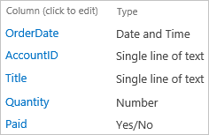
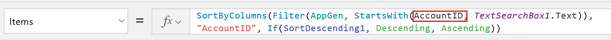
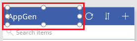
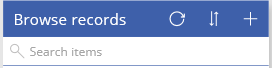

# 在 PowerApps 中自定义库布局
在 PowerApps 中自动生成应用后，自定义默认显示的浏览屏幕。 指定要使用的布局、要显示的列，以及排序和筛选记录时使用的列。

* 有关如何自动生成应用的信息，请参阅 [生成应用以管理 SharePoint 列表中的数据](app-from-sharepoint.md)。
* 如果不熟悉 PowerApps，请参阅 [PowerApps 简介](getting-started.md)。

## 必备组件
你可以查看本教程，了解一些基本概念，也可以严格按照以下步骤完成操作。

1. [创建连接](connect-to-sharepoint.md)（从 PowerApps 到 SharePoint）。
2. 创建包含以下列的 SharePoint 列表并命名为 **AppGen**。
   
    
3. 将以下项添加到刚刚创建的列表中。
   
    
4. 基于刚刚创建的列表 [自动生成应用](app-from-sharepoint.md)。
5. 在左侧导航栏中，单击或点击右上角的图标，切换到缩略图视图。
   
    

## 自定义库
1. 在左侧导航栏中，单击或点击顶部缩略图，以确保选择“BrowseScreen1”。
   
    
   
    “BrowseScreen1”显示 SharePoint 列表中每一项的“AccountID”和“Title”。
   
    
   
    接下来，指定将显示每个项的 **OrderDate** ，而不显示 **AccountID** 。
2. 单击或点击屏幕上第一个项的 **AccountID**。
   
    单击或点击 UI 元素（称为控件）并进行选择后，在该控件周围会显示具有调整大小图柄的选择边框。
   
    
3. 在右侧窗格中，打开“Title1”列表，然后单击或点击“OrderDate”。
   
    
   
    **BrowseScreen1** 可反映所做的更改。
   
    

有关库的详细信息，请参阅[在 PowerApps 中显示项列表](add-gallery.md)。

## 设置排序和搜索列
1. 单击或点击除第一条记录之外的任意记录，选择“**库**控件。
   
    
2. 确保左上角附近的属性列表显示**项**。
   
    
   
    编辑栏中显示的此属性值不仅可以确定屏幕上显示的数据源，还可以确定筛选和排序列。
   
    例如，默认情况下，编辑栏可能包含此公式。
   
    
   
    根据此公式，用户可以仅显示“AccountID”列中值以键入的一个或多个字母开头的记录。
   
    
   
    例如，如果用户在搜索栏中键入字母“A”，那么屏幕上会显示 Europa 对应的记录。 该记录的标题不匹配搜索条件，但帐户 ID 匹配搜索条件。 稍后在此过程中，可以将公式更改为按“Title”列筛选记录。
   
    在任何生成的应用中，通过单击或点击靠近右上角的排序按钮，用户可以按字母顺序对记录进行升序或降序排序。 此公式指定根据 **AccountID** 列对记录进行排序。
   
    
   
    在本过程的后续步骤中，用户可以更改公式以根据“**标题**”列对记录进行排序。
3. 在编辑栏中，将两个“AccountID”实例替换成“Title”（在第二个示例两边加上双引号）。
   
    编辑栏现在应包含类似于以下示例的公式： 
    **SortByColumns(Filter(AppGen, StartsWith(Title, TextSearchBox1.Text)), "Title", If(SortDescending1, Descending, Ascending))**
   
    **注意**：在 **TextSearchBox** 之后出现的数字可能较大，具体取决于之前执行的操作。 但是，公式应仍会按预期运行。

## 测试排序和搜索
1. 按 F5（或者单击或点击靠近右上角的播放按钮）即可打开预览模式。
   
    
2. 在 **BrowseScreen1** 的右上角附近，一次多多次单击或点击排序按钮，在升序和降序之间更改字母排序顺序。
   
    
3. 在搜索框中，键入一个或多个字母，仅显示标题以键入的一个或多个字母开头的记录。
   
    
4. 删除搜索栏的所有文本，然后按 Esc 键（或者单击或点击 PowerApps 标题栏 *下方* 的关闭图标）即可关闭预览模式。
   
    

## 更改屏幕标题
1. 单击或点击屏幕标题以将其选中。
   
    
2. 确保属性列表显示**文本**，然后在编辑栏中键入所需的名称，并用双引号括住。
   
    
   
    **BrowseScreen1** 可反映所做的更改。
   
    

## 后续步骤
* 按 CTRL-S 保存所做的更改。
* 通过显示、隐藏和重新排序窗体所显示的字段，可在应用中 [自定义窗体](customize-forms-sharepoint.md)。

