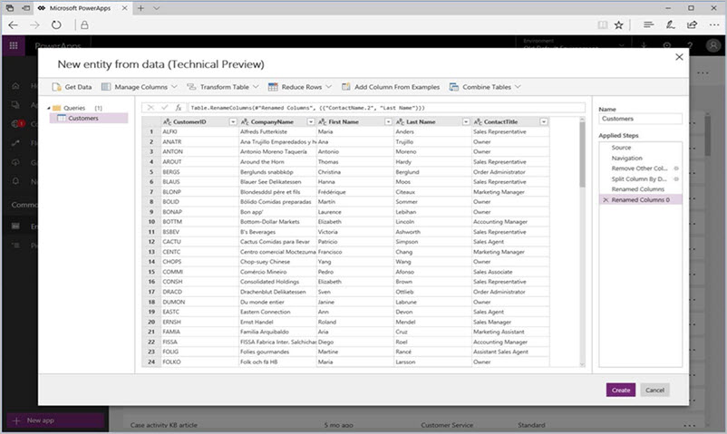
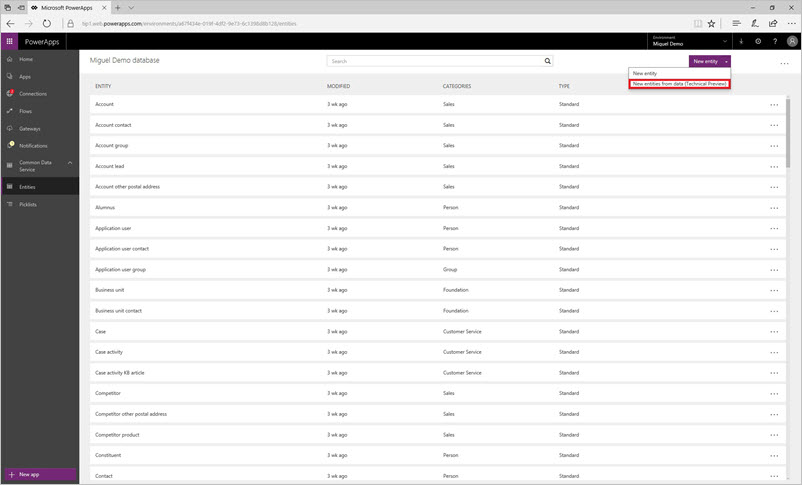
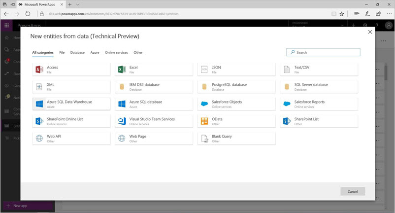
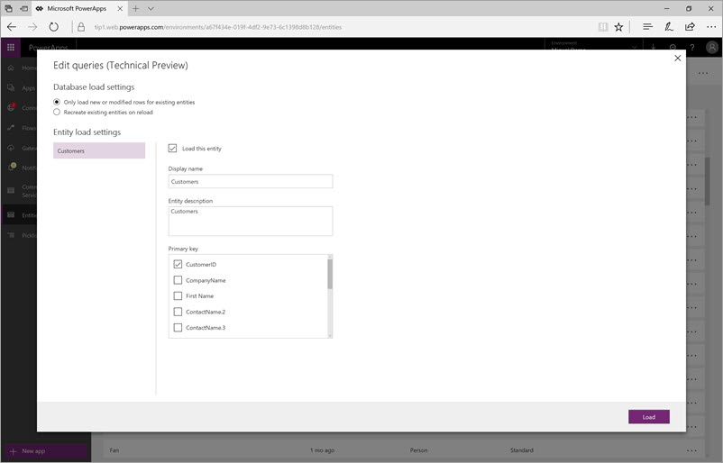

# 使用 Power Query 在 Common Data Service (CDS) 中新建实体
集成 Power Query 后，商业应用程序开发者可以根据各种数据源在 Common Data Service (CDS) 中新建实体。

使用 Common Data Service，用户可以在一组标准实体和自定义实体中安全地存储和管理数据。 实体是一组用于存储数据的字段，类似于数据库中的表。 将数据存储在 Common Data Service 后，可以使用 Microsoft PowerApps 生成各种应用程序，以使用存储的数据。

集成 Power Query 后，使用 PowerApps 的商业应用程序开发者可以根据外部数据源中的数据，在 Common Data Service 中新建实体，包括本地数据源（如关系数据库（SQL Server、IBM DB2 等）、Excel、Access 和文本文件）、在线服务（Salesforce、Azure SQL 数据库和数据仓库、Web API、OData 数据源）以及其他许多数据源。 除了可以连接到各种数据源，使用 Power Query，还可以先筛选、转换和组合数据，然后再将数据加载到 Common Data Service。

## 启用使用 Power Query 新建 CDS 实体的功能
此功能在 PowerApps 租户中可用，但默认处于禁用状态。 可以在 [web.powerapps.com](https://aka.ms/pqocds) 中启用此功能。

**注意：**只能在已创建的数据库中新建自定义实体。

在 PowerApps 门户中，按照下列步骤操作，启用此功能：

1. 在左侧导航窗格中，依次转到“Common Data Service”>“实体”选项卡。
2. 在“实体”列表中，选择“新建实体”下拉菜单。
3. 在下拉菜单显示的列表中，选择“根据数据新建实体(技术预览版)”，如下图所示。
   
    
4. 从菜单中选择“根据数据新建实体(技术预览版)”后，便会看到一个对话框，其中列出了技术预览版中的可用连接器，如下图所示。
   
   
5. 选择要使用的连接器后，便可以继续执行后续步骤，指定数据源连接详细信息和凭据、选择要导入的表等。 还可以访问“查询编辑器”（使用“导航器”视图中的“编辑”按钮），从而在将数据导入 CDS 前执行筛选或数据转换步骤。
   
    

## 调整加载设置和其他行为
完成上一部分中的步骤，且数据源可用于 在 CDS 中使用 Power Query 新建实体后，便可以调整其他加载设置，如刷新行为和实体专属设置（如显示名称、主键等）。

完成这些步骤并选择“加载”后，便会在 CDS 中新建自定义实体。 初始加载后，也可以访问特定实体的“实体”菜单，从而编辑查询。

我们非常高兴地宣布推出此功能，很想听到大家的反馈。 请[向我们发送对此功能的建议和反馈](https://powerusers.microsoft.com/t5/PowerApps-Community/ct-p/PowerApps1)！

