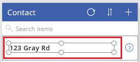

# 使用 Common Data Service 数据库生成应用
可自动生成应用来管理存储在 Common Data Service 中的数据。 可管理多个标准实体中的一个实体（内置于模型中）或自定义实体（你或组织中的其他人所创建）中的数据。

如果不熟悉 Common Data Service，请参阅[了解实体](data-platform-intro.md)。

本主题介绍如何自动生成应用，该应用基于所指定的单个实体。 有关如何生成基于多个实体的应用的信息，请参阅[从头开始构建应用](data-platform-create-app-scratch.md)。

默认情况下，Microsoft PowerApps 生成的每个应用均具有三个屏幕：

* 浏览屏幕显示一个或多个字段的子集、搜索栏和排序按钮，这样用户可以轻松地查找特定记录。
* 详细信息屏幕显示特定记录的多个字段或所有字段。
* 编辑屏幕提供 UI 元素，用户可在其中创建或更新记录并保存其更改。

> [!NOTE]
> 通过 Common Data Service 生成应用时，无需从 PowerApps 建立连接，这一点不同于 SharePoint、Dynamics 365 和 Salesforce 等数据源。 只能指定想要在应用中显示、管理，或同时执行上述两项操作的实体。

## 生成应用
1. 创建 Common Data Service 数据库。 有关详细信息，请参阅[创建 Common Data Service 数据库](create-database.md)。

2. 在适用于 Windows 的 PowerApps Studio 中，单击或点击“文件”菜单（左边缘附近）上的“新建”。

3. 在“开始处理数据”下，在“Common Data Service”磁贴中，单击或点击“Phone 布局”。

4. 在“**选择实体**”下，单击或点击“**联系人**”实体。

5. 单击或点击“**连接**”以自动生成应用。

    此时，可能会提示观看介绍性教程。 稍后，还可以通过单击或点击右上角附近的问号，然后单击或点击“获取简介教程”来获取教程。

6. 在左侧导航栏中，单击或点击右上角的图标，切换到缩略图视图。

    

## 自定义浏览屏幕
1. 在右侧窗格中，单击或点击仅显示标题的布局。

    

2. 在搜索框下，单击或点击“标签”控件以选择它。

    

3. 在右侧窗格中，在下拉列表中选择“给定的姓名的姓氏”

    此时，选择的“标签”控件显示这个字段中的数据。

4. 在浏览屏幕中，单击或点击顶部名称之外的任何名称来选择库。

    选择框会环绕该库。

    

5. 通过选中并按 Ctrl+C 来复制下面的公式。

    **SortByColumns(Search(Contact, TextSearchBox1.Text, "Name_Surname"), "Name_Surname", If(SortDescending1, Descending, Ascending))**

6. 确保左上角附近的属性列表显示**项**。

7. 在公式栏中，选择默认公式。

    

8. 按 Delete 删除默认公式，然后粘贴复制的公式。 库中的名称按字母顺序排序。

## 测试浏览屏幕
1. 按 F5 或者单击或点击靠近右上角的“播放”按钮即可打开预览模式。

2. 使用触摸屏或鼠标滚轮滚动浏览所有记录，或者用鼠标指向库以显示滚动条。

3. 在右上角附近，一次或多次单击或点击排序按钮，以更改名称列出顺序。

    

4. 在搜索框中，键入字母以仅显示含该字母的名称。

5. 从搜索框中删除所有文本，然后单击或点击列表中第一个名称右侧的箭头。

    此时打开详细信息屏幕，并显示所选联系人的详细信息。

6. 按 Esc 或者单击或点击右上角附近的标题栏下方的“关闭”按钮即可返回设计工作区。

## 自定义其他屏幕
1. 如果**详细信息屏幕**未显示，单击左侧导航栏中间的缩略图。

2. 在“详细信息屏幕”顶部附近，单击或点击“完整名称”以显示用于自定义该屏幕上窗体的选项。

3. 在右侧窗格中，单击或点击 **Name_MiddleName** 的眼睛按钮，以隐藏该字段。

4. 在右侧窗格中，单击或点击  的眼睛按钮，以显示该字段。

5. 在右侧窗格中，将 **Name_Surname** 向上拖动，然后将其置于 **Name_GivenName** 下方。

    **详细信息屏幕**将反映所做更改。

6. 在左侧的导航栏中，单击或点击底部缩略图，以显示**编辑屏幕**，然后重复此过程中的前述步骤，以使**编辑屏幕**匹配**详细信息屏幕**。

## 测试应用程序
1. 在左侧导航栏中，单击或点击顶部的缩略图以打开浏览屏幕。

2. 按 F5 或者单击或点击靠近右上角的“播放”按钮即可打开预览模式。

3. 在浏览屏幕的右上角，单击或点击加号 (**+**) 图标以创建记录。

4. 在“名字”和“姓氏”字段中添加文本，然后单击或点击复选标记按钮以保存新记录并返回到浏览屏幕。

5. 查找刚创建的记录，然后单击或点击其右侧的箭头以在详细信息屏幕中显示该记录。

6. 在右上角，单击或点击铅笔按钮以在编辑屏幕中显示该记录。

7. 更改“名字”字段中的数据，然后单击或点击复选标记按钮以保存所做更改。

8. 在右上角附近单击或点击回收站按钮，以删除创建和更新的记录。

## 后续步骤
[使用 Common Data Service 数据库从头开始创建应用](data-platform-create-app-scratch.md)
