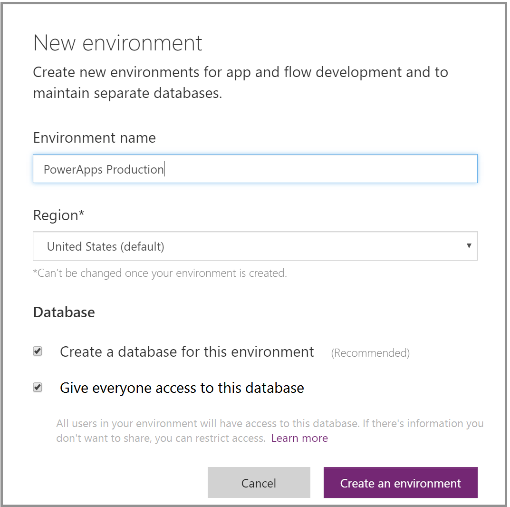

# 环境概述
环境是 PowerApps 中的一个新概念。 简单来说，环境是指用于存储、管理和共享组织中业务数据、应用和流的空间。 还可以将环境用作分隔具有不同角色、安全要求或目标受众的应用的容器。 环境的使用方式视组织和要生成的应用而定。 例如：

1. 可以选择仅在一个环境中生成应用。
2. 可以创建不同的环境，对测试版和生产版应用进行分组。
3. 可以创建不同的环境，对应于公司中的特定团队或部门，每个环境包含各个受众的相关数据和应用。
4. 还可以创建不同的环境，对应于公司的其他全球分支机构。  

## 环境范围
每个环境都是在 Azure AD 租户下创建的，只有相应租户中的用户才能访问环境中的资源。 环境还会与地理位置（如美国）绑定。 在环境中创建应用后，此应用只会路由到位于该地理位置的数据中心。 在此环境中创建的所有项（包括连接、网关、使用 Microsoft Flow 的流等）也会与此环境的地理位置绑定。

每个环境可以有 0 或 1 个 Common Data Service 数据库，从而为应用提供存储空间。 能否为环境创建数据库取决于你购买的 PowerApps 许可证以及你在相应环境内拥有的权限。 有关详细信息，请参阅[定价信息](pricing-billing-skus.md)。

在环境中创建应用后，此应用只能连接也在同一环境中部署的数据源，包括连接、网关、流和 Common Data Service 数据库。  例如，假设在一个应用场景中，你创建了两个名为“Test”和“Dev”的环境，并在每个环境中创建了 Common Data Service 数据库。 如果你在“Test”环境中创建应用，那么此应用只能连接“Test”数据库，无法连接“Dev”数据库。

此外，还可以在两个环境之间移动资源。 有关详细信息，请参阅[迁移资源](environment-and-tenant-migration.md)。

## 环境权限
环境中内置两个角色，在环境中拥有相应的权限：

* 环境管理员角色可以执行所有环境管理操作，包括以下操作：
  
  o    授予或撤销用户或组的“环境管理员”或“环境创建者”角色
  
  o    为环境预配 Common Data Service 数据库
  
  o    查看和管理在环境中创建的所有资源
  
  o    设置数据丢失防护策略。 有关详细信息，请参阅[数据丢失防护策略](prevent-data-loss.md)。
* 环境创建者角色角色可以在环境中创建资源，包括应用、连接、自定义连接器、网关和 Microsoft Flow 流。

环境创建者还可以与个人用户共享自己在环境中生成的应用，从而向组织中的其他用户分发此应用，或向安全组或组织中的所有用户分发此应用。 有关详细信息，请参阅[在 PowerApps 中共享应用](share-app.md)。

分配到这些环境角色的用户或组并不会自动获得对环境内数据库（若有）的访问权限，必须由数据库所有者单独授予。 有关详细信息，请参阅[配置数据库安全性](database-security.md)。

环境管理员可以在 [PowerApps 管理中心][1]向用户或安全组分配这两个角色中的任意一个。 有关详细信息，请参阅[环境管理](environments-administration.md)。

## 默认环境
PowerApps 自动为每个租户创建一个默认环境，并由相应租户中的所有用户共享。 只要新用户注册 PowerApps，就会自动获得默认环境的创建者角色。 默认环境在离 AAD 租户的默认区域最近的区域创建。

> [!NOTE]
> 任何用户都不会自动获得默认环境的环境管理员角色。 有关详细信息，请参阅[环境管理](environments-administration.md)。
> 
> 

默认环境的命名方式如下：“{Azure AD 租户名称} (默认)”

## 选择环境
随着环境的引入，你现在会在访问 [https://web.powerapps.com](https://web.powerapps.com) 时获得全新的体验。站点中可见的应用、连接和其他项现在会根据当前选定的环境进行筛选。  当前环境在标头右侧边缘附近的环境选取器中指定。 若要选择其他环境，请单击或点击选取器，查看可用环境列表。 单击或点击要进入的环境。

当你满足下列条件之一时，选取器中会显示环境：

1. 你是相应环境的环境管理员角色的成员。
2. 你是相应环境的环境创建者角色的成员。
3. 你不是相应环境的环境管理员或环境创建者，但你拥有对相应环境中至少一个应用的“参与者”访问权限。 有关详细信息，请参阅[共享应用](share-app.md)。 **注意**：在这种情况下，你无法在此环境中创建应用。 只能修改已与你共享的现有应用。

## 创建环境
### 谁能创建环境？
你的许可证决定了你能否创建环境。

| 许可证 | 允许创建环境 |
| --- | --- |
| PowerApps P2 |√ |
| PowerApps P2 试用版 |√ |
| PowerApps P1 |x |
| PowerApps P1 试用版 |x |
| Dynamics 365 计划 |x |
| Office 365 计划 |x |
| Dynamics 365 应用和团队计划 |x |

每个用户最多可以创建两个环境。

### 在哪里可以创建环境？
可以通过 [PowerApps.com][2] 和 [PowerApps 管理中心][1]新建环境。 创建环境后，你会自动获得该环境的环境管理员角色。 作为环境管理员或环境创建者角色成员可以加入无限多个环境。 有关详细信息，请参阅[环境管理](environments-administration.md)。

## PowerApps 预览版用户会发现什么变化？
随着环境的引入，已加入 PowerApps 预览版的所有用户都会发现用户体验有所变化。  下表列出了美国和非美国用户可能会发现的变化：

| 用户 | 变化 |
| --- | --- |
| 创建了 Common Data Service 数据库的预览版用户 |你将看到名为“{你的名称} 的环境”的环境，其中包含预览版 Common Data Service 数据库，以及你针对此数据库生成的所有应用。  你将获得此环境的环境创建者和环境管理员角色，并成为该数据库的数据库所有者。 当 PowerApps 公开上市时，我们将升级 Common Data Service 的元数据。 此变化带来以下影响：仍能使用你针对预览版 Common Data Service 数据库生成的实体和应用，但无法在该数据库中创建字段或实体。 我们将很快发布指南，指导你如何创建数据库包含已升级元数据的环境，以及如何将应用迁移到此环境中。 **注意**：如果以预览版 Common Data Service 数据库为依据生成的任何应用还使用自定义连接器作为数据源，那么这些应用在此环境中暂时无效，因为所有自定义连接器都将迁移到默认环境中。 必须在此环境中重新创建自定义连接器，从而修复任何受影响的应用。 |
| 美国预览用户 |你在 PowerApps 预览期间创建的以下资源在租户的默认环境中可用： - 创建的所有应用（不包括任何已连接预览版 Common Data Service 数据库的应用） - 创建的所有连接和自定义连接器 - 安装的所有本地数据网关 |
| 非美国预览用户 |除了默认环境外，你还将看到名为“{Azure AD 租户} (来自预览)”的环境，其中包含你在 PowerApps 预览期间创建的以下资源： - 创建的所有应用（不包括任何已连接预览版 Common Data Service 数据库的应用） - 创建的所有连接和自定义连接器 - 安装的所有本地数据网关。 你将获得此环境的环境创建者角色。 |

预览用户是指 Microsoft PowerApps 公开上市 (GA) 前的用户。

在 PowerApps 公开上市 (GA) 两周后，包含预览内容的环境将被标记为只读（默认环境除外）；所有现有应用和流将继续在这些环境中正常运行，但你将无法创建应用或流。 我们强烈建议这些环境的用户将其内容迁移到默认环境或其他自定义环境中。 有关迁移流程的详细信息，请参阅以下博客（将在本周发布）：[Common Data Service 功能公告博客][3]。

### 针对美国预览用户的示例环境。

### 针对非美国预览用户的示例环境。

## 为组织管理环境
随着环境的引入，我们还推出了 PowerApps 管理中心。你可以在其中管理自己已创建或已获得环境管理员角色的所有环境。 在管理中心内，可以执行所有环境管理操作，包括以下操作：

* 授予或撤销用户或组的环境管理员或环境创建者角色。  有关详细信息，请参阅[环境管理](environments-administration.md)。
* 为环境预配 Common Data Service 数据库。 有关详细信息，请参阅[创建 Common Data Service 数据库](create-database.md)。
* 设置数据丢失防护策略。 有关详细信息，请参阅[数据丢失防护策略](prevent-data-loss.md)。
* 设置数据库安全策略（由数据库角色设置为开放或受限）。 有关详细信息，请参阅[配置数据库安全性](database-security.md)。
* Azure AD 租户全局管理员角色（包括 Office 365 全局管理员）的成员也可以在 PowerApps 管理中心内管理自己已在租户中创建的所有环境，并在整个租户范围内设置策略。

<!--Reference links in article-->
[1]: https://admin.powerapps.com
[2]: https://web.powerapps.com
[3]: https://aka.ms/cdspreviewtoga
