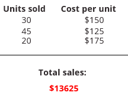

# PowerApps 中的 Average、Max、Min、StdevP、Sum 和 VarP 函数
用于对一组数字进行汇总的聚合函数。

## 说明
**Average** 函数可用于计算其参数的平均值（或算术平均值）。

**Max** 函数用于查找最大值。

**Min** 函数用于查找最小值。

**Sum** 函数可用于对其参数求和。

**StdevP** 函数可用于计算其参数的标准偏差。

**VarP** 函数可用于计算其参数的方差。

可以按如下形式为这些函数提供值：

* 分别列出每个参数。 例如，**Sum( 1, 2, 3 )** 会返回 6。
* 一个[表](../working-with-tables.md)和一个对表进行运算的公式。  通过公式对每条[记录](../working-with-tables.md#records)的值计算聚合。  

[!INCLUDE [record-scope](../includes/record-scope.md)]

这些函数只能对数值进行运算。 它们会忽略其他类型的值（例如字符串或记录）。 可使用 **[Value](function-value.md)** 函数将字符串转换成数值。

当与[支持这些函数的委派的数据源](../delegation-list.md)结合使用时，可以委派 Average、Max、Min 和 Sum 函数。  但是，不能为任何数据源委派 StdevP 和 VarP。  如果不支持委派，则只会检索数据的第一个部分，然后本地应用函数。  结果可能并不是事实的全部。  系统会在你创作时显示一个蓝点，提醒注意此限制，并建议尽可能改用可委托的替代项。 有关详细信息，请参阅[委托概述](../delegation-overview.md)。

## 语法
**Average**( *NumericalFormula1*, [ *NumericalFormula2*, ... ] ) **Max**( *NumericalFormula1*, [ *NumericalFormula2*, ... ] ) **Min**( *NumericalFormula1*, [ *NumericalFormula2*, ... ] ) **Sum**( *NumericalFormula1*, [ *NumericalFormula2*, ... ] ) **StdevP**( *NumericalFormula1*, [ *NumericalFormula2*, ... ] ) **VarP**( *NumericalFormula1*, [ *NumericalFormula2*, ... ] )

* *NumericalFormula(s)* - 必需。  要运算的数值。

**Average**( *Table*, *NumericalFormula* ) **Max**( *Table*, *NumericalFormula* ) **Min**( *Table*, *NumericalFormula* ) **Sum**( *Table*, *NumericalFormula* ) **StdevP**( *Table*, *NumericalFormula* ) **VarP**( *Table*, *NumericalFormula* )

* *Table* - 必需。  要运算的表。
* *NumericalFormula* - 必需。 用于对每条记录求值的公式。 这个公式的结果用于聚合。 你可以在公式中使用的表的列。

## 示例
### 分步操作
假设有一个名为 **Sales** 的[数据源](../working-with-data-sources.md)，其中包含 **CostPerUnit** 列和 **UnitsSold** 列，并且将一个标签的 **[Text](../controls/properties-core.md)** 属性设置为以下函数： 
**Sum(Sales, CostPerUnit * UnitsSold)**

这个标签会显示总销售额，计算方法如下：对每条记录，将这两列中的值相乘，然后将所有记录的计算结果相加。 

再举一个例子，假设有几个滑块，分别名为 **Slider1**、**Slider2** 和 **Slider3**，还有一个标签，其 **[Text](../controls/properties-core.md)** 属性设置为以下公式： 
**Sum(Slider1.Value, Slider2.Value, Slider3.Value)**

这个标签会显示为滑块设置的所有值的总和。

