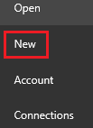
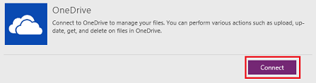
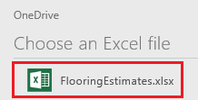
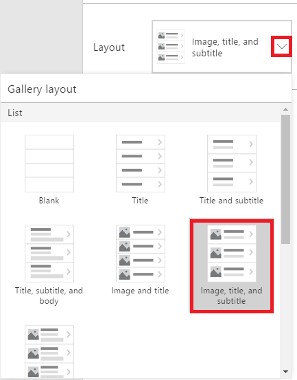
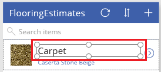
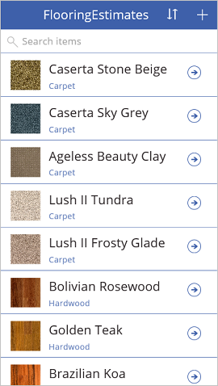
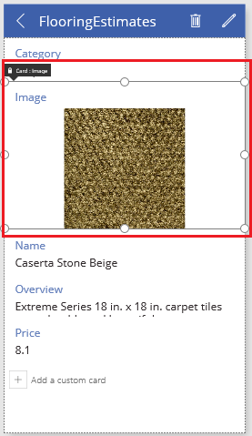
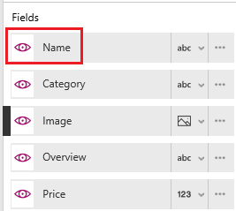
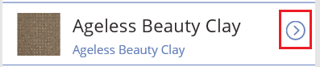

# 通过 Excel 数据生成应用
基于上传到云存储帐户（例如 OneDrive）的 Excel 文件中的数据自动构建应用。 生成应用后，自定义该应用，使其更好地满足你的需求，然后运行该应用并确保其按预期方式工作。

生成的应用默认包含三个屏幕：

* **BrowseScreen1** 显示一个或多个字段的子集、搜索栏和排序按钮，使用户可以轻松地查找特定记录。
* **DetailsScreen1** 显示特定记录的多个字段或所有字段。
* **EditScreen1** 提供 UI 元素，用户可在其中创建或更新记录并保存其更改。

**注意**：还可基于[自定义 SharePoint 列表](app-from-sharepoint.md)生成应用。

## 必备组件
* [注册](signup-for-powerapps.md) PowerApps，然后执行下列步骤之一：
  * 在运行 Windows 8、Windows 8.1 或 Windows 10 的计算机上安装[ PowerApps Studio for Windows](http://aka.ms/powerappsinstall)。
  * 在浏览器中打开[适用于 Web 的 PowerApps Studio](create-app-browser.md)（预览版）。
* 使用注册所用的同一凭据登录到 PowerApps。
* 请下载此 [Excel 文件](https://az787822.vo.msecnd.net/documentation/get-started-from-data/FlooringEstimates.xlsx)，并完全按照本教程操作。
  
    **重要提示**：如果数据已设置为表格式，则可使用自己的 Excel 文件。 有关详细信息，请参阅 [Create an Excel table in a worksheet](https://support.office.com/en-us/article/Create-an-Excel-table-in-a-worksheet-E81AA349-B006-4F8A-9806-5AF9DF0AC664)（在工作表中创建 Excel 表）。
* 将 Excel 文件上传到 OneDrive 或其他[云存储帐户](connections/cloud-storage-blob-connections.md)。

## 创建应用
1. 在 PowerApps Studio 中，单击或点击左边缘附近的“文件”菜单上的“新建”。
   
    
2. 请按照以下任意步骤进行操作：
   
   * 如果云存储帐户出现在“以你的数据开头”下，则单击或点击“手机布局”。
     
     
   * 如果云存储帐户没有出现在“使用你的数据开始”下，则单击磁贴行末尾的箭头。 如果帐户出现在连接列表中，则单击或点击该条目。
   * 如果云存储帐户没有出现在“使用你的数据开始”下或连接列表中，则单击或点击“新建连接”，然后单击或点击帐户的条目。 单击或点击“连接”，然后按照提示配置连接。
     
     
3. 在“**选择 Excel 文件**”下，浏览到“**FlooringEstimates.xlsx**”，然后单击或点击该文件。
   
      
4. 在“选择表”下，单击或点击“FlooringEstimates”。  
   
    
5. 单击或点击“**连接**”生成应用。
6. 如果系统提示获取简介教程，请单击或点击“下一步”来熟悉 PowerApps 用户界面的主要区域（也可以单击或点击“跳过”）。
   
    
   
    **注意**：稍后可以通过单击或点击右上角附近的问号图标，然后单击或点击“**获取简介教程**”，随时获取此教程。

## 更改库布局
生成应用后，虽然其中包含以你的数据为依据的默认布局，但可以根据自己的需求自定义库布局。

1. 在左侧导航栏中，单击或点击右上角的图标，切换到缩略图视图。
   
    
2. 单击或点击顶部缩略图，以确保选择浏览屏幕 (BrowseScreen1)。
3. 单击或点击库中的任意位置，如第一个图像。
   
    
4. 在右侧窗格中，打开“布局”列表，然后单击或点击包含图像、标题和副标题的布局。
   
    
   
    此时，应用布局会发生变化，以反映你的选择。
   
    

## 更改显示的数据
1. 在“搜索项”下，单击或点击“Carpet”，以选择“标签”控件。
   
   关联的列表在右侧窗格中突出显示。
   
   
2. 在右侧窗格中，打开突出显示的列表，然后单击或点击“名称”。
   
    
3. 打开底部的列表，然后单击或点击“类别”。
   
    
   
    **BrowseScreen1** 更改为显示各个记录的名称和类别。
   
    
   
    **注意**：默认情况下，使用鼠标滚轮或在触摸屏上向上和向下轻扫可以滚动浏览列表（称为库）。 若要使用触控板或没有滚轮的鼠标，请选择库，单击或点击属性列表中的“显示滚动条”，然后在公式栏中将 **false** 替换为 **true**。

## 更改窗体中的字段顺序
1. 在左侧导航栏中，单击或点击中间的缩略图来打开详细信息屏幕 (**DetailsScreen1**)。
   
    
2. 单击或点击图像以显示可用于自定义窗体的选项。
   
    
3. 在右侧窗格中，将“名称”字段拖到列表顶部。
   
    
   
    屏幕将更新以反映所做的更改。
   
    

## 更改控件
1. 在左侧导航栏中，单击或点击底部的缩略图来打开编辑屏幕 (**EditScreen1**)。
   
    
2. 单击或点击“概述”。
   
    此步骤可选中“概述”卡。 每个卡均包含用于描述卡用途的文本。 另外，还可以在卡上自定义控件。 有关详细信息，请参阅 [PowerApps 中的卡控件](controls/control-card.md)。
   
    
3. 在右侧窗格中，单击或点击卡的向下箭头，向下滚动，然后单击或点击“编辑多行文本”。
   
    此步骤将在大小足以显示文本的控件中显示各个产品的概述。
   
    

## 运行应用
自定义应用时，通过以“预览”模式运行应用，可测试所做的更改。

1. 在左侧导航栏中，单击或点击顶部的缩略图以打开浏览屏幕 (**BrowseScreen1**)。
2. 按 F5 或者单击或点击靠近右上角的“播放”按钮即可打开预览模式。
   
    
3. 在“BrowseScreen1”上，单击或点击记录右侧的箭头，在详细信息屏幕 (**DetailsScreen1**) 中显示该记录。
   
    
4. 在 **DetailsScreen1** 上，单击或点击右上角的铅笔图标，以在编辑屏幕 (**EditScreen1**) 中显示此记录。
   
    
5. 在 **EditScreen1** 上的一个或多个字段中更改信息，然后在右上角单击或点击选中标记，保存所做的更改。
   
    
6. 按 Esc 键（或者单击或点击标题栏下方的关闭图标）可关闭“预览”模式。
   
    

## 已知的限制
若要了解如何在组织内共享 Excel 数据，请[查看这些限制](connections/cloud-storage-blob-connections.md#sharing-excel-tables)。

## 后续步骤
* 按 Ctrl-S 保存应用，以便从其他设备运行该应用。
* 现在你已了解如何通过数据生成应用，你可以[从头开始创建应用](get-started-create-from-blank.md)。
* [共享应用](share-app.md)，便于其他人运行该应用。

