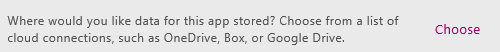

# 从模板创建并运行应用
基于针对特定方案的模板自动创建应用，然后运行该应用，了解其默认行为。 有关如何自定义应用，然后保存以供他人共享的实验。

## 先决条件
* [注册](signup-for-powerapps.md)、[安装](http://aka.ms/powerappsinstall) PowerApps，然后打开该程序，并提供注册所用的同一凭据进行登录。

    > [!NOTE]
> 若要使用此功能，请务必运行 2.0.510 或更高版本。 要确定版本，请（沿左边缘）打开“**文件**”菜单，单击或点击“**帐户**，然后在“**产品信息**”下查看。

* DropBox、OneDrive 或 Google Drive 等云存储帐户。

## 创建应用
1. 在适用于 Windows 的 PowerApps Studio 或适用于 Web 的 PowerApps Studio 中，单击或点击“新建”（靠近屏幕左侧边缘）。

    
2. 在“应用模板”磁贴上，单击或点击“手机布局”。

   > [!NOTE]
> 还可以通过平板电脑布局模板创建应用，但本教程重点介绍的是手机选项。

   

   将显示模板列表。

3. 如果未连接到云存储帐户：

   1. 在屏幕底部附近，单击或点击“选择”。

       
   2. 单击或点击要使用的帐户。

       
   3. 提供凭据，然后单击或点击“使用”授予访问权限。

       连接显示在屏幕底部附近。

4. 在模板列表中，单击或点击一个模板，然后单击或点击“**使用**”（靠近右下角）。

    

    示例数据将复制到云存储帐户，应用将得以创建，此应用主页也将显示。

## 运行应用
从模板创建的应用可在默认工作区打开，大部分时间都会在该工作区进行自定义。 对应用进行任何更改之前，请按照本节中的步骤，浏览应用在**预览**模式下的运行方式。

> [!TIP]
> 请在默认工作区中设计和开发应用，但先在预览模式下进行测试，再与其他人共享应用。

1. 如果尚未使用过 PowerApps，可以获取简介教程（也可以单击或点击“**跳过**”）。

    

    稍后可以通过单击或点击右上角附近的问号图标，然后单击或点击“**获取简介教程**”，随时获取教程。

2. 在左侧导航栏中，单击或点击最接近顶部的屏幕。

3. 按 F5（或者单击或点击右上角的右箭头）可在**预览**模式下打开应用。

    

    应用已使用示例数据进行了预填充，以展示应用的功能。 例如，成本估算器应用包含用于创建约会和估算在特定大小的室内安装指定地板产品成本的数据。

4. 浏览应用的默认行为，并确认云帐户中的数据可反映所做的更改。

    例如，创建约会并在成本估算器应用内创建预计成本。

5. 选择右上角的“**X**”图标（位于 PowerApps 标题栏下方）返回默认工作区。

    

## 自定义应用
此外，还可以通过以下方式自定义此应用或任何其他应用：

* [更改屏幕大小、方向，或同时更改这两项](set-aspect-ratio-portrait-landscape.md)
* [添加其他数据源](add-data-connection.md)
* [添加一个或多个屏幕](add-screen-context-variables.md)
* [添加并配置更多控件](add-configure-controls.md)
* [更改应用行为方式](working-with-formulas.md)

## 后续步骤
1. 按 Ctrl-S，为应用程序命名，然后单击或点击“**保存**”将应用保存到云。
2. 与组织内的其他人[共享应用](share-app.md)。

    > [!NOTE]
> 共享应用前，请确保共享对象有权访问数据。 例如，必须在云存储帐户中 [共享 Excel 或其他文件](share-app-data.md)。
