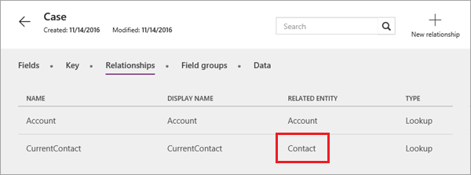
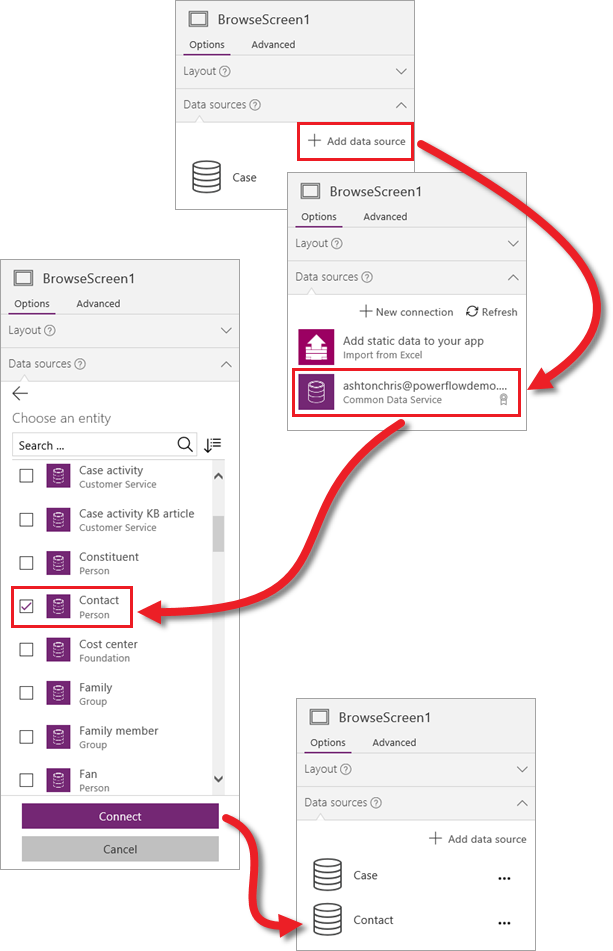
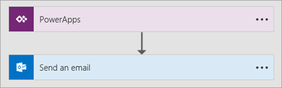

到目前为止，在此部分中，我们已经生成基于 Common Data Service 中“案例”实体的应用，探索了应用的各组成部分，并自定义了应用的多个方面。 在此部分的最后一个主题中，我们将引入另一个标准实体，并使用 Microsoft Flow 发送电子邮件。 应用会触发流，以便在案例更新时通知创建此案例的人员。 虽然我们将在此主题中完成的是特定方案，但你所掌握的技能可应用于多种类型的应用。 让我们从实体入手。

## <a name="review-entity-relationships"></a>检查实体关系
我们很快就会添加“联系人”实体，但先要检查“案例”和“联系人”实体之间的关系。 “案例”实体有一个字段是“**当前联系人**”，数据类型为“**查找**”。 也就是说，此字段与另一个表有关联。


在“**关系**”选项卡上，你会发现关联的实体为“**联系人**”。 请务必注意这一点，因为我们将在此主题的后面部分用到此关系。



## <a name="add-an-entity-to-the-app"></a>向应用添加实体
在 PowerApps 中添加数据源非常简单。 在右侧窗格中，依次单击或点击“**数据源**”和“**添加数据源**”。 在此示例中，依次选择“**Common Data Service**”连接和“**联系人**”实体。 单击或点击“**连接**”后，便会将此实体添加到应用中。 



请注意，在此示例中，我们添加的是另一实体的数据，你可以在应用中组合多个源的数据。 

## <a name="look-up-contact-information"></a>查找联系人信息
至此，我们已有权访问应用中的“联系人”实体数据，是时候将此类数据用起来了。 如引言所述，我们希望在案例更新时发送电子邮件。 为此，我们将使用两个公式和一个流。 第一个公式用于应用的编辑屏幕，尤其是保存按钮的 OnSelect 属性。


默认情况下，当用户在窗体中编辑数据时，此按钮使用公式 `SubmitForm(EditForm1)` 提交更新。 我们需要向此公式添加内容，使其先查找当前案例创建人的联系信息，然后将联系信息存储在本地应用中： 

```UpdateContext({contact:LookUp(Contact, ContactId=BrowseGallery1.Selected.CurrentContact.ContactId)}); SubmitForm(EditForm1)```

这确实有点复杂，但 James 从视频的 2:04 开始更精彩详细地介绍了此公式。

## <a name="trigger-a-flow-from-the-app"></a>在应用中触发流
至此，我们已知道每个案例的联系人，现在可以向他们发送电子邮件了。 虽然可以直接从应用发送电子邮件，但对于此示例，我们将展示如何在应用中触发流。 这就是流，原理非常简单，即根据应用中的操作发送电子邮件。 在这里，我们不会详细介绍流，但已推出有关 Microsoft Flow 的一整套引导式系列课程。 



回到应用，我们需要根据事件调用流。 我们将使用编辑窗体的 OnSuccess 属性，以便在编辑成功时触发流。 依次单击或点击编辑窗体和功能区中的“**操作**” > “**流**”。 选择要使用的流。 


此时，流与编辑窗体的 OnSuccess 事件相关联，我们可以引用电子邮件的联系人。 以下公式调用流，其中包含案例创建者的电子邮件地址、主题行和电子邮件正文。 

```CaseResolvedEmailConfirmation.Run(contact.EmailPrimary, "Your case has been updated", "Check it out")```

有关向应用添加数据源，以及触发用于发送电子邮件的流的介绍到此结束。 如果尚未观看此部分中的视频，建议先观看视频。 其中详细介绍了这些主题未深入介绍的许多内容。

## <a name="wrapping-it-all-up"></a>总结
至此，你已阅读完这一部分。 我们由衷希望你对此部分感到满意，并学到很多知识。 我们先是生成基于实体的基本应用，然后探索了应用的各组成部分。 我们花费了大量时间自定义应用，然后还添加了数据源并展示了如何触发流。 虽然我们在此部分中生成的是特定案例管理应用，但你所掌握的技能可应用于多种类型的应用。 正如我们在此部分开头所讲的一样，若要深入了解更复杂的案例管理应用，请务必查看适用于 Windows 的 PowerApps Studio 提供的模板。 

接下来，我们将继续介绍如何管理应用。 管理部分不仅介绍了如何共享应用和进行版本控制，还介绍了环境（即应用、数据和其他资源的容器）。 

