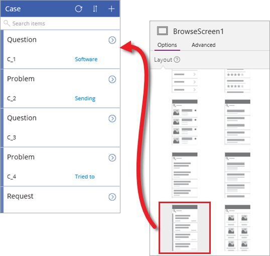

在此部分的前两个主题中，你生成了基于 Common Data Service 实体的应用，并探索了组成应用的三个屏幕。 虽然 PowerApps 生成的应用非常有用，但经常需要在生成应用后进行自定义。 此主题将逐步介绍如何对应用的浏览屏幕进行一些更改。 虽然可以自定义任何屏幕，但我们希望以其中一个为重点，更深入一点介绍自定义。 建议采用生成的基于实体、Excel 文件或其他源的任何应用，了解如何自定义应用。 这确实是了解应用的各组成部分的最佳方式。

## 更改库和数据绑定
PowerApps 在生成应用后，确定了要使用的布局，以及每个屏幕上显示的特定字段。 对于此应用，让我们来选择包含状态栏的库控件（我们很快就会自定义状态栏）。 在右侧窗格的“**布局**”选项卡上，选择所需的布局。 你会立即看到所选布局，因为 PowerApps 在你执行更改的同时更新应用。

设置正确的基本布局后，现在让我们来更改显示字段。 单击或点击第一项中的字段，然后在右侧窗格中更改每一项的显示数据。 这样一来，便可以改进实体中每一项的摘要。

## 更改应用主题
PowerApps 提供一系列可用于应用的主题，与 PowerPoint 一样。 在下面的屏幕中，应用采用了“**沙丘色**”主题，并粘贴有简单徽标。 虽然这些都是基本更改，但却可以有效改善应用外观。 

## 使用公式显示案例状态
PowerApps 的主要优势之一是，无需编写传统的应用程序代码。也就是说，无需成为开发者也可以创建应用！ 不过，仍需要通过一种方法在应用中表达逻辑，并控制应用的导航、筛选、排序及其他功能。 这时候公式便派上用场。

如果你用过 Excel 公式，就不会对 PowerApps 采用的方法感到陌生。 假设要在案例解决后显示绿色状态栏，否则显示红色状态栏。 为此，请选择屏幕上的状态控件，然后在编辑栏中将此控件的 **Fill** 属性设置为以下公式：`If(Status="Resolved", Color.Green, Color.Red)`。 这就像 Excel 公式一样，不同之处在于 PowerApps 公式引用的是控件和其他应用元素，而不是电子表格中的单元格。 下图展示了在何处设置公式以及应用中的结果。

## 按日期排序和筛选
在浏览屏幕中，生成的应用允许搜索案例，并对库中的项列表进行排序。 我们将删除搜索和排序功能，以支持按日期显示案例。 你可以结合使用这些方法，而我们将重点介绍此应用按日期显示案例的方法。 下图中展示了我们添加的项：

* 告诉用户要执行的操作的文本标签（“显示在此日期之后的案例:”）：依次转到“插入” > “文本” > “标签”；将“Fill”公式更改为“White”。
* 日期选取器：依次转到“**插入**” > “**控件**” > “**日期选取器**”。
* 将浏览库的 **Items** 属性与日期选取器相关联的公式：`Filter(Case, DatePicker1.SelectedDate < LastModifiedDateTime)`。

日期设置为 10 月 20 日，结果就是，应用显示在此日期之后创建的案例。 请注意，默认情况下，实体中所有案例的上次修改日期都相同。 可以更新一个或多个，了解筛选的工作原理。 本课程的后面部分将介绍如何处理实体数据。

## 显示案例总数
虽然此主题涉及许多方面，但有关自定义的介绍即将结束。 此主题将介绍的最后一项操作是添加标签来显示两个数字：一个是案例总数，另一个是与基于日期的筛选器匹配的案例数。

本视频详细介绍了如何添加两个标签，下面列出了我们为每个标签设置的基本属性：

* **Align** = `Center`
* **Width** = `Parent.Width/2`
* 左框 **Text** = `"Total cases: " & CountRows(Case)`。 这会统计实体中的所有案例。 
* 右框 **Text** = `Filtered cases: " & CountRows(BrowseGallery1.AllItems)`。 这只会统计与基于日期的筛选器匹配的案例。

有关自定义应用的介绍到此结束，下一主题将介绍如何添加数据源和流，并展示完成的应用。

