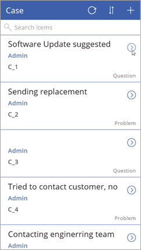
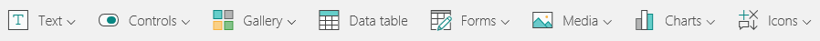

此主题将更深入地介绍生成的应用，即探索定义应用行为的屏幕和控件。 虽然我们的介绍无法面面俱到，但深入了解此应用的工作方式将有助于你生成自己的应用。 后续主题将介绍与屏幕和控件结合使用的公式。

## 在预览模式下运行应用
单击或点击右上角的  运行应用。 如果浏览应用，便会发现其中包含实体数据，并提供令人满意的默认体验。

## 了解 PowerApps 中的控件
控件只是一种与行为相关联的 UI 元素。 PowerApps 中的许多控件与你在其他应用中用过的控件（如标签、文本输入框、下拉列表、导航元素等）相同。 不过，PowerApps 具有更为专业化的控件，如“**库**”（显示摘要数据）和“**窗体**”（显示详细数据并允许创建和编辑项）。 还有其他一些相当棒的控件，如“**图像**”、“**照相机**”和“**条形码**”。 若要查看可用控件，请单击或点击功能区上的“插入”，然后依次单击或点击从“文本”到“图标”的各个选项。

## 探索浏览屏幕
三个应用屏幕都有一个主控件和一些附加控件。 应用中的第一屏是浏览屏幕，默认命名为 **BrowseScreen1**。 此屏幕上的主控件是名为 **BrowseGallery1** 的库。 **BrowseGallery1** 包含其他控件，例如 **NextArrow1**（一种图标控件，单击或点击它可以转到详细信息屏幕）。 此屏幕上还有独立控件，例如 **IconNewItem1**（一种图标控件，单击或点击它可以在编辑/创建屏幕中创建项）。

PowerApps 提供各种库类型，以便你可以使用最能满足应用布局要求的类型。 此部分的后续主题将介绍更多布局控制方法。

## 探索详细信息屏幕
第二屏是详细信息屏幕，默认命名为 **DetailScreen1**。 此屏幕上的主控件是名为 **DetailForm1** 的显示窗体。 **DetailForm1** 包含其他控件，例如 **DataCard1**（一种卡片控件，在此示例中用于显示问题类别）。 此屏幕上还有独立控件，例如 **IconEdit1**（一种图标控件，单击或点击它可以在编辑/创建屏幕上编辑当前项）。

虽然有许多库选项，但窗体更简便易用（不是编辑窗体，就是显示窗体）。

## 探索编辑/创建屏幕
应用中的第三屏是编辑/创建屏幕，默认命名为 **EditScreen1**。 此屏幕上的主控件是名为 **EditForm1** 的编辑窗体。 **EditForm1** 包含其他控件，例如 **DataCard8**（一种卡片控件，在此示例中可方便你编辑问题类别）。 此屏幕上还有独立控件，例如 **IconAccept1**（一种图标控件，单击或点击它可以保存在编辑/创建屏幕上做出的更改）。

至此，你已大致了解应用包含哪些屏幕和控件，下一主题将介绍如何自定义应用。

