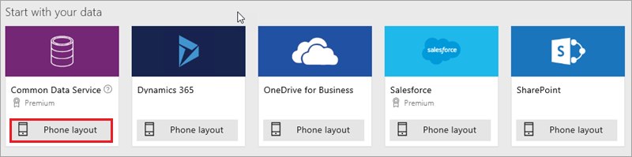
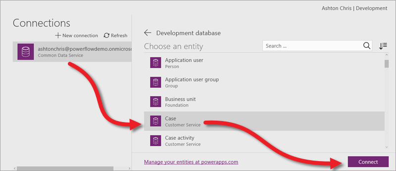

在本课程的这一部分中，我们将创建基于 Common Data Service *实体*的应用。 实体是可以修改、存储、检索和交互的共享数据区块。 我们将生成基于实体的应用，并介绍如何自定义应用、添加其他数据源以及在应用中调用流。 如果已阅读完创建基于 SharePoint 列表的应用这一部分，便会发现我们将介绍的内容有部分重叠，不同之处在于介绍更为深入，尤其是在自定义应用方面。

我们将创建一个案例管理应用，以供 IT 部门跟踪整个组织内的软硬件问题，安排问题处理优先顺序，并采取相应措施。 浏览这些主题时，可能还会想到类似应用的其他用途。 我们使用的是 Common Data Service 数据，因为此服务非常适合存储应用数据。不过，你也可以生成基于其他数据源的相同应用。

PowerApps 包含更为复杂的案例管理模板，其中所用实体与我们即将生成的应用使用的实体相同。 建议在阅读完此部分后探索这个模板，大致了解可以在 PowerApps 中生成的内容。

## 创建 Common Data Service 数据库
生成此应用的第一步是创建 Common Data Service 数据库（如果尚未创建的话）。 Common Data Service 数据库是在*环境*中创建。 环境是应用和其他资源的容器（本课程的后续部分将详细介绍环境）。 *环境管理员*可以按照下面这些步骤操作，创建数据库（如果不是管理员，请与组织管理员联系）。

单击“**主页**”选项卡中的“**创建数据库**”。

指定是否要限制对数据库的访问权限（我们将继续允许公开访问），然后单击“**创建我的数据库**”。

完成此过程后，便会看到通用数据模型中包含的所有标准实体。 下图展示了部分实体。

## 生成基于“案例”实体的应用
至此，数据库已创建，我们将连接“案例”实体并生成应用。 依次单击“**新建应用**”和“**PowerApps Studio for web**”。

由于我们要生成的是基于 Common Data Service 实体的手机应用，因此单击或点击“**Common Data Service**”下的“**手机布局**”。

在下一屏中，选择一个连接和要连接的实体，然后单击“**连接**”。

在你单击“**连接**”后，PowerApps 便会开始生成应用。 PowerApps 会进行各种数据推论，生成实用应用，以便你可以在此基础上进行各种自定义。

## 在 PowerApps Studio 中查看应用
此时，新建的三屏应用会在 PowerApps Studio 中打开。 所有基于数据生成的应用都有一组相同的屏幕：

* **浏览**屏幕：可以在此屏幕中浏览、排序、筛选和刷新从列表中拉取的数据，并能通过单击 (+) 图标添加项。
* **详细信息**屏幕：可以在此屏幕中查看项的详细信息，并能选择删除或编辑项。
* **编辑/创建**屏幕：可以在此屏幕中编辑现有项，也可以创建新项。

在左侧导航栏中，单击或点击右上角的图标，切换到缩略图视图。

单击或点击每个缩略图，查看相应屏幕上的控件。

接下来，我们将详细探索应用，然后自定义应用，使其更能满足我们的需求。

