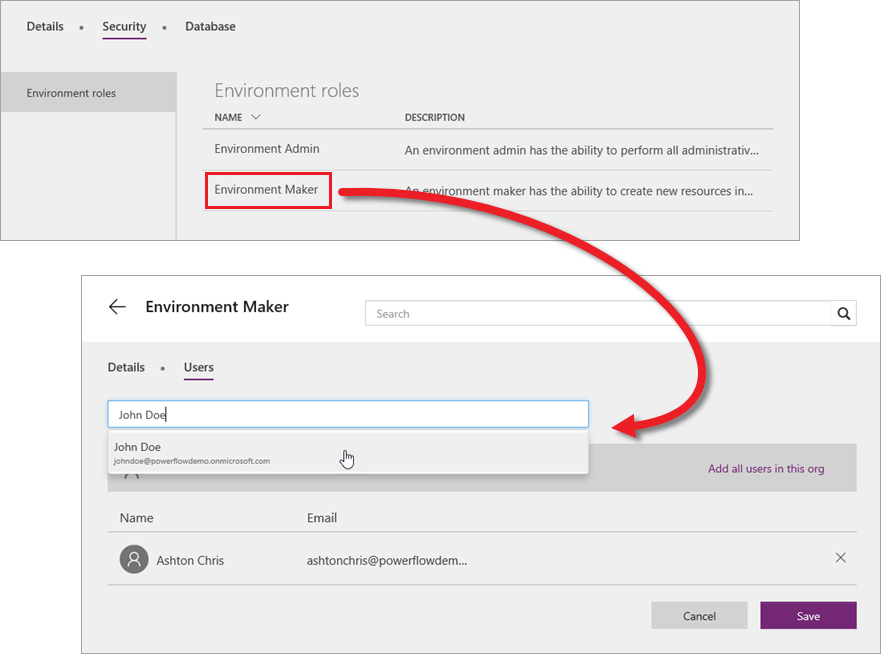

学习本课程到现在，你已用过几次 web.powerapps.com。无论知道与否，你一直是在特定的*环境*中执行操作。 简单来说，环境就是应用和其他资源的分组（稍后将对此进行详细介绍）。 web.powerapps.com 屏幕右上角显示指明当前环境的下拉菜单。

如果刚开始接触 PowerApps，此时可能只会看到默认环境。 单击或点击下拉菜单，看看是否有其他环境。

## 为什么要使用环境？
环境是应用和其他资源（如数据连接和 Microsoft Flow 流）的容器。 这是一种根据业务需求对资源进行分组的方法。 除默认环境之外，可出于以下几个原因创建其他环境：

* **各部门单独开发应用**：在大型组织中，每个部门都可以在不同的环境中工作。
* **支持应用程序生命周期管理 (ALM)**：可以将正在开发的应用和已经完成并共享的应用的环境区分开来。
* **管理数据访问**：每个环境都有自己的 Common Data Service for Apps 数据库，其他数据连接也专用于相应的环境（即无法跨环境共享数据）。

请注意一点，环境仅与应用创建者和 PowerApps 管理员相关。 与用户共享应用后，他/她只要拥有相应权限，即可运行应用。 无需担心应用源自什么环境。

## 创建环境
到目前为止，本课程都以应用创建者为重，而环境则是由管理员进行创建和维护的。 如果不是管理员，此信息仍十分有用，因为需要就环境创建与管理员联系。 在 PowerApps 管理中心内，依次单击或点击“**环境**”和“**新建环境**”。 在“新建环境”屏幕上，输入环境名称，选择一个区域，选择是否为环境创建 Common Data Service for Apps 数据库，然后单击或点击“创建环境”。

就是这么简单！现在便可以在新环境中工作了。 此时，如果返回 web.powerapps.com，就可以在环境下拉菜单中看到它。

## 管理对环境的访问权限
拥有以下角色便可以访问环境：

* **环境管理员**：在环境中拥有全部权限。
* **环境创建者**：可以查看所有应用、创建应用并且使用 Common Data Service for Apps（其他权限适用）。

作为管理员，可以在“**环境**”选项卡中授予对环境的访问权限。首先，单击或点击一个环境。 若要添加某用户（在此示例中，添加到**环境创建者**角色），请依次单击或点击“**环境角色**”和“**环境创建者**”。 在这里，将用户或组添加到角色，然后单击“**保存**”。

至此，你已了解环境的优势、如何创建环境以及如何授予对环境的访问权限。 即使不是管理员角色，阅读此类信息也有助于了解此服务的工作原理。 

至此，“管理应用”部分已介绍完毕，同时本引导式学习课程也全部结束。 我们由衷希望你对本课程感到满意，并学到很多知识。欢迎随时向我们提供任何反馈意见，并持续关注本课程，因为我们计划逐步补充内容。 若要立即进行更深入的探究，请参阅 [PowerApps 文档](https://docs.microsoft.com/powerapps/)。 

