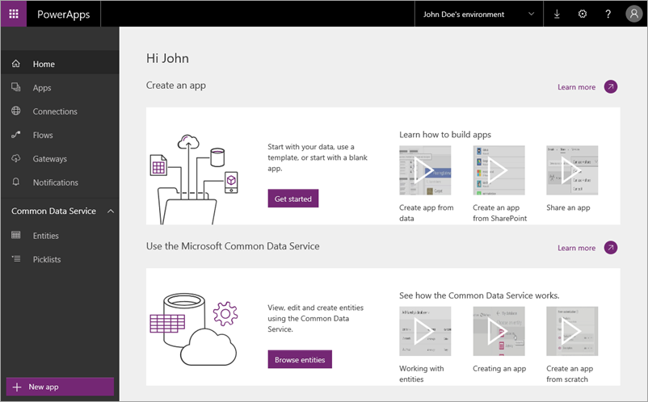

引导式课程的第一个主题介绍了 PowerApps 的主要组成部分。 现在，我们将更详细地介绍每个组成部分。 PowerApps 包含一系列软件服务和应用，与相关技术结合使用有助于搭建功能强大的生态系统。 PowerApps 组成部分包括：

* **web.powerapps.com** - 管理和共享生成的应用
* **PowerApps Studio** - 使用易用的可视化工具生成功能强大的应用
* **PowerApps Mobile** - 在 Windows、iOS 和 Android 设备上运行应用
* **PowerApps 管理中心** - 管理 PowerApps 环境和其他组成部分

我们并不希望你花大量时间就学习了 PowerApps *概念*，我们认为学习更充实的课程对你更有帮助。

## web.powerapps.com
如果生成应用，大部分时间都是在这里执行操作。 可以查看其中提供的**示例应用和模板**，以及你创建的所有应用。 可以在 **PowerApps Studio for web** 或 **PowerApps Studio for Windows** 中创建应用，并与个人和组织共享这些应用。 可以管理数据：**连接**、**网关**和**实体**（很快就会逐一介绍）。可以查看在 **flows.microsoft.com** 中创建的全部**流**，并能将流与应用集成。

## PowerApps Studio
**PowerApps Studio** 可以是能在任何新式浏览器中使用的 Web 应用程序，也可以是 Windows 应用程序。 PowerApps Studio 有三个窗格和一个功能区，创建应用**类似于在 PowerPoint 中创建幻灯片组**：

1. **左侧导航栏**：可以显示应用中每个屏幕的缩略图或每个屏幕上所有控件的分层视图
2. **中间窗格**：显示正在处理的屏幕
3. **右侧窗格**：包含“布局”和“数据源”等设置选项
4. **属性**下拉列表：可在其中选择公式适用的属性
5. **编辑栏**：可在其中添加定义应用行为的公式（就像在 Excel 中一样）
6. **功能区**：可在其中添加控件并自定义设计元素

## PowerApps Mobile
**适用于 Windows、iOS 和 Android 的 PowerApps Mobile** 提供了一个环境，方便你查找和使用应用。 无需单独转到应用商店，不离开 PowerApps 就可以访问你自己创建的所有应用以及其他人与你共享的所有应用。 在 PowerApps Mobile 中使用应用时，可充分利用设备的功能，如相机控件、GPS 定位等。

## 管理中心
**PowerApps 管理中心**是为组织集中管理 PowerApps 的位置。 在这里，可以定义不同的**环境**，其中包含应用、数据连接和其他元素。 还可以在管理中心内创建 Common Data Service 数据库，并管理权限和数据策略。

下一主题将介绍为了搭建功能强大的生态系统进行应用开发，与 PowerApps 结合使用的一系列相关技术。

