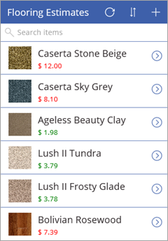
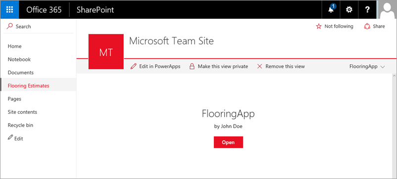

PowerApps 的主要优势之一是，无需编写传统的应用程序代码。也就是说，无需成为开发者也可以创建应用！ 不过，仍需要通过一种方法在应用中表达逻辑，并控制应用的导航、筛选、排序及其他功能。 这时候公式便派上用场。 如果你用过 Excel 公式，就不会对 PowerApps 采用的方法感到陌生。 此主题将介绍几个用于设置文字格式的基本公式，然后逐个介绍 PowerApps 在生成的应用中添加的三个公式。 你将大致了解公式的用途。 然后，可以花时间查看生成的应用中的其他公式，然后编写你自己的公式。

## 了解公式和属性
在上一主题中，我们在浏览屏幕库中添加了“价格”字段，但显示的是不含货币符号的纯数字。 假设我们要添加美元符号，并根据商品价格更改文字颜色（例如，如果超过 5 美元，文字颜色为红色；否则，文字颜色为绿色）。 下图展示了显示结果。

让我们从添加货币符号开始。 默认情况下，PowerApps 只拉取每个商品的价格，将其设置为价格标签的“Text”*属性*。

若要添加美元货币符号，请单击或点击标签控件，然后在编辑栏中将“Text”属性设置为以下公式。

公式 - `Text(Price, "[$-en-US]$ ##.00"` 使用 **Text** *函数*来指定应如何设置数字格式。 这就像 Excel 公式一样，不同之处在于 PowerApps 公式引用的是控件和其他应用元素，而不是电子表格中的单元格。 如果依次单击或点击控件和属性下拉列表，便会看到与控件相关的属性列表。 例如，下图展示了标签的一部分属性列表。 一些属性适用于各种控件，另一些属性专用于特定控件。

若要根据价格有条件地设置颜色，请对标签的“Color”属性使用以下公式：`If(Price > 5, Color.Red, Color.Green)`。

## 生成的应用中包含的公式
至此，你已了解如何结合使用公式和属性。我们将继续介绍 PowerApps 在生成的应用中使用的三个示例公式。 示例公式均来自浏览屏幕，并与 OnSelect 属性结合使用，此属性定义了在用户单击或点击应用控件时发生什么。

* 第一个公式与 **IconNewItem1** 控件  相关联。 单击或点击此控件后，可从浏览屏幕转到编辑/创建屏幕并创建项。 
  
  * 公式为 `NewForm(EditForm1);Navigate(EditScreen1, ScreenTransition.None)`
  * 此公式*实例化*新的编辑窗体，然后转到编辑/创建屏幕，以便你可以新建项。 值 `ScreenTransition.None` 表示没有屏幕切换效果（如淡化）。
* 第二个公式与 **IconSortUpDown1** 控件  相关联。 单击或点击此控件后，可对浏览屏幕库中的项列表进行排序。
  
  * 公式为 `UpdateContext({SortDescending1: !SortDescending1})`
  * 此公式使用 `UpdateContext` 更新名为 `SortDescending1` 的*变量*。 单击控件的同时，此变量的值来回切换。 这可指示此屏幕上的库如何进行项排序（如需了解更多详情，请观看视频）。 
* 第三个公式与 **NextArrow1** 控件  相关联。 单击或点击此控件后，可从浏览屏幕转到详细信息屏幕。
  
  * 公式为 `Navigate(DetailScreen1, ScreenTransition.None)`
  * 此公式转到详细信息屏幕，同样没有切换效果。

应用中还有许多其他公式，请花时间点击控件，了解为各种属性设置的公式。

## 总结
至此，你已阅读完“探索生成的应用”部分，并了解了屏幕、控件、属性和公式是如何在后台运行，从而让应用具备各种功能的。 学习本课程到现在，应该对生成的应用的工作方式有了更深入的了解。 现在，你可以利用所掌握的知识来创建你自己的应用。 

在继续介绍下一部分前，我们要回顾一下 SharePoint，并介绍如何在应用中集成列表体验。 如你所见，**FlooringApp** 现在作为列表*视图*，点击“**打开**”即可启动应用。 这样一来，可以通过易用的自定义方式轻松管理列表。

