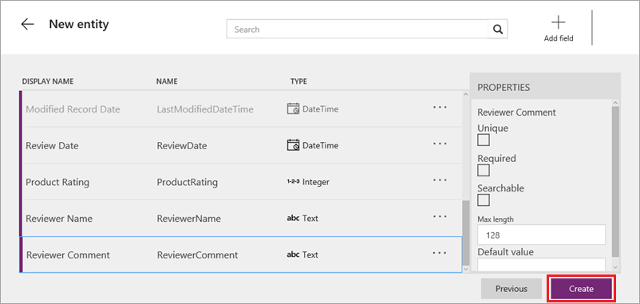
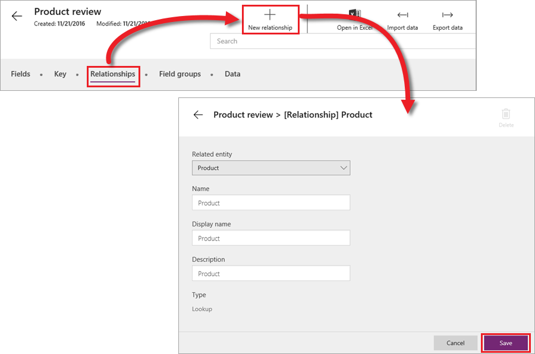

# 创建自定义实体
Common Data Service 适用于所有业务客户，从规模较小的商店到规模较大的企业。 通用数据模型包含一组标准实体，可满足多种常见业务需求，上一主题也提到可以根据需要扩展这些标准实体。 不过，有时需要完全不同的实体来解决特定的业务问题。 在这种情况下，需要使用自定义实体，此主题将介绍如何生成自定义实体。

创建实体的方法有两种：

* 从头开始创建实体。 这正是此主题将要介绍的方法。
* 复制另一实体的字段和设置，但不复制数据，从而在此实体的基础上创建新实体。

## 从头开始创建实体
在此示例中，我们将从头开始创建名为“产品审核”的自定义实体。 首先，单击“**实体**”选项卡上的“**新建实体**”。 输入“**实体名称**”（不含空格或特殊字符）、易记的“**显示名称**”和有意义的“**说明**”。 然后，单击“**下一步**”。

下一屏显示所有标准实体和自定义实体都包含的五个默认字段。 单击“**添加字段**”，开始添加你自己的字段。

在此示例中，我们将添加以下四个字段：

* “**审核日期**”：必填的日期字段。
* “**产品评级**”：必填的整数字段。 在这里，我们可以使用选择列表来指定仅限特定值（例如 1-5），但暂时一切从简。
* “**审核人姓名**”：可选的文本字段。
* “**审核人评论**”：也是可选的文本字段。 

对实体感到满意后，单击“**创建**”。 创建的实体不含任何数据。 下一主题将介绍如何导入数据。

## 创建两个实体之间的关系
由于我们要将各次审核与特定产品相关联，因此需要创建“产品审核”和“产品”实体之间的关系。 在“产品审核”实体的“**关系**”选项卡上，单击“**新建关系**”。 然后，选择“**相关实体**”，并输入“**名称**”、“**显示名称**”和“**说明**”。 单击“**保存**”，创建关系。

## 在 PowerApps Studio 中连接自定义实体
在 PowerApps Studio 中连接自定义实体的方法与连接标准实体相同。 依次单击“**新建**”和“**Common Data Service**”下的“**手机布局**”。 左侧显示可用的数据连接，右侧显示实体列表。

下一主题将介绍如何管理 Common Data Service 中的数据。

