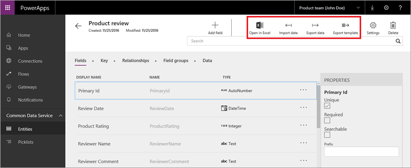

# 管理实体数据
此主题将介绍 Common Data Service 数据管理。 其他主题提到过数据导入和导出，现在我们将花更多时间介绍如何处理 Excel 中的数据。

## 从 Excel 或 CSV 导入数据
在此示例中，我们将把数据从 Excel 导入我们在上一主题中创建的“产品审核”实体。 还可以从 CSV 文件（用于移动数据的常见格式）导入数据。 下图旨在提醒你了解实体是什么样的；此主题将重点介绍突出区域。

在实体中，单击“**导入数据**”，然后转到要从中导入数据的文件。 单击“**显示映射**”，确保 Excel 文件中的列已与实体中的正确字段相关联。 对映射感到满意后，单击“**保存更改**”。 返回主导入屏幕，单击“**导入**”。

## 将数据导出到 Excel
如果需要访问非 Common Data Service 数据，请导出数据。 在实体中，单击“**导出数据**”，然后等待 zip 文件生成。 打开 zip 文件，便可以看到导出的数据。 

## 将模板导出到 Excel
除了下载数据之外，还可以下载模板。 模板是结构与实体中的字段匹配的 Excel 文件，但不包含数据。 下载模板后，可以手动或以编程方式填充模板，然后将其重新导入服务。 在实体中，单击“**导出模板**”，然后指定所需的字段（在此示例中，我选择了一个字段）。 单击“**导出到 Excel**”，然后等待 Excel 文件生成。 打开 Excel 文件，便可以看到包含所选字段的导出模板。

## 在 Excel 中打开和处理数据
最后，我们要介绍的是“**在 Excel 中打开**”选项。 如果安装了 PowerApps 外接程序，可以使用此选项在 Excel 中浏览和编辑数据。 在实体中，单击“**在 Excel 中打开**”，然后打开文件。 启用编辑，然后外接程序会建立与服务中实体的实时连接，并填充工作簿。 可以直接在工作簿中编辑，并能添加和删除行。 单击“**发布**”，保存更改。 还可以刷新数据，确保副本为最新；并能筛选数据，当实体中有大量数据时尤为方便。

有关管理 Common Data Service 数据（导入、导出数据和在 Excel 中处理数据）的主题到此结束。 下一主题将介绍如何管理数据安全性。

