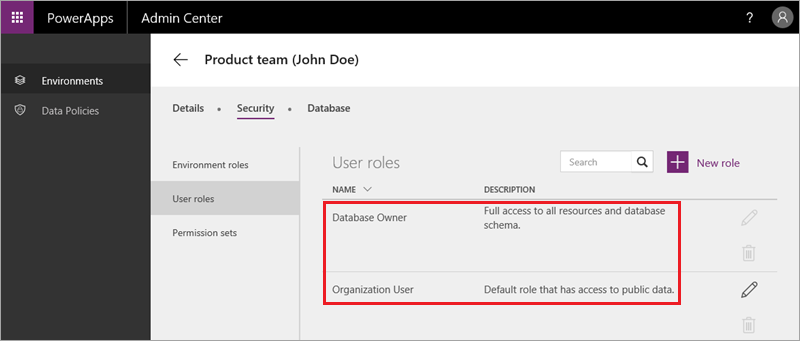

# Common Data Service 安全性
此主题将介绍 Common Data Service 安全性。 服务使用基于角色的系统向用户授予数据访问权限。 安全模型采用层次结构的方式，每个层级表示不同的访问权限级别。 最低级别是个人对单个实体的创建、读取、更新和删除权限。 这一系列的实体级权限组成一个权限集。 一个角色可以使用一个或多个权限集。 角色位于顶级，拥有用户或用户组需要的所有权限。

## 了解角色和权限集
在本课程的大部分主题中，我们重点介绍的是 powerapps.com 和 PowerApps Studio。 此主题将重点介绍 PowerApps 管理中心。 在管理中心内单击某个环境后，可在“**安全性**”下方看到“**环境角色**”（我们在上一个主题中提到过）、“**用户角色**”和“**权限集**”选项卡。 默认情况下，用户角色有两个：

* **数据库所有者**：授予对所有实体的完全访问权限的管理角色。
* **组织用户**：默认分配给所有用户的角色。 此角色向所有用户授予对包含公共数据的实体的访问权限。

默认情况下，每个实体对应有两个权限集： 

* **维护**：授予完全控制权，即创建、读取、更新和删除权限。
* **查看**：授予只读访问权限。

下图展示了“帐户”实体对应的默认权限集。 

本视频介绍了如何通过创建其他角色和权限集来实现应用程序精确访问。 我们创建了**维护产品审核**权限集，授予对我们在之前主题中创建的自定义实体的完全访问权限。此外，我们还创建了 **ReviewApp 所有者**角色，向其分配了此权限集。  

## 限制对数据库的访问权限
我们在之前主题中创建数据库时，并未更改可公开访问数据库的默认设置。 若要更改访问权限，请单击“**数据库**”选项卡上的“**限制访问**”，然后确认要进行的更改。

在受限模式下，每个用户都必须分配有一个或多个角色。 可以针对公司内的给定职位设定角色，然后将角色分配给该职位的所有任职人员。 还可以根据用户所属的 Azure Active Directory 组，为用户自动添加角色。

## 总结
虽然安全性这一主题非常复杂，但其实只需抓住主线，即权限层次结构。 最低级别是个人对单个实体的创建、读取、更新和删除权限，这一系列权限组成分配给角色的权限集。 这一系统非常灵活，便于你相当精确地控制数据访问权限。 

至此，你已阅读完有关 Common Data Service 的部分，同时也学完了本引导式课程。 我们由衷希望你对本课程感到满意，并学到很多知识。欢迎随时向我们提供任何反馈意见，并持续关注本课程，因为我们计划逐步补充内容。 若要立即进行更深入的探究，请参阅 [PowerApps 文档](https://powerapps.microsoft.com/tutorials/getting-started/)。 

