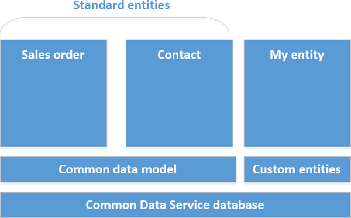

# Common Data Service
数据是业务应用程序和流程的核心，数据源包括 Excel、SQL Server 等本地源以及 Salesforce 和 SharePoint Online 等云源。 虽然数据可以与客户、销售、员工和许多其他对象相关，但共同点是数据对你的业务至关重要，在你使用 PowerApps 生成应用时发挥关键作用。 到目前为止，你已在本课程中了解并使用过各种不同类型的数据源。我们之前介绍过 Microsoft Common Data Service。 在此部分中，我们将花时间详细介绍此服务及其优势，并演示如何使用此服务。

## 了解此服务
我们将以几个关系图为重。 第一个关系图（你或许之前看到过）展示了 Microsoft 业务应用程序平台的组成部分。 此时，你显然非常了解 PowerApps，但你也可能用过 Microsoft Flow、Power BI 或其他组件。 你会发现，Common Data Service、连接器和网关与所有这些组件均相关。 目前，Common Data Service 主要与 PowerApps 和 Microsoft Flow 结合使用，但还是会适用于其他组件的。

至此，你已了解 Common Data Service 的适用范围，让我们了解一下此服务的组成部分。 将 Common Data Service 看作是采用层次结构的方式。 在最低层级，此服务可靠地存储可扩展的数据，让数据可供多个应用程序使用。 下一层级是通用数据模型，包括应用程序和业务流程中使用的许多实体，如“帐户”、“联系人”、“产品”和“销售订单”等实体。 可以扩展标准实体，并能创建自定义实体来满足业务需求。

实体只包含描述它的元数据（字段名称、数据类型等）和你存储的数据。 如果你熟悉 Access 或其他数据库，便会发现实体与表非常相似。 下一主题将详细介绍实体，而现在我们要介绍的是处理 Common Data Service 实体数据带来的益处：

* **易于管理**：元数据和数据均存储在云中。 无需详细了解如何进行存储。
* **易于共享**：可以与同事轻松共享数据，因为 PowerApps 管理权限。
* **易于保护**：安全存储数据，只有拥有访问权限的用户才能查看数据。 借助基于角色的安全性，可以控制组织内不同用户对实体的访问权限。
* **各种元数据**：可直接在 PowerApps 中利用数据类型和关系。 例如，定义字段类型 URL 会以超链接的形式在应用中数显示据。
* **实用工具**：实体适用于 Microsoft Excel 和 Outlook 的外接程序，以提高工作效率，并确保数据可访问性。
* **选项列表**：包含一系列各种标准选项列表，可在实体和应用中实现快速下拉。

## 创建 Common Data Service 数据库
Common Data Service 数据库是在*环境*中创建。 本课程的前面部分介绍过环境。简单总结一下，环境是应用和其他资源（如 Common Data Service）的容器。 每个环境可以与一个服务实例相关联。 如果是环境管理员，并且要将此服务添加到环境中，请按照以下步骤操作。

单击“**主页**”选项卡中的“**创建数据库**”。

指定是否要限制对数据库的访问权限，然后单击“**创建我的数据库**”。

完成此过程后，便会看到通用数据模型中包含的所有标准实体。 下图展示了部分实体。

如果之前没有用过数据库，可能会对此主题介绍的某些内容不熟悉。 不过，一般概念非常简单：Common Data Service 提供一种安全可靠的数据存储方式，以处理常见实体（如“帐户”、“联系人”、“产品”和“销售订单”）中的数据。 下一主题将深入介绍实体。

