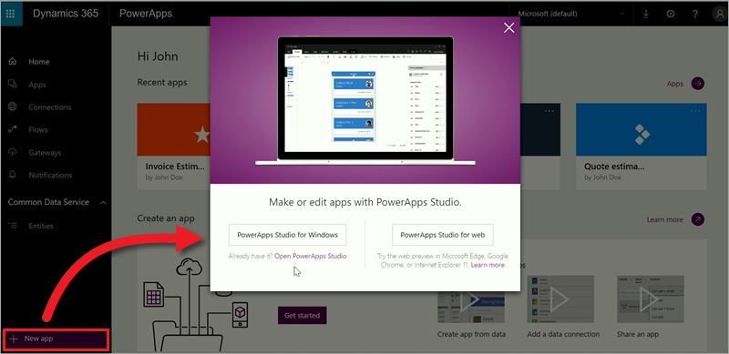
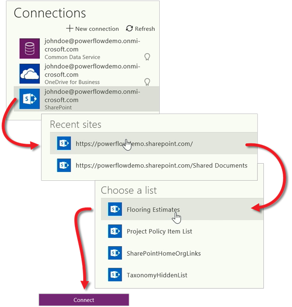

# 在 PowerApps 中创建首个应用
至此，已熟悉 PowerApps 的所有组成部分和应用创建选项，是时候真正开始生成应用了。 在此主题中，我们将生成基于 SharePoint Online 列表的手机应用。不过，也可以使用其他许多数据源，包括 Excel、Salesforce 等云服务和 SQL Server 等本地源。

## 连接到数据源
生成基于数据的应用的第一步是，选择要使用的 PowerApps Studio，然后连接数据源。 在 web.powerapps.com 上，单击或点击“**新建应用**”，然后选择是使用 PowerApps Studio for Windows，还是使用 PowerApps Studio for web。

在 PowerApps Studio 中，可以视需要选择是根据数据、模板还是从头开始创建。 由于我们要生成的是基于 SharePoint 列表的手机应用，因此单击或点击“**SharePoint**”下的“**手机布局**”。

生成的应用始终基于一个列表或表（以后可以向应用添加更多数据）。 在接下来的三屏中，逐步完成连接 SharePoint Online 中的“**地面材料估算**”列表。

在你单击“**连接**”后，PowerApps 便会开始生成应用。 PowerApps 会进行各种数据推论，生成实用应用，以便你可以在此基础上进行各种自定义。

## 探索生成的应用
成功！ 此时，新建的三屏应用会在 PowerApps Studio 中打开。 所有基于数据生成的应用都有一组相同的屏幕：

* **浏览**屏幕：可以在此屏幕中浏览、排序、筛选和刷新从列表中拉取的数据，并能通过单击 (+) 图标添加项。
* **详细信息**屏幕：可以在此屏幕中查看项的详细信息，并能选择删除或编辑项。
* **编辑/创建**屏幕：可以在此屏幕中编辑现有项，也可以创建新项。

在左侧导航栏中，单击或点击右上角的图标，切换到缩略图视图。 

单击或点击每个缩略图，查看相应屏幕上的控件。

单击或点击右上角的  运行应用。 如果浏览应用，便会发现其中包含列表中的所有数据，并提供令人满意的默认体验。

哇，真是太简单了！ 在短短几分钟内，你就了解到如何连接数据源并生成应用，以及 PowerApps Studio 和应用的三个屏幕。 后续部分将介绍如何自定义生成的应用。 下一主题将回顾本课程的第一部分，为你学习后面的课程打好基础。

