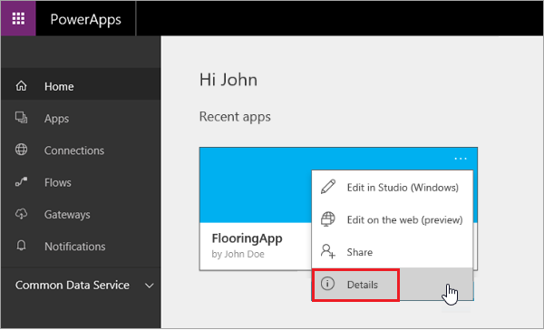

# 对应用进行版本控制
如果遇到问题或保存了本不该执行的应用更改，不可不知的是，PowerApps 可以帮你走出困境。对于保存在云中的应用，PowerApps 保留了你所做更改的历史记录。 可以查看已保存的版本，并根据需要还原旧版应用。 请注意，如果应用已共享，共享对象也会收到还原版本。

## 如何对应用进行版本控制
访问 web.powerapps.com，依次单击应用磁贴上的省略号 (. 。 .) 和“**详细信息**”。

在这里，不仅可以控制应用版本，还能共享应用（上一主题对此进行了介绍）。 若要还原旧版应用，请单击相应版本（在此示例中为版本 3）对应的“**还原**”，然后再次单击“**还原**”进行确认。 如此示例所示，还原到版本 3 后，PowerApps 会此视为新版本（即此示例中的版本 5），而不是仅覆盖版本 4。

如果需要还原旧版应用，便会发现版本控制非常有用。因此，请记得在应用出现任何问题时使用此功能。 至此，你已了解如何共享应用并根据需要还原应用。我们将继续学习本课程中有关应用管理的最后一个主题，即如何管理环境。

