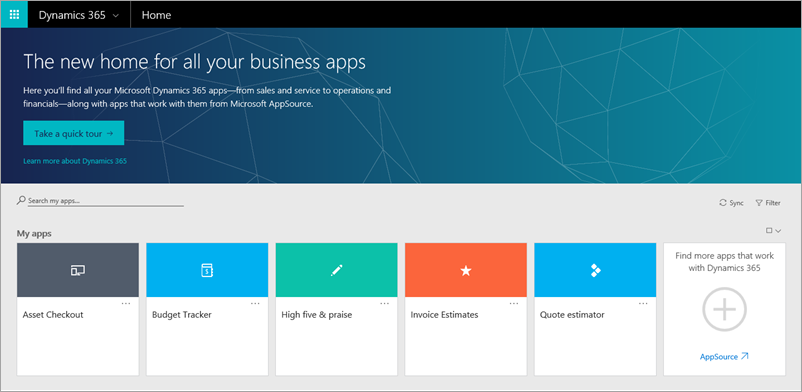

# 相关技术
通常情况下，通过结合使用以下技术和 PowerApps，在整个组织中生成和共享功能强大的应用。 应用可以集成多个数据源中的数据，以及用于自动执行任务的工作流。 

* **Microsoft Flow** - 在常用应用和服务之间创建自动执行的工作流
* **数据源、连接、连接器和网关** - 将云和本地数据引入应用
* **Common Data Service** - 使用通用数据模型集成业务数据
* **Microsoft Dynamics 365** - 在网上运行所有业务应用
* **Microsoft AppSource** - 将你的应用集中共享到这个位置，以便 Microsoft 和许多合作伙伴能够轻松找到

### Microsoft Flow
**Microsoft Flow** 是一项跨业务用户依赖的日益增多的应用和服务自动处理工作流的服务。 Microsoft Flow 可以加快业务执行，节省你在重复单调的任务上花费的时间，有更多时间来做自己想做的事情。 将 Microsoft Flow 与 PowerApps 结合使用可以**生成触发和响应工作流的应用**。

### 数据源、连接、连接器和网关
你可能关注了许多**数据源**，PowerApps 使用**连接器**来**连接**这些数据源。 下图展示了一些最常用的数据源，其中许多是云服务，如 Salesforce。 连接器可能不是应用开发中最棒的一部分，但却是处理你、同事和客户所关注数据时不可或缺的一部分。 对于存储在本地而不是云中的数据，使用**网关**在 PowerApps 和数据源之间建立可靠连接。 网关位于本地计算机上，并与 PowerApps 进行通信。

### Microsoft Common Data Service
**Common Data Service** 可以轻松集成多个数据源的业务数据。 此服务的**通用数据模型**包括对应用和业务流程常见的许多**实体**，如“联系人”、“产品”和“销售订单”等实体。 此服务可靠地存储可扩展的数据，让数据可供多个应用程序使用。 可以是在 PowerApps 中生成的应用，也可以是在其他 Microsoft 应用程序或第三方应用程序中生成的应用。 下图展示了 web.powerapps.com 中“**联系人**”实体的一部分。

### Microsoft Dynamics 365
**Dynamics 365** 是一款包含特制应用的云服务，可帮助你满足特定业务需求，如销售自动化、运营或客户服务。 在 PowerApps 中，可以将应用共享到 AppSource 中，然后共享用户便能在 Dynamics 365 以及移动设备中查看和运行共享应用。 在 Dynamics 365 中运行应用的优势在于，**可以在一个位置集中运行所有业务应用**，无论组织成员创建的应用、Microsoft 应用，还是第三方应用。

### Microsoft AppSource
在 **AppSource** 中，**可轻松找到并评估同事、Microsoft 和我们的合作伙伴共享的应用**。 在 PowerApps 中共享应用后，便会将应用共享到 AppSource 中。 可以选择仅限组织成员使用，也可以选择允许公开访问。

至此，你已更深入地了解 PowerApps 的所有组成部分及相关技术。 无需记住这个列表，因为我们将在本课程中继续深入介绍每个组成部分。 下一主题将介绍应用创建选项。

