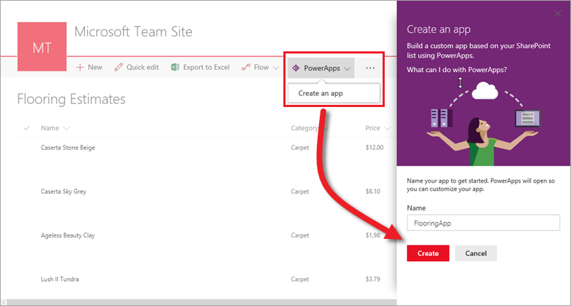
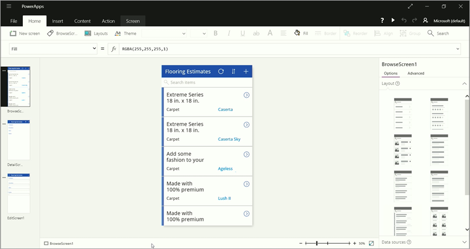
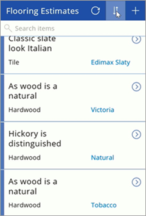

# 生成应用（SharePoint 列表）
在本课程的这一部分中，我们将创建基于“地面材料估算”SharePoint 列表的应用。 现场访问客户的估算人员可使用此应用来引用并不断更新列表。 “入门”部分已介绍过如何生成基于同一列表的应用，为什么要再次介绍此应用的生成方法呢？ 首先，我们不是在 PowerApps Studio 中开始操作。所以，现在要介绍如何将 PowerApps 集成到 SharePoint Online 中。 其次，我们将深入介绍应用的组成部分，以及如何自定义应用。 阅读完此部分后，你一定会掌握一些新知识。那么，让我们开始吧！

## 生成应用
下图展示了“地面材料估算”SharePoint 列表，其中包含名称、价格等基本信息，以及每种地面材料的图像。 你会发现，PowerApps 和 Microsoft Flow 现已集成到 SharePoint Online 中，这样你就可以轻松生成基于列表的应用和流了。

若要生成应用，请依次单击“**PowerApps**”和“**创建应用**”。 在右侧窗格中，输入应用名称，然后单击“**创建**”。 在你单击“**创建**”后，PowerApps 便会开始生成应用。 PowerApps 会进行各种数据推论，生成实用应用，以便你可以在此基础上进行各种自定义。

## 在 PowerApps Studio 中查看应用
此时，新建的三屏应用会在 PowerApps Studio 中打开。 所有基于数据生成的应用都有一组相同的屏幕：

* **浏览**屏幕：可以在此屏幕中浏览、排序、筛选和刷新从列表中拉取的数据，并能通过单击 (+) 图标添加项。
* **详细信息**屏幕：可以在此屏幕中查看项的详细信息，并能选择删除或编辑项。
* **编辑/创建**屏幕：可以在此屏幕中编辑现有项，也可以创建新项。

在左侧导航栏中，单击或点击右上角的图标，切换到缩略图视图。

单击或点击每个缩略图，查看相应屏幕上的控件。

## 在预览模式下运行应用
单击或点击右上角的  ，以运行应用。 如果浏览应用，便会发现其中包含列表中的所有数据，并提供令人满意的默认体验。

接下来，我们将详细探索应用并自定义应用，使其更能满足我们的需求。

