# 在 PowerApps 中添加和配置控件
将各种 UI 元素添加到应用中，然后直接在“属性”选项卡的工具栏或编辑栏中配置其各方面外观和行为。 这些 UI 元素称为“控件”，配置的各方面外观和行为称为“属性”。

## 先决条件
1. [注册](../signup-for-powerapps.md) PowerApps，然后使用注册所用的同一凭据[登录](https://web.powerapps.com?utm_source=padocs&utm_medium=linkinadoc&utm_campaign=referralsfromdoc)。

2. 在 PowerApps Studio 中，单击或点击左边缘附近的“文件”菜单上的“新建”。

    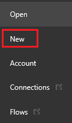

3. 在“空白应用”磁贴上，单击或点击“手机布局”。

    

4. 如果系统提示获取简介教程，请单击或点击“**下一步**”来熟悉 PowerApps 界面的主要区域（也可以单击或点击“**跳过**”）。

    

    稍后可以通过单击或点击右上角附近的问号图标，然后单击或点击“**获取简介教程**”，随时获取教程。

## 添加控件
可以依次单击或点击工具栏的“插入”选项卡、相应类别和所需的控件，从各种类别中选择添加任意一种控件。 在此部分中，你将了解每种类别的控件，从而熟悉可以添加的控件类型，以及可以在哪里找到各种类型的控件。

在“插入”选项卡上，依次单击或点击这些类别中的任何一种和要添加的控件：

**文本**：标签、文本输入、HTML 文本、笔输入 
控件：按钮、下拉列表、日期选取器、列表框、复选框、单选框、切换按钮、滑块、评分、计时器 
库：垂直、水平、灵活高度、空白垂直、空白水平、空白灵活高度 
数据表 
表单：编辑、显示、实体表单 
媒体：图像、相机、条形码、视频、音频、麦克风、添加图片 
图表：柱状图、折线图、饼图 
**图标**

> [!TIP]
> 如果控件需要占用更多空间，请[添加另一个屏幕](add-screen-context-variables.md)。

## 直接配置控件
虽然在此过程中将添加和配置的是“标签”控件，但其中许多做法准则也适用于其他控件。

1. 依次单击或点击“插入”选项卡和“标签”。

    

    系统会默认选择你添加的控件。 也可以选择现有控件，只需单击或点击它即可。 选择控件后，它的周围会出现一个选择框，而其他 UI 区域则会发生变化，以便你可以配置选定控件。 例如，选择的“标签”控件如下图所示。

    

    > [!IMPORTANT]
   > 如果先选择了一个控件，然后又选择了另一个控件或屏幕的空白区域，那么系统将不再选择第一个元素。
2. 向左拖动选择框右边缘上的图柄，缩窄“标签”控件。 （只有在放大时，才能看到中间的图柄。）

    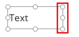

     也可以通过修改此控件的**[“Height”](controls/properties-size-location.md)** 和/或**[“Width”](controls/properties-size-location.md)** 属性来重设控件大小，本主题稍后将会对此进行介绍。

3. 拖动选择框本身（或修改“[X](controls/properties-size-location.md)”和/或“[Y](controls/properties-size-location.md)”属性，本主题稍后将会对此进行介绍），移动“标签”控件。

4. 三击“标签”控件中显示的文本，然后键入“Hello, world”。

    

     也可以通过设置此控件的**[“Text”](controls/properties-core.md)** 属性来修改该文本，本主题稍后将会对此进行介绍。

## 在工具栏中配置控件
与直接配置控件相比，在工具栏中配置控件可以指定更多不同类型的选项。

1. 选择“标签”控件后，单击或点击工具栏中的“开始”选项卡。

    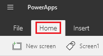

2. 依次单击或点击“填充”和一种颜色（如“碧绿色”）。

    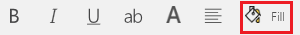

    此时，“标签”控件会反映出你的选择。

    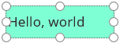

3. 更改字体系列和文本大小（例如，更改为 18 磅  Georgia）。

    

    此时，“标签”控件会反映出你的选择。

    

4. 依次单击或点击“标签”选项卡、“垂直对齐”和“顶端对齐”。

    

    此时，“标签”控件会反映出你的选择。

    

## 在“属性”选项卡中配置控件
通过使用“属性”选项卡，无需编写公式即可配置控件。 虽然在此过程中将添加和配置的是另一个“标签”控件，但其中许多做法准则也适用于其他控件。

1. 按照本主题之前所述内容，添加另一个“标签”控件。

2. 选中新控件后，单击或点击右侧窗格中的“属性”选项卡。

    

3. 在“文本”框中，键入“属性选项卡”。

    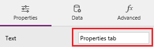

    “标签”控件将显示输入的文本。

    

4. 单击或点击“属性”面板中的“填充”图标，然后单击或点击一种颜色。

    

    此时，“标签”控件会反映出你的选择。

    

5. 单击或点击属性面板中的“颜色”属性。

    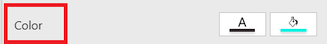

    “颜色”属性的值在编辑栏中突出显示。

    

6. 单击或点击“标签”控件，然后按 Delete 键删除第二个控件。

## 在编辑栏中配置控件
使用编辑栏，可以设置无法在“属性”选项卡中或在工具栏中直接设置的属性。 例如，可以设置一个工具提示，以便在用户将光标指向控件（但不单击或点击控件）时显示。 还可以指定复杂公式，让应用的功能更加强大。

本主题前面所做的全部更改均更新了你配置的控件的[属性](reference-properties.md)值。

* 重设此控件的大小时，更改了它的**[“Width”](controls/properties-size-location.md)** 属性。
* 移动此控件时，更改了它的**[“X”](controls/properties-size-location.md)** 和**[“Y”](controls/properties-size-location.md)** 属性。
* 更改此控件显示的文本时，更改了它的**[“Text”](controls/properties-core.md)** 属性。

除了在“属性”选项卡中或在工具栏中直接配置控件外，也可以通过在属性列表中选择一个属性，然后在编辑栏中指定一个值来更新该属性的值。 使用这种方法，可以按字母顺序搜索属性，并能指定更多类型的值。

1. 保持选中“标签”控件，单击或点击属性列表中的“[Text](controls/properties-core.md)”，然后在编辑栏中键入 "My Company Name" （含双引号）。

    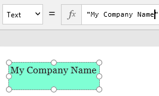

    如果用双引号括住文本字符串，即指定应按键入时的原样呈现。 也可以将属性值设为公式。

2. 选择“标签”控件后，单击或点击属性列表中的“[Text](controls/properties-core.md)”，然后在编辑栏中键入“Today()”（不含双引号）。

    此控件显示当前日期。

    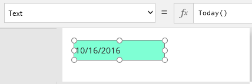

    > [!TIP]
   > 除了能够执行计算之外，还可以通过多种方式[设置日期和时间的格式](show-text-dates-times.md)。

## 将两个控件配置为相互交互
在此过程中，将添加一个复选框，然后将现有标签配置为仅在复选框处于选中状态时显示。

1. 单击或点击“插入”选项卡。

    

2. 依次单击或点击“控件”和“复选框”。

    

3. 将“复选框”控件移到“标签”控件下方，然后将“复选框”控件的“[Text](controls/properties-core.md)”属性设置为“Show text”。

    

4. 保持选中“复选框”控件，单击或点击其位于“属性”选项卡正上方的名称，然后键入 MyCheckbox。

    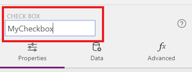

5. 单击或点击“标签”控件以选择它。

6. 在“属性”选项卡上，单击或点击“Visible”属性。

    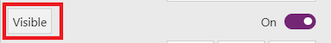

7. 在编辑栏中，删除“true”，然后键入或粘贴以下公式：

    **If(MyCheckbox.Value = true, true, false)**

    这个 **[If 函数](functions/function-if.md)** 声明了标签应仅在复选框处于选中状态时显示。 由于复选框处于取消选中状态，因此“标签”控件消失（选择框仍可见）。

    

8. 单击或点击“复选框”控件，向其添加选择框。然后，再次单击或点击此控件，添加一个复选标记。

    “标签”随即再次显示：

    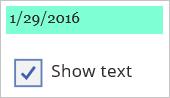

9. 取消选中“复选框”控件，隐藏“标签”控件。

    

虽然这一个基本示例，但你可以从简单到复杂地生成一个或多个[公式](formula-reference.md)，从而配置应用的行为和外观。

## 重命名屏幕或控件
通过重命名屏幕或控件，可以生成更易于读取和维护的公式。

1. 单击或点击要重命名的屏幕或控件。

2. 在右侧窗格中，单击或点击此控件的名称（“属性”选项卡正上方），然后键入所需的名称。

    

## 查找和选择屏幕或控件
可以在左侧窗格中搜索以查找和选择屏幕或控件，即使已隐藏或与其他控件重叠，也不例外。 此窗格显示应用中每个屏幕的缩略图或每个屏幕上所有控件的分层视图。

* 若要在缩略图和分层视图之间切换，请单击或点击窗格右上角的图标。

    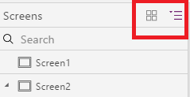

* 若要查找控件，请键入一个或多个字符，系统会突出显示包含所键入文本的控件名称。

    如果单击或点击搜索结果，则会选择应用中的相应控件。

    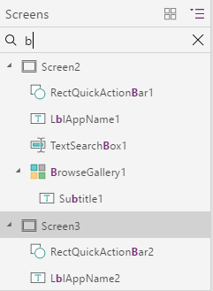

* 若要向上或向下移动屏幕、复制、删除或重命名屏幕，请右键单击屏幕（或单击或点击它旁边的省略号），再单击或点击所需选项。

    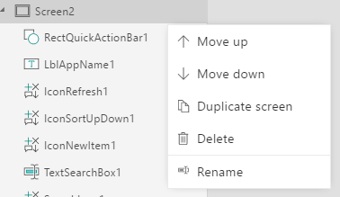

* 若要复制/粘贴、删除或重命名控件，请右键单击控件（或单击或点击它旁边的省略号），再单击或点击所需选项。
