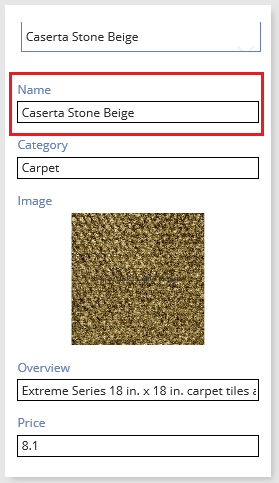

# 在 PowerApps 中显示、编辑或添加表中的记录
若要显示记录中的所有字段，请添加和配置[“显示窗体”](controls/control-form-detail.md)控件。 若要编辑记录中的任意字段（或添加记录），并将更改保存回数据源，请添加和配置[“编辑窗体”](controls/control-form-detail.md)控件。

## 先决条件

* 了解如何在 PowerApps 中[添加和配置控件](add-configure-controls.md)。
* 下载[此 Excel 文件](https://az787822.vo.msecnd.net/documentation/get-started-from-data/FlooringEstimates.xlsx)，其中包含本教程的示例数据。
* 将 Excel 文件上传到[云存储帐户](connections/cloud-storage-blob-connections.md)（如 OneDrive for Business）中。
* 在新应用或现有应用中[添加连接](add-data-connection.md)，建立与 Excel 文件中 FlooringEstimates 表的连接。
* 如果使用的是现有应用，请向其中[添加屏幕](add-screen-context-variables.md)。

## 添加窗体并显示数据
1. 添加[“下拉列表”](controls/control-drop-down.md)控件并命名为“ChooseProduct”，然后将其[“Items”](controls/properties-core.md)属性设为以下值：

    **FlooringEstimates.Name**

    > [!NOTE]
   > 如果不确定如何添加控件、重命名控件或设置属性，请参阅[添加和配置控件](add-configure-controls.md)。

    此列表显示数据源中地面材料产品的名称。

2. 添加“编辑窗体”控件，将其移到“ChooseProduct”下方，然后重设此窗体的大小，以覆盖大部分屏幕。

    

    > [!NOTE]
   > 虽然本主题介绍的是“编辑表单”控件，但类似做法准则也适用于“显示表单”控件。

3. 将此窗体的“[DataSource](controls/control-form-detail.md)”属性设为“FlooringEstimates”，并将此窗体的“[Item](controls/control-form-detail.md)”属性设为以下公式：

   First(Filter(FlooringEstimates, Name=ChooseProduct.Selected.Value))

   此公式指定，在配置完窗体后，显示用户在“ChooseProduct”中选择的记录。

4. 在“数据”窗格中，单击或点击每个字段对应的复选框，以便显示相应字段。

    > [!NOTE]
   > 如果“数据”窗格已关闭，请打开它，具体方法为选择左侧窗格中的表单，再单击或点击右侧窗格中的“数据”。

    

5. 在“数据”窗格中，将“名称”条目拖到列表顶部。

    

    此时，“编辑窗体”控件会反映出所做的更改。

    

## 设置字段的卡类型
1. 选择此窗体后，单击或点击“数据”窗格中“价格”的卡选择器。

    

2. 向下滚动，然后单击或点击“查看文本”选项，让字段成为只读字段。

    

    此时，编辑窗体会反映出所做的更改。

      

## （仅限编辑窗体）保存更改
1. 在左侧窗格中选择窗体，然后单击或点击省略号 (...)。

   

2. 单击或点击“重命名”，然后重命名“EditForm”窗体。

3. 添加“[按钮](controls/control-button.md)”控件，再将“[Text](controls/properties-core.md)”属性设为“Save”。

      

4. 将“保存”按钮的“[OnSelect](controls/properties-core.md)”属性设为以下公式：

   SubmitForm(EditForm)

5. 选择右上角附近的播放按钮（或按 F5 键），打开预览模式。

    

6. 更改产品名称，然后单击或点击你创建的“保存”按钮。

    “[SubmitForm](functions/function-form.md)”函数会将你所做的更改保存到配置此窗体时使用的数据源中。

7. （可选）选择关闭图标（或按 Esc 键），关闭预览模式。

    

## 后续步骤
详细了解如何使用[窗体](working-with-forms.md)和[公式](working-with-formulas.md)。
