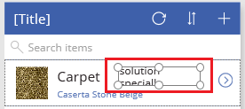

# 显示 PowerApps 中项的列表
通过向应用添加[库](controls/control-gallery.md)控件，显示任意数据源中项的列表。 本主题使用 Excel 作为数据源。 筛选该列表，方法是：将库控件配置为仅显示那些与[文本输入](controls/control-text-input.md)控件中的筛选器条件匹配的项。

## 先决条件
* 了解如何在 PowerApps 中[添加和配置控件](add-configure-controls.md)。

* 设置示例数据：
    1. 下载[此 Excel 文件](https://az787822.vo.msecnd.net/documentation/get-started-from-data/FlooringEstimates.xlsx)，其中包含本教程的示例数据。

    2. 将 Excel 文件上传到[云存储帐户](connections/cloud-storage-blob-connections.md)（如 OneDrive for Business）中。

## 添加库控件
1. 打开 PowerApps，然后单击或点击左边缘附近的“新建”。

2. 在“空白应用”磁贴上，单击或点击“手机布局”。

3. 在“欢迎使用 PowerApps Studio”对话框中，单击或点击“跳过”。

4. 与 Excel 文件中的“FlooringEstimates”表[建立连接](add-data-connection.md)。

5. （可选）依次单击或点击“插入”选项卡、“库”和空（空白）库控件或包含一组默认控件的库，将库控件添加到默认屏幕中。

    可以选择水平或垂直滚动的库控件。 还可以添加自动根据各项的内容量重设大小的库控件。

    

6. 在“开始”选项卡上，单击或点击“新屏幕”。

    可以添加空屏幕、滚动的屏幕、包含库控件或窗体的屏幕。

7. 单击或点击“列表屏幕”，添加包含库控件和其他控件（如搜索栏）的屏幕。

    > [!NOTE]
> 无论是将“库”控件添加到新屏幕，还是添加到现有屏幕，都可以单击或点击“库”控件底部附近位置以选择它，再依次单击或点击右侧窗格中的“FlooringEstimates”和“数据”窗格中的其他布局。 对于本教程，保留默认布局。

    

8. 在屏幕中单击或点击刚添加的库控件。

9. 在右侧窗格的“属性”选项卡上，单击或点击“CustomGallerySample”。

10. 在“数据”窗格中，依次单击或点击“CustomGallerySample”和“FlooringEstimates”。

    

    此时，库控件显示示例数据。

    

    本主题稍后将介绍如何配置排序和搜索。

## 将控件添加到库控件
请先确定库控件布局，然后再自定义库控件。 库控件中的第一组控件为模板，用于确定库控件中所有数据的显示方式。

1. 依次单击或点击库控件底部附近位置和左上角的铅笔图标，从而选择模板。

    

2. 在模板仍然处于选中状态的情况下，添加[标签](controls/control-text-box.md)控件，然后移动此控件并重设其大小，使之与模板中的其他控件不重叠。

    
3. 通过选择模板然后单击或点击右侧窗格中的“Flooring Estimates”打开“数据”窗格。

4. 选择在此过程前面部分添加的标签，然后打开“数据”窗格中突出显示的列表。

    

5. 在此列表中，单击或点击“价格”。

    

    此时，库控件显示示例新值。

    

## 筛选库控件
库控件的[“Items”](controls/properties-core.md) 属性决定了其所显示的项。 在此过程中，需对该属性进行配置，使得库控件仅显示产品名称包含 TextSearchBox1 中文本的那些项。

1. 单击或点击库控件底部附近，以选择该库控件。

2. 在“高级”选项卡上，将库控件的[“Items”](controls/properties-core.md) 属性设置为以下公式：

    If(IsBlank(TextSearchBox1.Text), FlooringEstimates, Filter(FlooringEstimates, TextSearchBox1.Text in Text(Name)))

    若要详细了解此公式中的函数，请参阅[公式参考](formula-reference.md)。

3. 在搜索框中键入产品的全称或部分名称。

    库控件仅显示符合筛选器条件的那些项。

## 对库控件排序
库控件的[“Items”](controls/properties-core.md)属性决定了项的显示顺序。 在此过程中，需对该属性进行配置，使得库控件按 ImageSortUpDown1 所设置的顺序来显示项的顺序。

1. 将库控件的[“Items”](controls/properties-core.md)属性设置为以下公式：

    Sort(If(IsBlank(TextSearchBox1.Text), FlooringEstimates, Filter(FlooringEstimates, TextSearchBox1.Text in Text(Name))), Name, If(SortDescending1, SortOrder.Descending, SortOrder.Ascending))

2. 选择排序图标，更改库控件的排序顺序（按产品名称）。

若要对库控件进行排序和筛选，请执行以下操作：

* 将以下公式中的两个 DataSource 实例替换为数据源名称。

* 将两个 ColumnName 实例替换为要用作排序和筛选依据的列名称。

Sort(If(IsBlank(TextSearchBox1.Text), DataSource, Filter( DataSource, TextSearchBox1.Text in Text( ColumnName ))), ColumnName, If(SortDescending1, SortOrder.Descending, SortOrder.Ascending))

## 突出显示选定项
将库控件的“TemplateFill”属性设置为类似于以下示例的公式：

If(ThisItem.IsSelected, LightCyan, White)

## 更改默认选择
将库控件的“Default”属性设置为要默认选择的记录。 例如，指定“FlooringEstimates”数据源中的第五项：

Last(FirstN(FlooringEstimates, 5))

在以下示例中，指定“FlooringEstimates”数据源中“Hardwood”类别的第一项：

First(Filter(FlooringEstimates, Category = "Hardwood"))

## 后续步骤
了解如何使用[窗体](working-with-forms.md)和[公式](working-with-formulas.md)。
