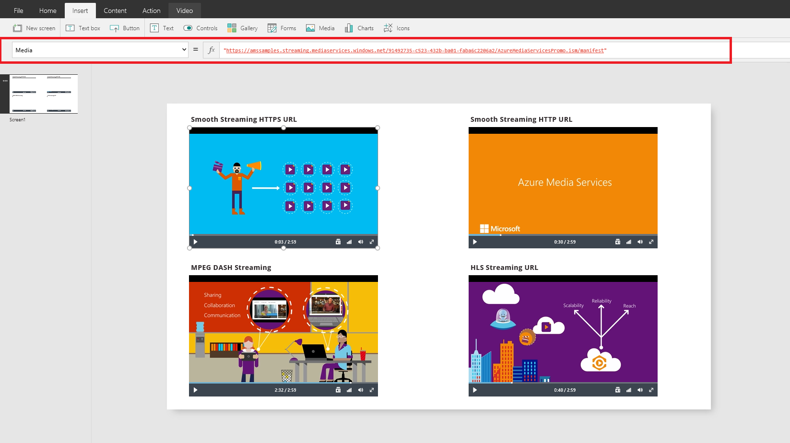
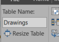
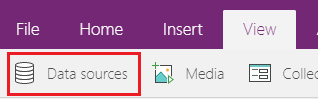

# 在 PowerApps 中使用多媒体文件

本主题介绍如何在画布应用中嵌入多媒体文件、将笔绘作品上载到数据源，然后在画布应用中显示该数据源中的图像。 本主题使用的数据源是 OneDrive for Business 中的一个 Excel 文件。

## 先决条件

[注册](../signup-for-powerapps.md) PowerApps，然后使用注册所用的同一凭据[登录](https://web.powerapps.com?utm_source=padocs&utm_medium=linkinadoc&utm_campaign=referralsfromdoc)。

## 从文件或云添加媒体

可以选择要添加的媒体文件类型（例如图像、视频或音频）。

1. 在“内容”选项卡中选择“媒体”。

2. 在“媒体”下面，选择“图像”、“视频”或“音频”，然后选择“浏览”：

    ![浏览媒体][1]

3. 选择要添加的文件，然后选择“打开”。

    此时将打开计算机上的“图片”文件夹，可从中选择图像或导航到另一个文件夹。

4. 添加完文件后，请按 Esc 返回默认工作区。

5. 在“插入”选项卡中选择“媒体”，然后选择“图像”、“视频”或“音频”：

    ![选择媒体类型][8]

6. 如果添加了图像控件，请将其 **[Image](controls/properties-visual.md)** 属性设置为添加的文件：  

    

    > [!NOTE]
   > 请仅指定文件名（不含扩展名），并用单引号将它括起来。

7. 如果添加了视频或音频控件，请将其 **Media** 属性设置为添加的文件：  

    

    > [!NOTE]
   > 若要播放 YouTube 视频，请将视频控件的 Media 属性设置为相应的 URL，并用双引号将它括起来。

## 从 Azure 媒体服务添加媒体
1. 通过 Azure 媒体服务帐户的“AMS”>“设置”>“资产”上传并发布视频资产。

2. 发布视频后，复制其 URL。

3. 通过 PowerApps 的“插入”>“媒体”添加“视频”控件。

4. 将 **Media** 属性设置为已复制的 URL。

    如图所示，你可以选择 Azure 媒体服务支持的任何流式处理 URL：

    

## 将云中的图像添加到应用
在此情景中，图像保存在云存储帐户 OneDrive for Business 中。 你要使用 Excel 表格来包含图像的路径，并在应用的库控件中显示图像。

此情景使用包含一些 .jpeg 文件的 [CreateFirstApp.zip](http://pwrappssamples.blob.core.windows.net/samples/CreateFirstApp.zip)。

> [!NOTE]
> Excel 文件中这些图像的路径必须使用正斜线。 当 PowerApps 在 Excel 表格中保存图像路径时，路径使用反斜杠。 如果使用此类中的图像路径，请将 Excel 表格中的路径更改为使用正斜杠而不是反斜杠。 否则图像不会显示。  

1. 下载 [CreateFirstApp.zip](http://pwrappssamples.blob.core.windows.net/samples/CreateFirstApp.zip)，并将 **Assets** 文件夹解压缩到云存储帐户。

2. 将 **Assets** 文件夹重命名为 **Assets_images**。

3. 在 Excel 电子表格创建一个单列表格，并在其中填充以下数据：

    

4. 将表格命名为 **Jackets**，将 Excel 文件命名为 **Assets.xlsx**。

5. 在应用中添加 **Jackets** 表格作为数据源。  

6. 添加“仅图像”控件（“插入”选项卡 >“库”），然后将其 **Items** 属性设置为 `Jackets`：  

    

    库将自动更新图像：  

    

    设置 **Items** 属性时，会自动将名为 **PowerAppsId** 的列添加到 Excel 表格。

    在 Excel 表格中，图像路径可以是到图像的 URL。 [Flooring Estimates](http://pwrappssamples.blob.core.windows.net/samples/FlooringEstimates.xlsx) 示例文件就是一个例子。 可将该文件下载到云存储帐户，在应用中添加 `FlooringEstimates` 表格作为数据源，然后将库控件设置为 `FlooringEstimates`。 库将自动更新图像。

## 将笔绘作品上载到云
此情景演示如何将笔绘作品上载到数据源 OneDrive for Business，然后了解绘图作品在该位置的存储方式。

1. 在 Excel 中，将“图像 [image]”添加到 A1 单元格。

2. 使用以下步骤创建表格：    

   1. 选择 A1 单元格。

   2. 在“插入”功能区中选择“表格”。

   3. 在对话框中选择“表包含标题”，然后选择“确定”。

       

       Excel 文件现在采用表格格式。 有关 Excel 中表格格式设置的详细信息，请参阅[将数据设为表格格式](https://support.office.com/article/Format-an-Excel-table-6789619F-C889-495C-99C2-2F971C0E2370)。

   4. 将表格命名为 **Drawings**：

       

3. 将该 Excel 文件以文件名 **SavePen.xlsx** 保存到 OneDrive for Business。

4. 在 PowerApps 中，创建一个[空白应用](get-started-create-from-blank.md)。

5. 在该应用中，将 OneDrive for Business 帐户添为[数据源](add-data-connection.md)：

   1. 单击或点击“视图”选项卡，然后单击或点击“数据源”。

       

   2. 单击或点击“添加数据源”，然后单击或点击“OneDrive for Business”。

       

   3. 单击或点击“SavePen.xlsx”。

   4. 选择 **Drawings** 表格，然后单击或点击“连接”。

         

       现在，Drawings 表格已作为数据源列出。

6. 在“插入”选项卡中，依次选择“文本”和“笔输入”。

7. 将新控件重命名为 **MyPen**：  

    

8. 在“插入”选项卡中添加一个“按钮”控件，并将其 **OnSelect** 属性设置为以下公式：

    **Patch(Drawings, Defaults(Drawings), {Image:MyPen.Image})**

9. 添加“图像库”控件（“插入”选项卡 >“库”），然后将 **Items** 属性设置为 `Drawings`。 库控件的 **Image** 属性将自动设置为 `ThisItem.Image`。

    排列这些控件，使屏幕外观如下所示：  

    

10. 按 F5，或选择“预览”(  )。

11. 在 MyPen 中绘制一些内容，然后选择按钮。

    库控件中的第一幅图像将显示你绘制的内容。

12. 在绘图中添加其他一些内容，并选择按钮。

    库控件中的第二幅图像将显示你绘制的内容。

13. 按 Esc 关闭预览窗口。

    云存储帐户中已自动创建一个 **SavePen_images** 文件夹。 此文件夹包含保存的图像，其中 ID 代表它们的文件名。 若要显示该文件夹，可能需要刷新浏览器窗口（例如，按 F5）。

    在 **SavePen.xlsx** 中，**Image** 列指定新图像的路径。

### 已知的限制
若要了解如何在组织内共享 Excel 数据，请[查看这些限制](connections/cloud-storage-blob-connections.md#known-limitations)。

## 有关
请务必在不同的平台上测试应用，包括在[浏览器窗口](https://home.dynamics.com/)和手机上测试。

若要了解涉及将多媒体直接上载到不同数据源的更高级方案，请参阅[有关捕获图像的专业提示](https://powerapps.microsoft.com/blog/image-capture-pro-tips/)和[用于上载图像的自定义连接器](https://powerapps.microsoft.com/blog/custom-api-for-image-upload/)。

将文件上载到数据源的另一种方法是使用 [Patch](functions/function-patch.md) 函数。

[1]: ./media/add-images-pictures-audio-video/add-image-video-audio-file.png
[3]: ./media/add-images-pictures-audio-video/add-intro-sound.png
[4]: ./media/add-images-pictures-audio-video/add-picture.png
[5]: ./media/add-images-pictures-audio-video/camera-gallery.png
[6]: ./media/add-images-pictures-audio-video/audio-gallery.png
[7]: ./media/add-images-pictures-audio-video/pen-gallery.png
[8]: ./media/add-images-pictures-audio-video/mediaoptions.png
[9]: ./media/add-images-pictures-audio-video/imageproperty.png
[10]: ./media/add-images-pictures-audio-video/mediaproperty.png
[11]: ./media/add-images-pictures-audio-video/renamecamera.png
