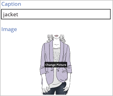
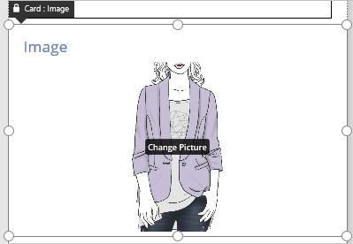
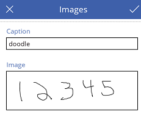

# 通过 PowerApps 将图像添加到 Excel 中
自动创建应用，用户可以在其中显示、添加或删除各文件中的图像，或通过“笔”控件绘制的画图。 此应用以你创建并上载到云存储帐户中的 Excel 文件为依据。

## 先决条件

* 熟悉如何[添加和配置控件](add-configure-controls.md)。
* 熟悉如何[将 Excel 数据配置为表](https://support.office.com/article/Format-an-Excel-table-6789619F-C889-495C-99C2-2F971C0E2370?ui=en-US&rs=en-US&ad=US)。
* 已建立与云存储帐户（如 Dropbox、OneDrive 或 Google 云端硬盘）的 [PowerApps 连接](add-data-connection.md)，以便可以在其中存储 Excel 文件。

## 创建数据源和应用
1. 在 Excel 中，向任意两个并排且正下方是空单元格的单元格（例如，A1 和 B1）添加“Caption”和“Image [image]”。
2. 将更新的单元格及其正下方的单元格格式化为表，然后命名此表（例如，“Images”）。
   
    
3. 保存此文件（例如，另存为“ImageDemo”），然后将其上载到云存储帐户中。
4. 在 PowerApps 中，依次单击或点击“文件”菜单上的“新建”（如果尚未打开应用，请单击或点击左边缘中的“新建”）和云存储帐户磁贴中的“手机布局”。
   
    
5. 在“选择 Excel 文件”下，单击或点击你创建的文件。
   
    
6. 在“选择表”下，依次单击或点击你创建的表和“连接”。
   
    
7. 如果出现快速导览，可选择观看，或者选择单击或点击“跳过”。
   
    

## 添加文件中的图像
1. 按 F5 键（或者单击或点击右上角附近的播放按钮），打开预览模式，然后单击或点击右上角的加号图标。
   
    
2. 在“说明”框中，键入或粘贴要添加的图像文件的简短说明，然后单击或点击其下方来指定文件。
3. 在“打开”对话框中，转到要添加的文件，然后依次单击或点击此文件和“打开”。
   
    
4. 单击或点击右上角的复选标记图标来保存更改。
   
    
5. 重复执行最后三步，根据需要添加任意多张图像，然后按 Esc 键返回到默认工作区。
6. （可选）删除显示每张图像的说明的“标签”控件。

## 添加绘图
1. 单击或点击左侧导航栏中的“EditScreen1”显示此屏幕，然后单击或点击图像卡以选择此卡。
   
    
2. 在右侧窗格中，依次单击或点击图像卡的卡选择器和“添加注释”。
   
    
3. 单击或点击左侧导航栏中的“BrowseScreen1”显示此屏幕，然后打开预览模式。
4. 单击或点击右上角的加号图标，添加说明，然后在“笔”控件中绘制图像。
   
    
5. 单击或点击右上角的复选标记图标来保存更改。
   
    
6. 重复执行最后两步，根据需要添加任意多张绘图，然后按 Esc 键返回到默认工作区。

