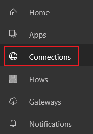
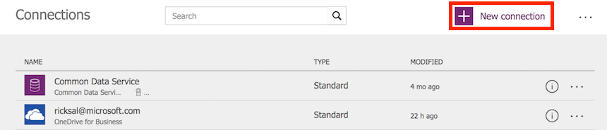
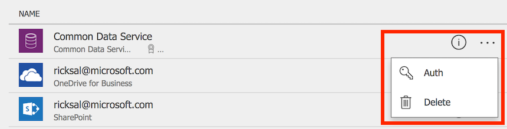

# 管理 PowerApps 中的连接
在 [powerapps.com](https://web.powerapps.com) 中，创建从 PowerApps 到一个或多个数据源的连接、删除连接或更新其凭据。

应用的数据连接可以连接到 SharePoint、SQL Server、Office 365、OneDrive for Business、Salesforce、Excel 以及许多其他[数据源](connections-list.md)。

阅读本文后的下一步是在应用中显示和管理来自数据源的数据，如以下示例所示：

* 连接到 OneDrive for Business，并在应用中管理 Excel 工作簿中的数据。
* 更新 SharePoint 站点上的列表。
* 连接到 SQL Server，并从应用更新表。
* 在 Office 365 中发送电子邮件。
* 发送推文。
* 连接到 Twilio，并从应用发送短信。

## 先决条件
1. [注册](../signup-for-powerapps.md) PowerApps。
2. 使用注册所用的同一凭据登录到 [powerapps.com](https://web.powerapps.com)。

## 数据连接的背景信息
大多数 PowerApps 应用使用称为“数据源”的外部信息，此类信息存储在云服务中。 一个常见的示例是存储在 OneDrive for Business 中的 Excel 文件中的表。 应用可通过使用**连接**访问这些数据源。

最常见的数据源类型是表，它可用于检索和存储信息。 可以利用到数据源的连接，采用 Microsoft Excel 工作簿、SharePoint 列表、SQL 表和许多其他格式来读取和写入数据，并将这些数据存储在 OneDrive for Business、DropBox、SQL Server 等云服务中。

除表以外，还有其他数据源类型，例如电子邮件、日历、Twitter 和（即将推出的）通知。

使用**[库](controls/control-gallery.md)**、**[显示窗体](controls/control-form-detail.md)** 和**[编辑窗体](controls/control-form-detail.md)** 控件，可以轻松创建一个在数据源中读取和写入数据的应用。 若要开始操作，请阅读[了解数据窗体](working-with-forms.md)一文。

除了在 [powerapps.com](https://web.powerapps.com) 中创建和管理连接外，还可以在执行以下任务时创建连接：

* 自动生成[来自数据的应用](app-from-sharepoint.md)，如自定义 SharePoint 列表。
* 更新现有应用，或从头开始创建应用，如 [添加连接](add-data-connection.md) 中所述。
* 打开由其他用户创建的应用并 [与你共享](share-app.md)。

> [!NOTE]
> 若要改用 PowerApps Studio，请打开“文件”菜单，再单击或点击“连接”，随即会打开 [powerapps.com](https://web.powerapps.com)，可以在其中创建和管理连接。

## 创建新连接
1. 如果尚未这样做，请登录到 [powerapps.com](https://web.powerapps.com)。
2. 在左侧导航栏中，单击或点击“连接”。
   
    
3. 在右上角单击或点击“新建连接”。
   
    
4. 在随即出现的列表中，单击或点击某个连接器，然后按提示操作。
   
   
5. 单击或点击“创建”按钮。
   
   
6. 按提示操作。 某些连接器会提示你提供凭据，指定一组特定的数据或执行其他步骤。 其他连接器（例如 **Microsoft Translator**）则不会。
   
   例如，这些连接器在使用之前需要提供其他信息。
   
   * [SharePoint](connections/connection-sharepoint-online.md)
   * [SQL Server](connections/connection-azure-sqldatabase.md)

新的连接器显示在“**连接**”下，可以 [将其添加到应用](add-data-connection.md)。

## 更新或删除连接
在连接列表中，找到要更新或删除的连接，然后单击或点击该连接右侧的省略号（3 点符号）。

* 若要更新连接凭据，请单击或点击钥匙图标，然后为该连接提供凭据。
* 若要删除连接，单击或点击回收站图标。

