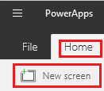
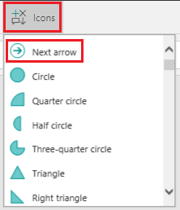

# 在画布应用中添加屏幕并切换屏幕

创建包含多个屏幕的画布应用，然后为用户提供屏幕切换方式。

## 添加并重命名屏幕

1. 在 "**主页**" 选项卡上，选择 "**新屏幕**"，然后选择要添加的屏幕类型。

    

2. 在右侧窗格中，选择屏幕的名称（在 "**属性**" 选项卡的上方），然后键入**Source**。

    

3. 添加另一个屏幕，然后将其命名为“Target”。

    

## 重新排序屏幕

在左侧导航栏中，将鼠标悬停在要上移或下移的屏幕上，选择显示的省略号按钮，然后选择 "**上移**" 或 **"下移"。**

> [!NOTE]
> 打开应用后，控件分层列表顶部的屏幕通常会首先出现。 但可以通过将 **[OnStart](controls/control-screen.md)** 属性设置为包含 **[导航](functions/function-navigate.md)** 函数的公式来指定其他屏幕。

## 添加导航

1. 选择**源**屏幕后，打开 "**插入**" 选项卡，选择 "**图标**"，然后选择 "**下一步" 箭头**。  

    

2. （可选）将此箭头移到屏幕右下角。

3. 在仍选中箭头的情况下，选择 "**操作**" 选项卡，然后选择 "**导航**"。

    此箭头的 **[“OnSelect”](controls/properties-core.md)** 属性会自动设为 **“Navigate”** 函数。

    

    当用户选择箭头时，**目标**屏幕将淡入。

4. 在“Target”屏幕上，添加“后退箭头” ，然后将其 **[“OnSelect”](controls/properties-core.md)** 属性设为以下公式：

    `Navigate(Source, ScreenTransition.Fade)`

5. 按下 Alt 键时，通过选择每个屏幕上的箭头在屏幕之间切换。

## 详细信息

[屏幕控制参考](controls/control-screen.md)