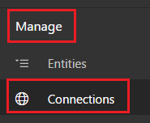
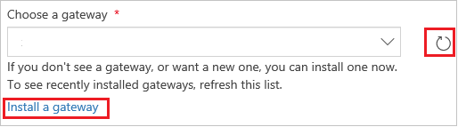

# 创建从 PowerApps 到 SharePoint 的连接
创建到 SharePoint Online 或本地 SharePoint 的连接，以便自动生成应用或从零构建应用。

如果不熟悉 PowerApps，请参阅 [PowerApps 简介](getting-started.md)。

截至本文，PowerApps 支持自定义列表，但不支持自定义库。 此外，还可以在某些类型的列（例如**选项**和**图片**）中显示数据，但无法更新该数据。 有关详细信息，请参阅 [已知问题](connections/connection-sharepoint-online.md#known-issues)。

## 指定 SharePoint 连接
1. 如果还未注册，请 [注册 PowerApps](../signup-for-powerapps.md)。

2. 使用注册所用的同一凭据登录到 [powerapps.com](https://web.powerapps.com)。

3. 在左侧导航栏中，单击或点击“**管理**”，然后单击或点击“**连接**”。

    

4. 在右上角附近，单击或点击“**新建连接**”。

    

5. 在连接列表中，单击或点击“**SharePoint**”。

    

6. 请按照本主题后面出现的任一过程中的步骤操作：

   * [连接到 SharePoint Online 站点](connect-to-sharepoint.md#connect-to-a-sharepoint-online-site)。
   * [连接到本地 SharePoint 站点](connect-to-sharepoint.md#connect-to-an-on-premises-sharepoint-site)。

## 连接到 SharePoint Online 站点
1. 单击或点击“**直接连接（云服务）**”，然后单击或点击“**添加连接**”。

    

2. 转到本主题末尾的 [后续步骤](connect-to-sharepoint.md#next-steps)。

## 连接到本地 SharePoint 站点
1. 单击或点击“**使用本地数据网关连接**”。

    

    > [!NOTE]
> 只能在用户的[默认环境](working-with-environments.md)中创建和使用网关和本地连接。

2. 指定用户名和密码。

    如果凭据包括域名，则将其指定为“*域\别名*”。

    

3. 如果未安装本地数据网关，则请 [安装](gateway-reference.md)，然后单击或点击图标来刷新网关列表。

    

4. 在“**选择网关**”下，单击或点击要使用的网关，然后单击或者点击“**添加连接**”。

    

## 后续步骤
* 基于指定的列表 [自动生成应用](app-from-sharepoint.md)。 默认情况下，应用包含三个屏幕，分别用于浏览记录、显示有关单个记录的详细信息以及创建或更新记录。
* [从零开始构建应用](get-started-create-from-blank.md)。 本主题针对 Excel 编写，但原则同样适用于 SharePoint。
