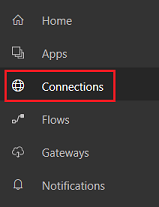
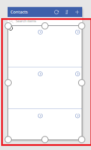
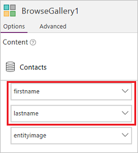
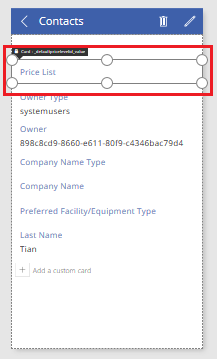
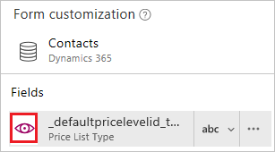

# 从 PowerApps 连接到 Dynamics 365
通过 PowerApps，可使用很少的代码或无需代码，快速生成、自定义、共享和运行移动应用。 通过使用 Dynamics 365 连接器，只需几分钟，即可创建有用的移动应用，与组织实现共享。

按照本主题中的步骤操作，可创建相关应用，用户可在此应用中浏览、添加、删除和更新 Dynamics 365 中的联系人。 用户可通过[浏览器](../../../user/run-app-browser.md)或[移动设备](../../../user/run-app-client.md)（如手机）运行该应用。

## 先决条件
若要遵照本教程操作，需要一个包含 Dynamics 365 订阅的 Microsoft Office 365 帐户。

## 创建连接
1. [登录 PowerApps](https://web.powerapps.com?utm_source=padocs&utm_medium=linkinadoc&utm_campaign=referralsfromdoc)。
2. 在左侧导航窗格中，单击“连接”。
   
    
3. 在右上角附近，单击“新建连接”。
   
    
4. 在连接列表中，单击 **Dynamics 365**。
   
    
5. 在对话框中，单击“创建”。
   
    
6. 在“登录你的帐户”对话框中，提供 Dynamics 365（联机）租户凭据。
   
    将创建一个连接。

## 自动生成应用
1. [登录 PowerApps](https://web.powerapps.com?utm_source=padocs&utm_medium=linkinadoc&utm_campaign=referralsfromdoc)，然后单击左下角附近的“新建应用”。
   
    
2. 在“开始使用数据”下，单击“Dynamics 365”磁贴上的“手机布局”。
   
    
3. 在“连接”下，选择所需的连接，然后选择将在应用中管理的 Dynamics 365 实例的相应数据集。
4. 在“选择表”下，单击“联系人”，然后单击“连接”。
5. 在左侧导航栏中，单击或点击右上角的图标，切换到缩略图视图。
   
    

PowerApps 会根据联系人记录生成三屏应用。

* **BrowseScreen1**。 用户打开应用时默认显示此屏幕。 在左侧导航栏中，此屏幕的缩略图显示在其他两个屏幕上方。
* **DetailScreen1**。 用户单击 **BrowseScreen1** 中的某项时，将显示此屏幕。  在左侧导航栏中，**DetailScreen1** 的缩略图显示在其他两个屏幕之间。
* **EditScreen1**。 用户单击 **DetailScreen1** 中某项的编辑图标时，将显示此屏幕。 在左侧导航栏中，**EditScreen1** 的缩略图显示在其他两个屏幕下方。

应用可以其初始状态运行，但可通过改进每个屏幕上的信息使其更有用。

## 自定义 BrowseScreen1
在此过程中，将配置 **BrowseScreen1** 以显示每个联系人的姓氏和名字。 数据将按姓氏的字母顺序排序，并在两列式网格中包含图像。

1. 在 **BrowseScreen1** 中，单击除第一条记录之外的任意记录可选择库。
   
    
2. 在右侧窗格中，单击或点击“数据”选项卡。
3. 在布局列表中，单击或点击在两列式网格中显示图片和文本的布局。
   
    可能需要向下滚动以显示此选项。
   
    
4. 复制此公式，在库仍处于选中状态的情况下，在编辑栏（**fx** 按钮的右侧）中粘贴该公式：
   
    `SortByColumns(Search(Filter(Contacts,statuscode=1), TextSearchBox1.Text, "lastname"), "lastname", If(SortDescending1, Descending, Ascending))`
5. 在右侧窗格中，将顶部下拉列表设置为 **firstname**，中间的下拉列表设置为 **lastname**。
   
    
6. （可选）在“文件”菜单上，单击“另存为”，键入应用的名称，然后单击“保存”。
   
    默认情况下，将应用保存到云。 单击“此计算机”可本地保存应用。

## 自定义 DetailsScreen1 和 EditScreen1
1. 在左侧导航栏中，单击中间的缩略图，选择 **DetailsScreen1**。
2. 在 **DetailScreen1** 上，单击标题栏下的任意位置，以在右侧窗格中显示自定义选项。
   
    
3. 在右侧窗格中，单击每个字段的眼睛图标可将其隐藏。
   
    
4. 单击标题栏下的任意位置，选择 **Form1**。
   
    
5. 在右侧窗格中，单击这些字段的眼睛图标，使屏幕显示每个联系人的图像（如果表包含图像）和其他四个字段：
   
   * **entityimage**
   * **firstname**
   * **lastname**
   * **mobilephone**
   * **emailaddress1**
     
     右侧窗格应类似于此图：
     
     
6. 在左侧导航栏中，单击底部的缩略图，选择 **EditScreen1**。
7. 重复此过程中的这些步骤，以自定义 **DetailsScreen1** 的相同方式自定义 **EditScreen1**。
8. （可选）保存应用。

## 后续步骤
* 在左侧导航栏中单击 **BrowseScreen1**，然后按 F5 或单击右上角附近的，在预览模式下测试应用。
* [共享应用](../share-app.md)。
* [添加第二个数据源](../add-data-connection.md)。

