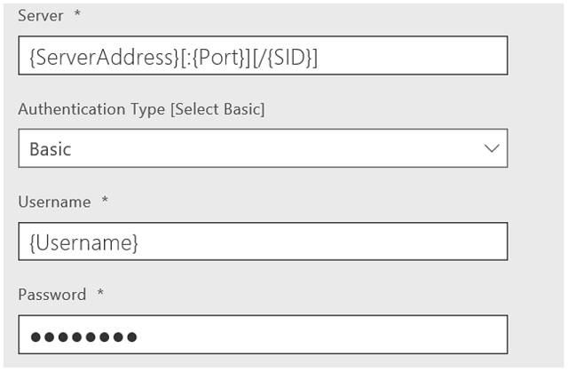
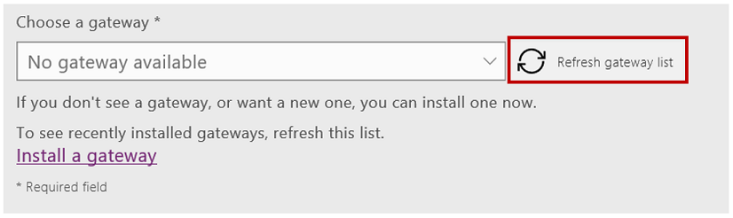

# 从 PowerApps 连接到 Oracle 数据库
创建连接并在 PowerApps 中生成应用后将列出表，并在 Oracle 数据库中创建、读取、更新和删除表行。 Oracle 数据库连接支持完全委派筛选、排序和其他功能，但触发器或存储过程除外。

## 先决条件
* Oracle 9 及更高版本
* Oracle 客户端软件 8.1.7 及更高版本
* 安装本地数据网关
* 安装 Oracle 客户端 SDK

### 安装本地数据网关
若要安装网关，请按照[本教程](../gateway-management.md)中的步骤操作。

本地数据网关充当网桥，提供本地数据（不位于云中的数据）与 Power BI、Microsoft Flow、逻辑应用和 PowerApps 服务之间快速安全的数据传输。 可以将同一个网关与多个服务和多个数据源一起使用。 有关详细信息，请参阅[了解网关](../gateway-reference.md)。

### 安装 Oracle 客户端
在作为本地数据网关的同一台计算机上，安装[适用于 Windows x64 的 64 位 ODAC 12c 版本 4 (12.1.0.2.4)](http://www.oracle.com/technetwork/database/windows/downloads/index-090165.html)。 否则，如已知问题列表中所述，在尝试创建或使用连接时将会出现错误。

## 通过 Oracle 数据库中的表创建应用
1. 在 PowerApps Studio 中，单击或点击左边缘附近的“文件”菜单上的“新建”。
   
   
2. 在“开始处理数据”下，单击或点击箭头。
   
      显示已有的连接列表。
3. 单击或点击“新建连接”。
   
   
4. 在连接列表中，单击或点击“Oracle 数据库”。
   
   
5. 指定 Oracle 服务器名称、用户名和密码。
   
    如果需要 SID，则使用以下格式指定服务器： 
    *ServerName*/*SID*
   
   
6. 单击或点击要使用的网关或安装一个网关。
   
    如果安装网关后该网关未出现，则单击“刷新网关列表”。
   
   
7. 单击或点击“创建”以创建连接。
   
   
8. 单击或点击“默认”数据集。
   
   
9. 在表列表中，单击或点击要使用的表。
   
   
10. 单击“连接”创建应用。
    
    

PowerApps 将创建包含三个屏幕的应用，该应用将显示所选表中的数据：

* **BrowseScreen1**，列出表中的所有条目。
* **DetailScreen1**，提供单个条目的详细信息。
* **EditScreen1**，用户可以在此处更新条目或创建条目。

## 后续步骤
* 要保存刚才生成的应用，请按 Ctrl-S。
* 要自定义 **BrowseScreen1**（默认情况下会显示），请参阅[自定义布局](../customize-layout-sharepoint.md)。
* 若要自定义 **DetailsScreen1** 或 **EditScreen1**，请参阅[自定义窗体](../customize-forms-sharepoint.md)。

## 已知问题、建议和疑难解答
1. 无法访问网关。
   
    本地数据网关无法连接到云时将出现此错误。 若要检查网关状态，请登录到 powerapps.microsoft.com，单击或点击“网关”，然后单击或点击要使用的网关。
   
    确保网关正在运行且可以连接到 Internet。 避免在可能会关机或进入休眠状态的计算机上安装网关。 同时尝试重启本地数据网关服务 (PBIEgwService)。
2. System.Data.OracleClient 需要具备 Oracle 客户端软件 8.1.7 版本或更高版本。
   
    如果未将 Oracle 客户端 SDK 安装在作为本地数据网关的同一台计算机上，则会出现此错误。 若要解决此问题，请[安装正式提供程序](https://go.microsoft.com/fwlink/p/?LinkID=272376)。
3. 表“[Tablename]”未定义任何键列。
   
    如果连接到的表不包含 Oracle 数据库连接所需的任何主键，则会出现此错误。
4. 在撰写本文时，存储过程、包含组合键的表以及表中的嵌套对象类型尚不受支持。

