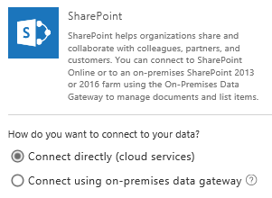
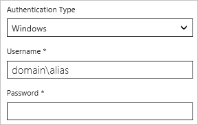
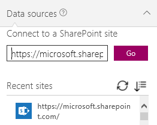
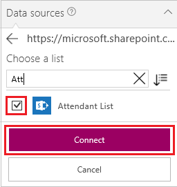

# 从 PowerApps 连接到 SharePoint

连接 SharePoint 站点，从列表自动生成应用、从头开始构建应用或更新现有应用。

## 已知问题
可从自定义列表而不是库中添加数据。 此外，并非所有列类型均受支持，且并非所有类型的列都支持所有类型的卡。

| 列类型 | 支持 | 默认卡 |
| --- | --- | --- |
| 单行文本 |是 |视图文本 |
| 多行文本 |是 |查看文本 |
| 选择 |是 |视图查找 编辑查找 查看多选 编辑多选 |
| Number |是 |视图百分比 视图分级 查看文本 |
| 货币 |是 |视图百分比 视图分级 查看文本 |
| 日期和时间 |是 |查看文本 |
| 查找 |是 |视图查找 编辑查找 查看多选 编辑多选 |
| 布尔值（是/否） |是 |查看文本 视图切换 |
| 用户或用户组 |是 |视图查找 编辑查找 查看多选 编辑多选 |
| 超链接 |是 |视图 URL 查看文本 |
| 图片 |是（只读） |视图图像 查看文本 |
| 附件 |是（只读） |查看附件|
| 已计算 |是（只读） | |
| 任务结果 |否 | |
| 外部数据 |否 | |
| 托管元数据 |是（只读） | |
| 评分 |否 | |

PowerApps 可以读取包含空格，但空格被替换为十六进制转义代码“\_x0020\_”的列。 例如，如果 SharePoint 中的“Column Name”在数据布局中显示或用于公式，它将在 PowerApps 中显示为“Column_x0020_Name”。

## 必备组件
1. [注册](../../signup-for-powerapps.md) PowerApps。

1. 使用注册所用的同一凭据[登录](http://web.powerapps.com?utm_source=padocs&utm_medium=linkinadoc&utm_campaign=referralsfromdoc)到 PowerApps。

1. 在左侧边缘附近选择“应用”，然后在横幅中选择“创建应用”。

## 创建应用
* 基于 SharePoint 列表中的数据[自动生成应用](../app-from-sharepoint.md)。

    默认情况下，应用包含三个屏幕，分别用于浏览记录、显示有关记录的详细信息以及创建或更新记录。 生成应用后，建议自定义[浏览屏幕](../customize-layout-sharepoint.md)和[详细信息和编辑屏幕](../customize-forms-sharepoint.md)以满足所需。

    **注意**：如果 SharePoint 列表包含“选择”、“查阅”或“用户或用户组”列，请参阅本主题稍后将介绍的[在库中显示数据](connection-sharepoint-online.md#show-data-in-a-gallery)。

* 通过后列操作生成自己的应用：[连接到 SharePoint](../connect-to-sharepoint.md)，查看[从头开始创建应用](../get-started-create-from-blank.md)中的步骤，然后将其应用于 SharePoint 而非 Excel。

## 将 SharePoint 列表添加到现有应用
1. 在 PowerApps Studio 中，打开想要更新的应用。

2. 在功能区的“视图”选项卡上，单击或点击“数据源”。

3. 单击或点击右侧窗格中的“添加数据源”。

    

4. 单击或点击“新连接”，单击或点击“SharePoint”，然后单击或点击“连接”。

    

5. 指定想要连接的 SharePoint 站点类型：

    

   * 单击或点击“直接连接(云服务)”以连接到 SharePoint Online。

   * 单击或点击“使用本地数据网关连接”以连接到本地 SharePoint 站点。

       指定 **Windows** 作为身份验证类型，然后指定凭据。 （如果凭据包括域名，则将其指定为 域\别名。）

       

       **注意**：如果未安装本地数据网关，请先[安装一个](../gateway-reference.md)，再单击或点击图标来刷新网关列表。

       在“选择网关”下，单击或点击要使用的网关。

       

6. 单击或点击“连接”。

7. 在“连接到 SharePiont 站点”下，单击或点击“最近使用的站点”列表中的记录（或者键入或粘贴要使用的站点的 URL），然后单击或点击“转到”。

    

8. 在“选择列表”下，选中要使用的一个或多个列表的复选框，再单击或点击“连接”：  

    

    默认情况下，并非所有类型的列表都会显示。 PowerApps 支持自定义列表，而不是基于模板的列表。  如果要使用的列表名称未显示，请滚动到底部，再在“输入自定义列表名称”框中键入列表名称。

    

    数据源已添加到应用。

    

## 在库中显示数据
若要在库中显示这些列类型中任一类型列中的数据，请使用编辑栏设置库中一个或多个“标签”控件的“Text”属性：

* 对于“选择”或“查找”列，请指定 **ThisItem.[ColumnName].Value** 以显示该列中的数据。

    例如，如果具有名为 **Location** 的“选择”列，请指定 **ThisItem.Location.Value**，如果有名为 **PostalCode** 的“查找”列，请指定 **ThisItem.PostalCode.Value**。

* 对于“用户或用户组”列，请指定 **ThisItem.[ColumnName].DisplayName** 以显示该用户或用户组的显示名称。

    例如，指定 **ThisItem.Manager.DisplayName** 以显示名为 **Manager** 的“用户或用户组”列中的显示名称。

    还可以显示关于用户的其他信息，如电子邮件地址或职务等。 若要显示完整的选项列表，请指定 **ThisItem.[ColumnName].** （含结尾句点）。

    **注意**：对于“CreatedBy”列，请指定 ThisItem.Author.DisplayName，以显示创建列表项的用户的显示名称。 对于“修改者”列，请指定 **ThisItem.Editor.DisplayName** 以显示更改列表中的项的用户的显示名称。

* 对于“托管元数据”列，请指定 **ThisItem.[ColumnName].Label** 以显示该列中的数据。

    例如，如果具有名为 **Languages** 的“托管元数据”列，请指定 **ThisItem.Languages.Label**。

## 后续步骤
* 了解如何[显示来自数据源的数据](../add-gallery.md)。
* 了解如何[查看详细信息和创建或更新记录](../add-form.md)。
* 请参阅其他可连接的[数据源](../connections-list.md)类型。
