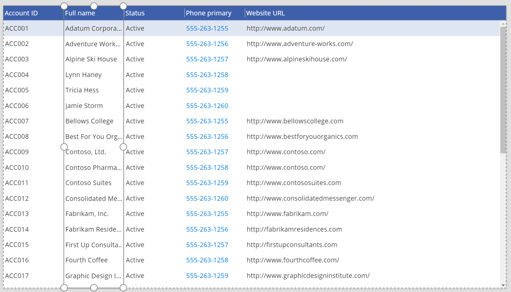
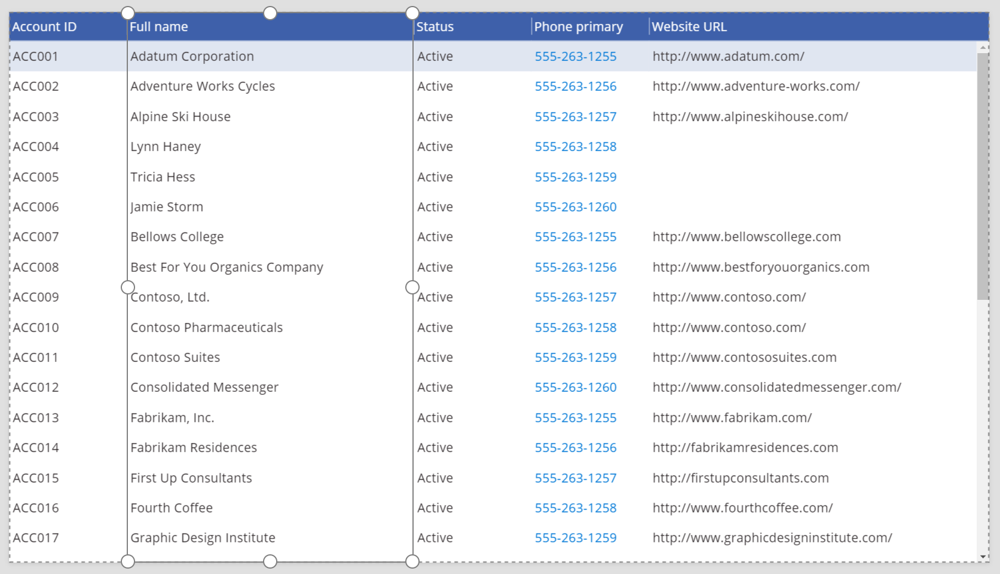

# PowerApps 中的“列”控件
用于在“[数据表](control-data-table.md)”控件中显示单个字段。

## 描述
“[数据表](control-data-table.md)”控件以表格格式显示数据集，表格格式中的每一列都由“列”控件表示。 “列”控件为应用开发者提供用于自定义列外观和行为的属性。

## 功能
### 现可用
* 更改“列”控件的宽度。
* 更改“列”控件的文本。
* 通过单击或点击“列”控件中的值进行导航。

### 尚未推出
* 自定义“列”控件的样式。

### 已知问题
* “Visible”属性不起作用。

## 属性
* **DisplayName** - 列标题文本。
  
  > [!NOTE]
  > 此属性很快将会重命名为“HeaderText”。
  > 
  > 
* **IsHyperlink** - 指明是否应为列中数据加上下划线以表明这是超链接的值。
* [**Width**](properties-size-location.md) -“列”控件左右边缘之间的距离。

## 示例
### 重设列大小
1. 创建一个空白的平板电脑应用。
2. 在“插入”选项卡上，单击或点击“数据表”，再重设“数据表”控件的大小，使其全屏显示。
3. 在右侧窗格中，依次单击或点击“未选择数据源”右侧的向下箭头和“添加数据源”。
4. 在连接列表中，单击或点击 Common Data Service 数据库的连接。
5. 在实体列表中，依次单击或点击“帐户”和“连接”。
   
    此时，“数据表”控件已初始化，显示一组默认字段。
6. 单击或点击“全名”列。
   
    
7. 拖动右侧的装饰器，以重设字段大小。
   
    

## 辅助功能准则
### 屏幕阅读器支持
* “DisplayName”必须存在。
