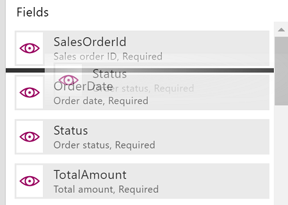
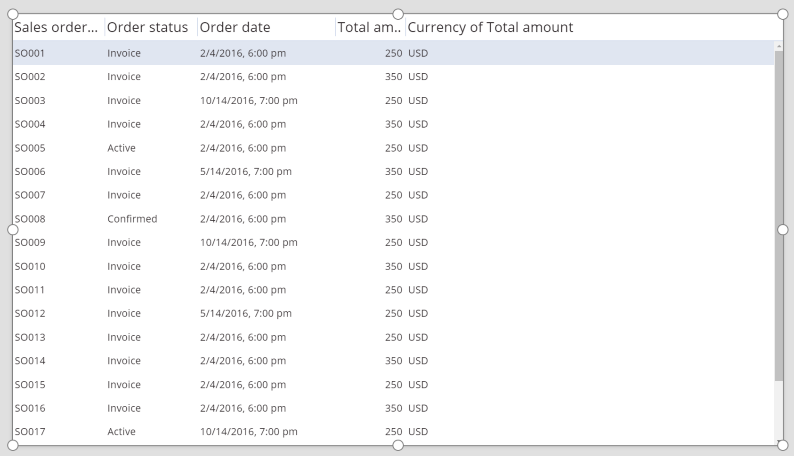
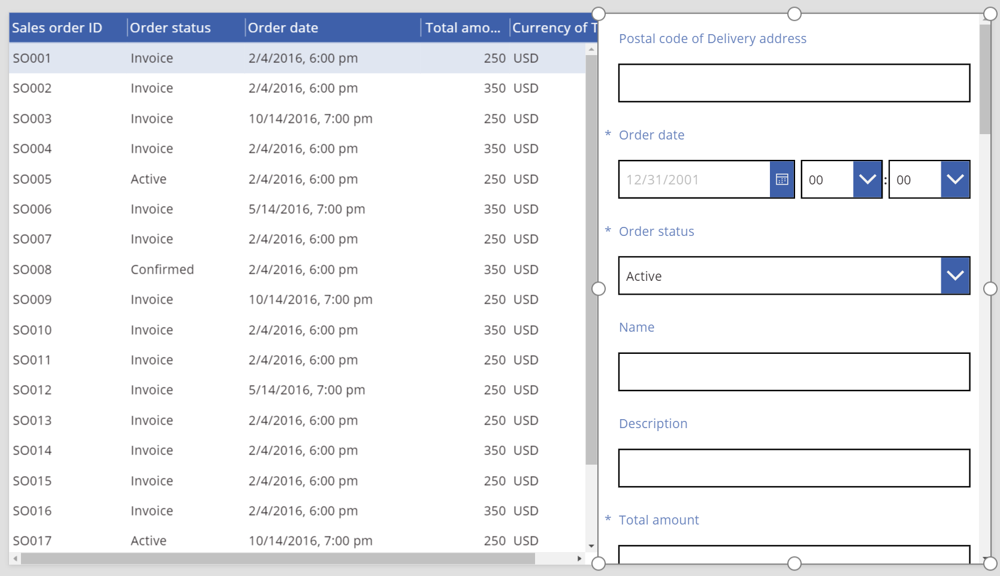

# Power Apps 中的数据表控件
以表格格式显示一组数据。

## 描述
“数据表”控件显示数据集，格式为控件显示的每个字段都有对应的列标题。 作为应用开发者，可以完全控制显示哪些字段和显示顺序。 与“库”控件一样，“数据表”控件包含指向选定行的“Selected”属性。 因此，可以将“数据表”控件与其他控件相关联。

## 功能
Power Apps 在5月 5 2017 日**引入了 "** 数据表" 控件。 此部分介绍了支持和不支持的功能。

### 现可用
* “数据表”控件中的数据为只读。
* “数据表”控件中始终都会选择一行。
* 将“数据表”控件链接到已连接或本地数据源。
* 运行应用的同时，在“数据表”控件中调整列宽度，尽管不会保存所做的更改。
* 将“数据表”控件链接到已实现此功能的连接器（如 Common Data Service）时，将显示一组默认字段。 然后，可以根据需要显示或隐藏这些字段以及其他内容。
* 自定义列宽度和标题文本。
* 在“数据表”控件中显示超链接。
* 复制并粘贴“数据表”控件。

### 尚未推出
* 自定义各列的样式。
* 在“表单”控件中添加“数据表”控件。
* 更改所有行的高度。
* 在“数据表”控件中显示图像。
* 显示相关实体中的字段。
* 使用内置功能按列标题对数据进行筛选和排序。
* 在“库”控件中添加“数据表”控件。
* 编辑“数据表”控件中的数据。
* 选择多行。

### 已知问题
* 如果在“Items”属性中使用“FirstN”函数，不会显示任何数据。

## 关键属性
* [**Items**](properties-core.md) -“数据表”控件中显示的数据源。
* **Selected** -“数据表”控件中的选定行。

## 其他属性
* [**BorderColor**](properties-color-border.md) -“数据表”控件边框颜色。
* [**BorderStyle**](properties-color-border.md) -“数据表”控件边框样式。 选项包括 Solid、Dashed、Dotted和 None。
* [**BorderThickness**](properties-color-border.md) -“数据表”控件边框粗细。
* [**Color**](properties-color-border.md) - 所有数据行的默认文本颜色。
* [**Fill**](properties-color-border.md) - 所有数据行的默认背景色。
* [**Font**](properties-text.md) - 所有数据行的默认字体。
* [**FontWeight**](properties-text.md) - 所有数据行的默认字体粗细。
* **HeadingColor** - 列标题的文字颜色。
* **HeadingFill** - 列标题的背景色。
* **HeadingFont** - 列标题的字体。
* **HeadingFontWeight** - 列标题的字体粗细。
* **HeadingSize** - 列标题的字号。
* [**Height**](properties-size-location.md) -“数据表”控件上下边缘之间的距离。
* [**HoverColor**](properties-color-border.md) - 鼠标指针指向的行的文字颜色。
* [**HoverFill**](properties-color-border.md) - 鼠标指针指向的行的背景色。
* **NoDataText** -“数据表”控件中没有记录可显示时向用户显示的消息。
* **SelectedColor** - 用户选择的行的文本颜色。
* **SelectedFill** - 用户选择的行的背景色。
* [**Size**](properties-text.md) - 所有数据行的默认字号。
* [**Visible**](properties-core.md) - 用于确定“数据表”控件是否可见的值。
* [**Width**](properties-size-location.md) -“数据表”控件左右边缘之间的距离。
* [**X**](properties-size-location.md) -“数据表”控件左边缘与其父容器左边缘（如果没有父容器，则为屏幕左边缘）之间的距离。
* [**Y**](properties-size-location.md) -“数据表”控件上边缘与其父容器上边缘（如果没有父容器，则为屏幕上边缘）之间的距离。

## 相关函数
* [Filter(DataSource, Formula)](../functions/function-filter-lookup.md)(DataSource, Formula)
* [Search(DataSource, SearchString, Column)](../functions/function-filter-lookup.md)(DataSource, SearchString, Column)

## 示例
### 基本用法
1. 创建一个空白的平板电脑应用。
2. 在“插入”选项卡上，单击或点击“数据表”。
   
    
   
    “数据表”控件已添加到屏幕中。
3. 将“数据表”控件重命名为“SalesOrderTable”，再重设大小，使其全屏显示。
4. 在右侧窗格中，依次单击或点击“未选择数据源”文本右侧的向下箭头和“添加数据源”。
   
    
5. 在连接列表中，单击或点击 Common Data Service 数据库的连接。
   
    
6. 在实体列表中，单击或点击“销售订单”，然后单击或点击“连接”。
   
    
   
    “数据表”控件现在与“销售订单”数据源相连。 “数据表”控件中会显示多个初始字段，因为我们使用的连接器支持此功能。
   
    
7. 在右侧窗格中，选中或取消选中一个或多个复选框，以显示或隐藏各个字段。
   
    例如，选中“CustomerPurchaseOrderReference”旁边的复选框可以显示此字段。
8. 在右侧窗格中，上下拖动字段，以重新排列。
   
    
   
    此时，“SalesOrderTable”控件按所指定的顺序显示字段。
   
    

### 重设“数据表”控件的列标题样式
1. 选择“数据表”控件后，单击或点击右侧窗格中的“高级”选项卡。
2. 单击或点击“HeadingFill”属性字段，然后将值更改为“RGBA(62,96,170,1)”。
3. 单击或点击“HeadingColor”属性字段，再将值更改为“White”。
4. 单击或点击“HeadingSize”属性字段，然后将值更改为“14”。
   
    

### 将“数据表”控件与其他控件相联
1. 将“编辑窗体”控件添加到屏幕中。
2. 重设“数据表”和“编辑表单”控件大小，让“数据表”控件显示在屏幕的左侧，并让“编辑表单”控件显示在屏幕的右侧。
   
    
3. 选择“Form1”的同时，在右侧窗格中将列数更改为“1”。
4. 将“Form1”与“销售订单”数据源相连。
   
    “Form1”中将显示多个初始字段。
   
    
5. 在右侧窗格中，单击或点击“高级”选项卡。
6. 将“Form1”的“Item”属性设置为“SalesOrderTable.Selected”。
   
    此时，“Form1”控件显示“数据表”控件中选定行的相关信息。
   
    

## 辅助功能准则
### 颜色对比度
在以下项之间必须有足够的颜色对比度：
* [**Color**](properties-color-border.md) 和 [**Fill**](properties-color-border.md)
* HeadingColor 和 HeadingFill
* SelectedColor 和 SelectedFill
* [HoverColor](properties-color-border.md) 和 [HoverFill](properties-color-border.md)

这是除[标准颜色对比度](../accessible-apps-color.md)以外的要求。

### 屏幕阅读器支持
* “NoDataText”必须存在。
